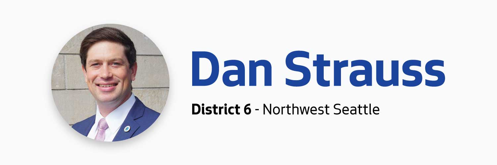
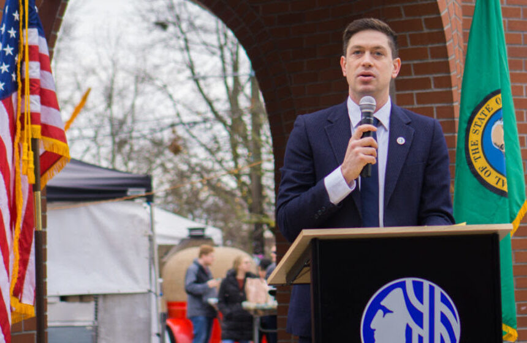
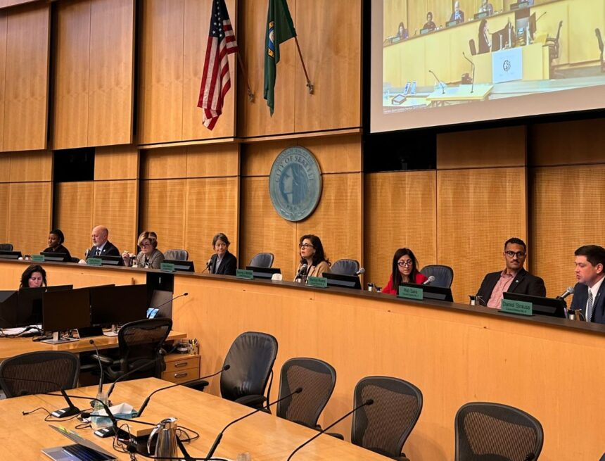

          

 *  [Home](https://council.seattle.gov) 
 *  [News](https://council.seattle.gov/news) 
 *  [Press Releases](https://council.seattle.gov/press-releases) 
 *  [Video](https://council.seattle.gov/video) 
 *  [Councilmembers](https://council.seattle.gov/seattle-city-councilmembers) 
   *  [Rob Saka](https://council.seattle.gov/saka) 
   *  [Mark Solomon](https://council.seattle.gov/solomon) 
   *  [Joy Hollingsworth](https://council.seattle.gov/hollingsworth) 
   *  [Maritza Rivera](https://council.seattle.gov/rivera) 
   *  [Cathy Moore](https://council.seattle.gov/moore) 
   *  [Dan Strauss](https://council.seattle.gov/strauss) 
   *  [Robert Kettle](https://council.seattle.gov/kettle) 
   *  [Alexis Mercedes Rinck](https://council.seattle.gov/rinck) 
   *  [Sara Nelson](https://council.seattle.gov/nelson) 
   *  [Councilmembers (Past)](https://council.seattle.gov/councilmembers-2022) 
 *  [About](https://council.seattle.gov/about) 

# Dan Strauss

  [Home](https://council.seattle.gov)  » Dan Strauss    

# Blog Posts from Councilmember Strauss

 March 18, 2025 March 18, 2025  [Councilmember Rinck](https://council.seattle.gov/category/councilmember-rinck) , [Councilmember Strauss](https://council.seattle.gov/category/councilmember-strauss) , [News](https://council.seattle.gov/category/news) , [News Releases](https://council.seattle.gov/category/news-releases) , [Rinck](https://council.seattle.gov/category/news-releases/rinck) , [Strauss](https://council.seattle.gov/category/news-releases/strauss)  By [City Council News Releases](https://council.seattle.gov/author/city-council-news-releases)   [0](https://council.seattle.gov/strauss)  

##  [Councilmembers call to reschedule Stadium District rezone vote after receiving 9 new amendments yesterday](https://council.seattle.gov/2025/03/18/councilmembers-call-to-reschedule-stadium-district-rezone-vote-after-receiving-9-new-amendments-yesterday) 

Seattle City Councilmembers Dan Strauss (District 6) and Alexis Mercedes Rinck (Position 8) are requesting to reschedule the Stadium District rezone legislation scheduled for a final Council vote later today. This comes after nine new amendments were released yesterday afternoon. The Seattle City Council has been considering fiercely debated legislation proposed by Council President Sara Nelson to rezone industrial lands...

  [Read More](https://council.seattle.gov/2025/03/18/councilmembers-call-to-reschedule-stadium-district-rezone-vote-after-receiving-9-new-amendments-yesterday)     March 06, 2025 March 7, 2025  [Councilmember Strauss](https://council.seattle.gov/category/councilmember-strauss) , [News Releases](https://council.seattle.gov/category/news-releases) , [Strauss](https://council.seattle.gov/category/news-releases/strauss)  By [Jesse Franz](https://council.seattle.gov/author/jesse)   [0](https://council.seattle.gov/strauss)  

##  [Seattle City Council signs letter in support of federal workers targeted for layoffs](https://council.seattle.gov/2025/03/06/seattle-city-council-signs-letter-in-support-of-federal-workers-targeted-for-layoffs) 

Seattle City Councilmember Dan Strauss (District 6) brought forward a letter today in support of federal workers threatened or targeted by layoffs. All seven of his Council colleagues in attendance at the inaugural meeting of the Council’s Select Committee on Federal Administration and Policy Changes added their names to the letter. The text of the letter can be found below:...

  [Read More](https://council.seattle.gov/2025/03/06/seattle-city-council-signs-letter-in-support-of-federal-workers-targeted-for-layoffs)     December 26, 2024 January 8, 2025  [Councilmember Strauss](https://council.seattle.gov/category/councilmember-strauss)  By [Jesse Franz](https://council.seattle.gov/author/jesse)   [0](https://council.seattle.gov/strauss)  

##  [Seattle City Councilmember Dan Strauss’ 2024-in-Review](https://council.seattle.gov/2024/12/26/seattle-city-councilmember-dan-strauss-2024-in-review) 

Dear Neighbor, Happy New Year! As we conclude the year, we are reflecting on the work my team and I accomplished in 2024. We hit the ground running last January, had a number of transitions on the team, and closed out the year strong. In this blog we highlight many, but not all, of the policies, projects, and community events...

  [Read More](https://council.seattle.gov/2024/12/26/seattle-city-councilmember-dan-strauss-2024-in-review)     November 21, 2024 November 21, 2024  [Budget](https://council.seattle.gov/category/news/budget) , [Councilmember Strauss](https://council.seattle.gov/category/councilmember-strauss) , [News](https://council.seattle.gov/category/news) , [News Releases](https://council.seattle.gov/category/news-releases) , [Strauss](https://council.seattle.gov/category/news-releases/strauss)  By [City Council News Releases](https://council.seattle.gov/author/city-council-news-releases)   [0](https://council.seattle.gov/strauss)  

##  [Council passes budget, closing $250-plus million deficit, making record investment in affordable housing, protecting services](https://council.seattle.gov/2024/11/21/council-passes-budget-closing-250-plus-million-deficit-making-record-investment-in-affordable-housing-protecting-services) 

Councilmember Dan Strauss (District 6), Chair of the Select Budget Committee, announced the passage of the City of Seattle’s 2025-2026 budget, successfully closing a $250-plus million dollar budget shortfall while making all-time-high investments in affordable housing and other critical services.   “In one of the toughest budget years in recent memory, we have come together, made smart decisions, and protected the...

  [Read More](https://council.seattle.gov/2024/11/21/council-passes-budget-closing-250-plus-million-deficit-making-record-investment-in-affordable-housing-protecting-services)  November 19, 2024 November 19, 2024  [Budget](https://council.seattle.gov/category/news/budget) , [Councilmember Strauss](https://council.seattle.gov/category/councilmember-strauss) , [News](https://council.seattle.gov/category/news) , [News Releases](https://council.seattle.gov/category/news-releases) , [Strauss](https://council.seattle.gov/category/news-releases/strauss)  By [City Council News Releases](https://council.seattle.gov/author/city-council-news-releases)   [0](https://council.seattle.gov/strauss)  

##  [Seattle City Council Select Budget Committee approves 2025-2026 budget proposal, sends it to final Council vote](https://council.seattle.gov/2024/11/19/seattle-city-council-select-budget-committee-approves-2025-2026-budget-proposal-sends-it-to-final-council-vote) 

Today, the City Council’s Select Budget Committee, chaired by Councilmember Dan Strauss (District 6), approved the City’s 2025-2026 budget package, sending it to the full Council for a final scheduled vote on Thursday, Nov. 21.  The budget proposal would make the biggest investment in affordable housing in Seattle’s history – more than $340 million in 2025. It would also make...

  [Read More](https://council.seattle.gov/2024/11/19/seattle-city-council-select-budget-committee-approves-2025-2026-budget-proposal-sends-it-to-final-council-vote)  November 18, 2024 November 18, 2024  [Budget](https://council.seattle.gov/category/news/budget) , [Councilmember Strauss](https://council.seattle.gov/category/councilmember-strauss) , [News](https://council.seattle.gov/category/news) , [News Releases](https://council.seattle.gov/category/news-releases) , [Strauss](https://council.seattle.gov/category/news-releases/strauss)  By [City Council News Releases](https://council.seattle.gov/author/city-council-news-releases)   [0](https://council.seattle.gov/strauss)  

##  [Seattle Select Budget Committee vote on 2025-26 budget legislation tomorrow, added public comment available](https://council.seattle.gov/2024/11/18/seattle-select-budget-committee-vote-on-2025-26-budget-legislation-tomorrow-added-public-comment-available) 

Final vote by full council expected Thursday The Seattle City Council’s Select Budget Committee, chaired by Councilmember Dan Strauss (District 6), will meet for the final time tomorrow to take its final votes on the 2025-26 budget and related legislation, such as proposed changes to the JumpStart Payroll Expense Tax and a capital gains tax proposal.  An additional public comment...

  [Read More](https://council.seattle.gov/2024/11/18/seattle-select-budget-committee-vote-on-2025-26-budget-legislation-tomorrow-added-public-comment-available)     November 13, 2024 November 15, 2024  [Budget](https://council.seattle.gov/category/news/budget) , [Councilmember Nelson](https://council.seattle.gov/category/councilmember-nelson) , [Councilmember Strauss](https://council.seattle.gov/category/councilmember-strauss) , [Nelson](https://council.seattle.gov/category/news-releases/nelson) , [News Releases](https://council.seattle.gov/category/news-releases) , [Strauss](https://council.seattle.gov/category/news-releases/strauss)  By [City Council News Releases](https://council.seattle.gov/author/city-council-news-releases)   [0](https://council.seattle.gov/strauss)  

##  [Council announces details on plans to save Seattle Channel programming, create plan for continued success](https://council.seattle.gov/2024/11/13/council-announces-details-on-plans-to-save-seattle-channel-programming-create-plan-for-continued-success) 

Seattle City Council PresidentSara Nelson and CouncilmemberDan Strauss (District 6, Chair of the Select Budget Committee) announced a two-pronged approach to restore full funding for the Seattle Channel and convene a workgroup of experts to suggest long-term solutions for its continued success.  “The Seattle Channel needs sustainable and dedicated funding going forward and Seattle Channel employees and content providers need...

  [Read More](https://council.seattle.gov/2024/11/13/council-announces-details-on-plans-to-save-seattle-channel-programming-create-plan-for-continued-success)  November 12, 2024 November 12, 2024  [Budget](https://council.seattle.gov/category/news/budget) , [Councilmember Strauss](https://council.seattle.gov/category/councilmember-strauss) , [News](https://council.seattle.gov/category/news)  By [City Council News Releases](https://council.seattle.gov/author/city-council-news-releases)   [0](https://council.seattle.gov/strauss)  

##  [Seattle City Council budget amendment tracker](https://council.seattle.gov/2024/11/12/seattle-city-council-budget-amendment-tracker) 

Seattle City Councilmember Dan Strauss has released this budget amendment tracker to help members of the community follow along with the budget process and upcoming votes on budget amendments. The tracker includes Council budget amendments that have already been announced as part of the Budget Chair Strauss’ balancing package and additional amendments proposed by other councilmembers. The tracker will include...

  [Read More](https://council.seattle.gov/2024/11/12/seattle-city-council-budget-amendment-tracker)  November 12, 2024 November 12, 2024  [Budget](https://council.seattle.gov/category/news/budget) , [Councilmember Strauss](https://council.seattle.gov/category/councilmember-strauss) , [News](https://council.seattle.gov/category/news)  By [City Council News Releases](https://council.seattle.gov/author/city-council-news-releases)   [0](https://council.seattle.gov/strauss)  

##  [Explore Seattle City Council Budget Chair Dan Strauss’ budget proposal](https://council.seattle.gov/2024/11/12/explore-seattle-city-council-budget-chair-dan-strauss-budget-proposal) 

Seattle City Councilmember Dan Strauss (District 6), Chair of the Select Budget Committee, is releasing this database to better help members of our community understand what was included in his budget proposal. Known as the “Chair’s Balancing Package,” the proposal acts as the Council’s first draft of the City’s 2025-2026 and lists proposed changes to the proposal made by the...

  [Read More](https://council.seattle.gov/2024/11/12/explore-seattle-city-council-budget-chair-dan-strauss-budget-proposal)  October 30, 2024 October 30, 2024  [Budget](https://council.seattle.gov/category/news/budget) , [Councilmember Moore](https://council.seattle.gov/category/councilmember-moore) , [Councilmember Saka](https://council.seattle.gov/category/councilmember-saka) , [Councilmember Strauss](https://council.seattle.gov/category/councilmember-strauss) , [Moore](https://council.seattle.gov/category/news-releases/moore) , [News](https://council.seattle.gov/category/news) , [News Releases](https://council.seattle.gov/category/news-releases) , [Saka](https://council.seattle.gov/category/news-releases/saka) , [Strauss](https://council.seattle.gov/category/news-releases/strauss)  By [City Council News Releases](https://council.seattle.gov/author/city-council-news-releases)   [0](https://council.seattle.gov/strauss)  

##  [Councilmember Rob Saka Funds Women in Policing Initiative](https://council.seattle.gov/2024/10/30/councilmember-rob-saka-funds-women-in-policing-initiative) 

Includes one professional staff to coordinate the ‘30×30’ Initiative Today, as part of the Council’s balancing package, Councilmember Rob Saka (District 1) adds one additional Seattle Police Department staff to advance a department-wide effort to meet the goal of having 30% women on the police force by 2030. The program, known as the 30×30, is designed to bolster the participation...

  [Read More](https://council.seattle.gov/2024/10/30/councilmember-rob-saka-funds-women-in-policing-initiative)     October 30, 2024 October 30, 2024  [Budget](https://council.seattle.gov/category/news/budget) , [Councilmember Strauss](https://council.seattle.gov/category/councilmember-strauss) , [News](https://council.seattle.gov/category/news) , [News Releases](https://council.seattle.gov/category/news-releases) , [Strauss](https://council.seattle.gov/category/news-releases/strauss) , [Top Story](https://council.seattle.gov/category/top-story)  By [City Council News Releases](https://council.seattle.gov/author/city-council-news-releases)   [0](https://council.seattle.gov/strauss)  

##  [Councilmember Strauss unveils budget aimed at strengthening public safety, building housing, and addressing affordability](https://council.seattle.gov/2024/10/30/councilmember-strauss-unveils-budget-aimed-at-strengthening-public-safety-building-housing-and-addressing-affordability) 

Seattle City Councilmember Dan Strauss (District 6), Chair of the Select Budget Committee, will officially release his Chair’s Balancing Package this morning. The balancing package is the initial budget proposal from the City Council, it updates the mayor’s proposal and reflects deep engagement between Chair Strauss and his Council colleagues. “Our city is at its best when we’re focused on...

  [Read More](https://council.seattle.gov/2024/10/30/councilmember-strauss-unveils-budget-aimed-at-strengthening-public-safety-building-housing-and-addressing-affordability)     October 29, 2024 October 30, 2024  [Budget](https://council.seattle.gov/category/news/budget) , [Councilmember Strauss](https://council.seattle.gov/category/councilmember-strauss) , [News](https://council.seattle.gov/category/news) , [News Releases](https://council.seattle.gov/category/news-releases) , [Strauss](https://council.seattle.gov/category/news-releases/strauss)  By [City Council News Releases](https://council.seattle.gov/author/city-council-news-releases)   [0](https://council.seattle.gov/strauss)  

##  [Councilmember Strauss announces legislation to restore Seattle Channel funding](https://council.seattle.gov/2024/10/29/councilmember-strauss-announces-legislation-to-restore-seattle-channel-funding) 

Seattle City Councilmember Dan Strauss (District 6), Chair of the Select Budget Committee, announced a proposal this morning to restore funding for the award-winning Seattle Channel and a process for charting a course for the channel’s continued success.   “The Seattle Channel is a crucial part of our civic life. It’s a place where Seattleites get unfiltered access to their...

  [Read More](https://council.seattle.gov/2024/10/29/councilmember-strauss-announces-legislation-to-restore-seattle-channel-funding)  

 *  1 
 *  [2](https://council.seattle.gov/strauss/page/2) 
 *  … 
 *  [5](https://council.seattle.gov/strauss/page/5) 
 *  [Next](https://council.seattle.gov/strauss/page/2) 

 __Learn more about Councilmember Strauss:__ 

 [Visit his website](https://seattle.gov/council/strauss) 

 [Sign up for his newsletter](https://seattle.us12.list-manage.com/subscribe?u=11a79978ca7225050bfabf7ad&id=d57b26f739) 

# News Releases

 March 18, 2025March 18, 2025 

###  [Councilmembers call to reschedule Stadium District rezone vote after receiving 9 new amendments yesterday](https://council.seattle.gov/2025/03/18/councilmembers-call-to-reschedule-stadium-district-rezone-vote-after-receiving-9-new-amendments-yesterday) 

Seattle City Councilmembers Dan Strauss (District 6) and Alexis Mercedes Rinck (Position 8) are requesting to reschedule the Stadium District...

  [Read More](https://council.seattle.gov/2025/03/18/councilmembers-call-to-reschedule-stadium-district-rezone-vote-after-receiving-9-new-amendments-yesterday)  March 6, 2025March 7, 2025 

###  [Seattle City Council signs letter in support of federal workers targeted for layoffs](https://council.seattle.gov/2025/03/06/seattle-city-council-signs-letter-in-support-of-federal-workers-targeted-for-layoffs) 

Seattle City Councilmember Dan Strauss (District 6) brought forward a letter today in support of federal workers threatened or targeted...

  [Read More](https://council.seattle.gov/2025/03/06/seattle-city-council-signs-letter-in-support-of-federal-workers-targeted-for-layoffs)  December 26, 2024January 8, 2025 

###  [Seattle City Councilmember Dan Strauss’ 2024-in-Review](https://council.seattle.gov/2024/12/26/seattle-city-councilmember-dan-strauss-2024-in-review) 

Dear Neighbor, Happy New Year! As we conclude the year, we are reflecting on the work my team and I...

  [Read More](https://council.seattle.gov/2024/12/26/seattle-city-councilmember-dan-strauss-2024-in-review)  November 21, 2024November 21, 2024 

###  [Council passes budget, closing $250-plus million deficit, making record investment in affordable housing, protecting services](https://council.seattle.gov/2024/11/21/council-passes-budget-closing-250-plus-million-deficit-making-record-investment-in-affordable-housing-protecting-services) 

Councilmember Dan Strauss (District 6), Chair of the Select Budget Committee, announced the passage of the City of Seattle’s 2025-2026...

  [Read More](https://council.seattle.gov/2024/11/21/council-passes-budget-closing-250-plus-million-deficit-making-record-investment-in-affordable-housing-protecting-services)  

  

### HELPFUL LINKS

 *  [Meet the Council](https://seattle.gov/council/meet-the-council) 
 *  [Mayor’s Office](https://seattle.gov/mayor) 
 *  [Council Calendar](https://seattle.gov/council/calendar) 
 *  [Council Agendas](https://seattle.legistar.com/Calendar.aspx) 
 *  [Council Committees](https://seattle.gov/council/committees) 
 *  [Watch Council Live](https://seattle.gov/council/watch-council-live) 

### Make your voice heard

 [Find Your Council District](https://www.seattle.gov/cityclerk/agendas-and-legislative-resources/find-your-council-district) 

 [Contact the Council](https://www.seattle.gov/cityclerk/agendas-and-legislative-resources/city-council-agendas/contact-the-city-council) 

 [Sign up for Public Comment](https://www.seattle.gov/council/committees/public-comment#:~:text=Register%20to%20speak%20on%20the,be%20recognized%20by%20the%20Chair.) 

 [Register to Vote](https://kingcounty.gov/depts/elections/how-to-vote/register-to-vote.aspx) 

### Councilmembers

 *  [Rob Saka](https://seattle.gov/council/meet-the-council/rob-saka) 
 *  [Joy Hollingsworth](https://seattle.gov/council/meet-the-council/joy-hollingsworth) 
 *  [Maritza Rivera](https://seattle.gov/council/meet-the-council/maritza-rivera) 
 *  [Cathy Moore](https://seattle.gov/council/meet-the-council/cathy-moore) 
 *  [Dan Strauss](https://seattle.gov/council/strauss) 
 *  [Robert Kettle](https://seattle.gov/council/meet-the-council/robert-kettle) 
 *  [Alexis Mercedes Rinck](https://seattle.gov/council/rinck) 
 *  [Sara Nelson](https://seattle.gov/council/meet-the-council/sara-nelson) 
    The official blog of the Seattle City Council 7ads6x98y 