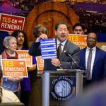

  [Office of the Mayor](https://harrell.seattle.gov/)  [Mayor Bruce Harrell](https://seattle.gov/mayor)  

 *  [Home](https://harrell.seattle.gov/) 
 * Topics
 * 
 Search Search 

## Find Posts By Topic

 *  [Arts and Culture](https://harrell.seattle.gov/category/arts-culture) 
 *  [City Administration](https://harrell.seattle.gov/category/city-administration) 
 *  [Citywide Strategy](https://harrell.seattle.gov/category/citywide-strategy) 
 *  [Environment and Sustainability](https://harrell.seattle.gov/category/environment-sustainability) 
 *  [Economic Development](https://harrell.seattle.gov/category/economic-development) 
 *  [Education and Youth](https://harrell.seattle.gov/category/education-youth) 
 *  [Housing and Homelessness](https://harrell.seattle.gov/category/housing-homelessness) 
 *  [Public Health](https://harrell.seattle.gov/category/public-health) 
 *  [Public Safety](https://harrell.seattle.gov/category/public-safety) 
 *  [Racial Equity and Social Justice](https://harrell.seattle.gov/category/racial-equity-social-justice) 
 *  [Transportation and Development](https://harrell.seattle.gov/category/transportation-land-use) 

##  [Mayor Harrell Statement on Revenue Forecast and Latest Federal Funding Threats](https://harrell.seattle.gov/2025/04/11/mayor-harrell-statement-on-revenue-forecast-and-latest-federal-funding-threats) 

 April 11, 2025 

Seattle – Today, Mayor Bruce Harrell released the following statement after the release of the Office of Economic and Revenue Forecasts’ latest projections and new threats from President Trump to cut federal investments over local policies: “The latest revenue projections are significant and reflect the ongoing uncertainty about the volatile… [[ Keep reading ]](https://harrell.seattle.gov/2025/04/11/mayor-harrell-statement-on-revenue-forecast-and-latest-federal-funding-threats) 

 Filed Under: [City Administration](https://harrell.seattle.gov/category/city-administration) , [Citywide Strategy](https://harrell.seattle.gov/category/citywide-strategy)     

##  [City of Seattle Selects Mercy Housing to Redevelop Lake City Community Center ](https://harrell.seattle.gov/2025/04/11/city-of-seattle-selects-mercy-housing-to-redevelop-lake-city-community-center) 

 April 11, 2025 

A combined community center and affordable housing development will address housing needs and create vibrant shared spaces in Lake City Seattle – The City of Seattle’s Office of Housing (OH) and Seattle Parks and Recreation (SPR) are excited to announce the selection of Mercy Housing to lead the redevelopment of… [[ Keep reading ]](https://harrell.seattle.gov/2025/04/11/city-of-seattle-selects-mercy-housing-to-redevelop-lake-city-community-center) 

 Filed Under: [Housing and Homelessness](https://harrell.seattle.gov/category/housing-homelessness)     

##  [Mayor Harrell Signs Legislation Fortifying Local Protections for People Seeking Gender-Affirming and Reproductive Health Care](https://harrell.seattle.gov/2025/03/31/mayor-harrell-signs-legislation-fortifying-local-protections-for-people-seeking-gender-affirming-and-reproductive-health-care) 

 March 31, 2025 

Seattle – Today, Mayor Bruce Harrell joined City leaders and LGBTQ+ community advocates to sign new legislation that strengthens local protections for people seeking gender-affirming and reproductive health care services in Seattle, with a focus on supporting Seattle’s LGBTQ+ community in response to recent federal actions. The legislation was signed… [[ Keep reading ]](https://harrell.seattle.gov/2025/03/31/mayor-harrell-signs-legislation-fortifying-local-protections-for-people-seeking-gender-affirming-and-reproductive-health-care) 

 Filed Under: [Racial Equity and Social Justice](https://harrell.seattle.gov/category/racial-equity-social-justice)     

##  [Mayor Bruce Harrell and City of Seattle Launch Groundbreaking AI Incubator to Propel the Next Generation of AI Entrepreneurs ](https://harrell.seattle.gov/2025/03/27/mayor-bruce-harrell-and-city-of-seattle-launch-groundbreaking-ai-incubator-to-propel-the-next-generation-of-ai-entrepreneurs) 

 March 27, 2025 

A new public-private partnership on Seattle’s waterfront positions Seattle as a premier location for AI innovation, development, and opportunity. SEATTLE – Today, Mayor Bruce Harrell announced the opening of AI House, a first-in-the-nation AI hub, launched through a public-private partnership, focused on entrepreneurs, startups, investors, and community leaders building the next era of AI in Seattle. Located… [[ Keep reading ]](https://harrell.seattle.gov/2025/03/27/mayor-bruce-harrell-and-city-of-seattle-launch-groundbreaking-ai-incubator-to-propel-the-next-generation-of-ai-entrepreneurs) 

 Filed Under: [Office of the Mayor](https://harrell.seattle.gov/category/office-of-the-mayor)  

##  [Statements from Mayor Bruce Harrell and Budget Chair Dan Strauss on 2024 Year-End Revenue Report ](https://harrell.seattle.gov/2025/03/25/statements-from-mayor-bruce-harrell-and-budget-chair-dan-strauss-on-2024-year-end-revenue-report) 

 March 25, 2025 

Seattle – Today, Mayor Bruce Harrell released the following statement after the Office of Economic and Revenue Forecasts (OERF) released the 2024 Year-end Revenue Report:  “Today’s announcement that PET revenues collected in 2024 were $47 million lower than projected requires action to ensure our budget remains balanced. We also know… [[ Keep reading ]](https://harrell.seattle.gov/2025/03/25/statements-from-mayor-bruce-harrell-and-budget-chair-dan-strauss-on-2024-year-end-revenue-report) 

 Filed Under: [Office of the Mayor](https://harrell.seattle.gov/category/office-of-the-mayor)  

##  [Statement from Seattle Mayor Bruce Harrell on the passing of former Washington State House Speaker Frank Chopp](https://harrell.seattle.gov/2025/03/23/statement-from-seattle-mayor-bruce-harrell-on-the-passing-of-former-washington-state-house-speaker-frank-chopp) 

 March 23, 2025 

Seattle – Today, Mayor Bruce Harrell released the following statement: “I am deeply saddened to learn of Frank’s passing. Frank Chopp was not only a legendary Speaker of the State House, he represented the heart of Seattle in Olympia for three decades. A lifelong champion for affordable housing and a voice… [[ Keep reading ]](https://harrell.seattle.gov/2025/03/23/statement-from-seattle-mayor-bruce-harrell-on-the-passing-of-former-washington-state-house-speaker-frank-chopp) 

 Filed Under: [Office of the Mayor](https://harrell.seattle.gov/category/office-of-the-mayor)     

##  [Mayor Harrell Celebrates the Expansion of CARE Responders Citywide](https://harrell.seattle.gov/2025/03/19/mayor-harrell-celebrates-the-expansion-of-care-responders-citywide) 

 March 19, 2025 

Seattle – Today, Mayor Bruce Harrell joined City and community leaders to mark the rollout of CARE department responders to neighborhoods in South and Southwest Seattle. This completes the citywide expansion announced last summer, after the pilot initially launched in downtown and has steadily grown as the model has proven successful…. [[ Keep reading ]](https://harrell.seattle.gov/2025/03/19/mayor-harrell-celebrates-the-expansion-of-care-responders-citywide) 

 Filed Under: [Office of the Mayor](https://harrell.seattle.gov/category/office-of-the-mayor)     

##  [Award-Winning Seattle Preschool Program Expanding for 2025-26 School Year ](https://harrell.seattle.gov/2025/03/14/award-winning-seattle-preschool-program-expanding-for-2025-26-school-year) 

 March 14, 2025 

The Seattle Preschool Program is now accepting applications for the 2025-2026 school year – classes begin in September! Seattle (March 14) – This morning, Mayor Bruce Harrell joined the Department of Education and Early Learning (DEEL) and education leaders at The Children’s Center at Burke Gilman Gardens to announce nine… [[ Keep reading ]](https://harrell.seattle.gov/2025/03/14/award-winning-seattle-preschool-program-expanding-for-2025-26-school-year) 

 Filed Under: [Education and Youth](https://harrell.seattle.gov/category/education-youth)     

##  [Mayor Harrell Proposes Renewal of Seattle’s First-in-Nation Democracy Voucher Program](https://harrell.seattle.gov/2025/03/10/mayor-harrell-proposes-renewal-of-seattles-first-in-nation-democracy-voucher-program) 

 March 10, 2025 

Seattle – Today, Mayor Bruce Harrell joined a coalition of community leaders and civic engagement organizations to announce his proposal to renew Seattle’s Democracy Voucher Program, which is expiring at the end of this year. “Seattle’s innovative Democracy Voucher Program is a local success story for supporting increased participation in… [[ Keep reading ]](https://harrell.seattle.gov/2025/03/10/mayor-harrell-proposes-renewal-of-seattles-first-in-nation-democracy-voucher-program) 

 Filed Under: [Citywide Strategy](https://harrell.seattle.gov/category/citywide-strategy) , [Office of the Mayor](https://harrell.seattle.gov/category/office-of-the-mayor) , [Racial Equity and Social Justice](https://harrell.seattle.gov/category/racial-equity-social-justice)     

##  [Mayor Harrell Proposes Legislation to Strengthen Local Protections for People Seeking Gender-Affirming and Reproductive Health Care in Seattle ](https://harrell.seattle.gov/2025/03/05/mayor-harrell-proposes-legislation-to-strengthen-local-protections-for-people-seeking-gender-affirming-and-reproductive-health-care-in-seattle) 

 March 5, 2025 

Seattle – Today, Mayor Bruce Harrell announced new legislation to strengthen local protections and safeguard access to gender-affirming and reproductive health care services in Seattle, with a focus on supporting the LGBTQ+ community and reaffirming the City’s commitment to be a safe, welcoming place for all people.   “We are proud… [[ Keep reading ]](https://harrell.seattle.gov/2025/03/05/mayor-harrell-proposes-legislation-to-strengthen-local-protections-for-people-seeking-gender-affirming-and-reproductive-health-care-in-seattle) 

 Filed Under: [Office of the Mayor](https://harrell.seattle.gov/category/office-of-the-mayor) , [Press Releases](https://harrell.seattle.gov/category/press-releases) , [Racial Equity and Social Justice](https://harrell.seattle.gov/category/racial-equity-social-justice)  

 *  [1](https://harrell.seattle.gov) 
 *  [2](https://harrell.seattle.gov/page/2) 
 *  [3](https://harrell.seattle.gov/page/3) 
 * …
 *  [34](https://harrell.seattle.gov/page/34) 
 *  [Next](https://harrell.seattle.gov/page/2) 

## Popular Tags

 *  [One Seattle](https://harrell.seattle.gov/tag/one-seattle) 
 *  [State of the City](https://harrell.seattle.gov/tag/state-of-the-city) 
 *  [Executive Order](https://harrell.seattle.gov/tag/executive-order) 
 *  [Seattle Police Department](https://harrell.seattle.gov/tag/seattle-police-department) 
 *  [Seattle Fire Department](https://harrell.seattle.gov/tag/seattle-fire-department) 

#### Browse the Archive

 Choose a Month  April 2025  (2)  March 2025  (8)  February 2025  (7)  January 2025  (11)  December 2024  (9)  November 2024  (10)  October 2024  (13)  September 2024  (9)  August 2024  (10)  July 2024  (10)  June 2024  (7)  May 2024  (9)  April 2024  (7)  March 2024  (9)  February 2024  (8)  January 2024  (7)  December 2023  (7)  November 2023  (10)  October 2023  (8)  September 2023  (14)  August 2023  (10)  July 2023  (4)  June 2023  (19)  May 2023  (7)  April 2023  (6)  March 2023  (10)  February 2023  (7)  January 2023  (9)  December 2022  (6)  November 2022  (5)  October 2022  (13)  September 2022  (10)  August 2022  (11)  July 2022  (10)  June 2022  (5)  May 2022  (6)  April 2022  (3)  March 2022  (8)  February 2022  (6)  January 2022  (6)  December 2021  (1) All Seattle.gov Blogs 

### Animals

 *  [The Scoop](https://thescoop.seattle.gov) 

### Assistance

 *  [Human Interests](https://humaninterests.seattle.gov) 

### For Businesses

 *  [The Bottom Line](https://bottomline.seattle.gov) 
 *  [The Buy Line](https://thebuyline.seattle.gov) 
 *  [Consultant Connection](https://consultants.seattle.gov) 
 *  [Finance and Administrative Services](https://fasblog.seattle.gov) 

### Civil Rights

 *  [Civil Rights Now](https://ocr.seattle.gov) 

### Elected Officials

 *  [Office of the Mayor](https://harrell.seattle.gov) 
 *  [Seattle City Council Blog](https://council.seattle.gov) 
 *  [Joy Hollingsworth](https://hollingsworth.seattle.gov) 
 *  [Bob Kettle](https://kettle.seattle.gov) 
 *  [Cathy Moore](https://moore.seattle.gov) 
 *  [Sara Nelson](https://nelson.seattle.gov) 
 *  [Alexis Mercedes Rinck](https://council.seattle.gov/rinck) 
 *  [Maritza Rivera](https://rivera.seattle.gov) 
 *  [Rob Saka](https://saka.seattle.gov) 
 *  [Mark Solomon](https://council.seattle.gov/solomon) 
 *  [Dan Strauss](https://strauss.seattle.gov) 

### Explore the City

 *  [Art Beat](https://artbeat.seattle.gov) 
 *  [Parkways](https://parkways.seattle.gov) 
 *  [Take 21](https://take21.seattlechannel.org) 
 *  [Center Spotlight](https://centerspotlight.seattle.gov) 
 *  [News.Seattle.gov](https://news.seattle.gov) 

### Get Involved

 *  [Front Porch](https://frontporch.seattle.gov) 

### Immigrants and Refugees

 *  [Welcoming Seattle](https://welcoming.seattle.gov) 

### Issues and Initiatives

 *  [At Home](https://housing.seattle.gov) 
 *  [Greenspace](https://greenspace.seattle.gov) 
 *  [Innovation Hub](https://innovation-hub.seattle.gov) 

### Learning and Education

 *  [What's the DEEL?](https://education.seattle.gov) 

### Public Safety

 *  [Alert Seattle](https://alert.seattle.gov) 
 *  [Fire Line](https://fireline.seattle.gov) 
 *  [SPD Blotter](https://spdblotter.seattle.gov) 

### Transportation and Development

 *  [Building Connections](https://buildingconnections.seattle.gov) 
 *  [Daily Plan It](https://dailyplanit.seattle.gov) 
 *  [Seattle Department of Transportation (SDOT)](https://sdotblog.seattle.gov) 

### Technology

 *  [TechTalk](https://techtalk.seattle.gov) 

### Utilities

 *  [Powerlines](https://powerlines.seattle.gov) 
 *  [At Your Service](https://atyourservice.seattle.gov) 

Seattle's Mayor is the head of the Executive department. The Mayor directs and controls all City offices and departments except where that authority is granted to another office by the City Charter.

## Policies

  [About Our Digital Properties](https://www.seattle.gov/digital)   [Privacy Policy](https://www.seattle.gov/tech/initiatives/privacy/about-the-privacy-program)   [ADA Notice](https://www.seattle.gov/americans-with-disabilities-act)     Original text Rate this translation Your feedback will be used to help improve Google Translate 