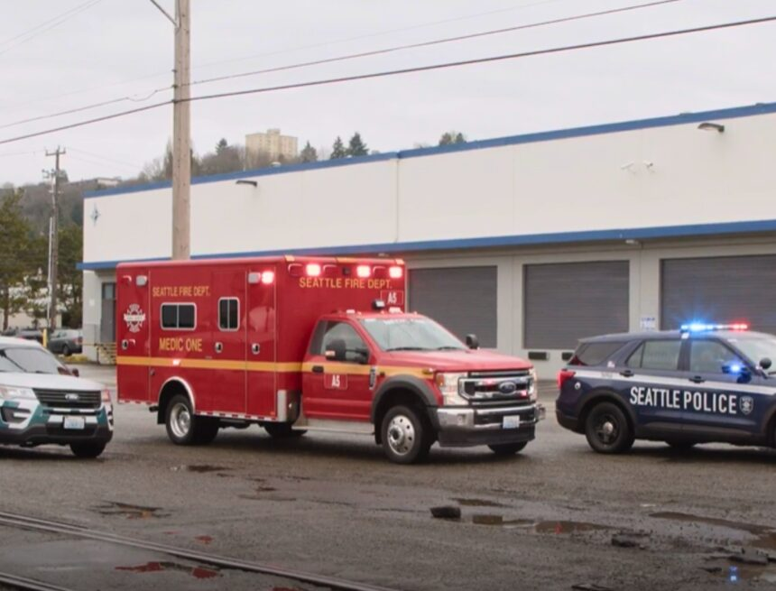

          

 *  [Home](https://council.seattle.gov) 
 *  [News](https://council.seattle.gov/news) 
 *  [Press Releases](https://council.seattle.gov/press-releases) 
 *  [Video](https://council.seattle.gov/video) 
 *  [Councilmembers](https://council.seattle.gov/seattle-city-councilmembers) 
   *  [Rob Saka](https://council.seattle.gov/saka) 
   *  [Mark Solomon](https://council.seattle.gov/solomon) 
   *  [Joy Hollingsworth](https://council.seattle.gov/hollingsworth) 
   *  [Maritza Rivera](https://council.seattle.gov/rivera) 
   *  [Cathy Moore](https://council.seattle.gov/moore) 
   *  [Dan Strauss](https://council.seattle.gov/strauss) 
   *  [Robert Kettle](https://council.seattle.gov/kettle) 
   *  [Alexis Mercedes Rinck](https://council.seattle.gov/rinck) 
   *  [Sara Nelson](https://council.seattle.gov/nelson) 
   *  [Councilmembers (Past)](https://council.seattle.gov/councilmembers-2022) 
 *  [About](https://council.seattle.gov/about) 

# Robert Kettle

  [Home](https://council.seattle.gov)  » Robert Kettle    

# Blog Posts from Councilmember Kettle

    April 01, 2025 April 2, 2025  [Councilmember Kettle](https://council.seattle.gov/category/councilmember-kettle) , [Councilmember Saka](https://council.seattle.gov/category/councilmember-saka) , [Kettle](https://council.seattle.gov/category/news-releases/kettle) , [News](https://council.seattle.gov/category/news) , [News Releases](https://council.seattle.gov/category/news-releases) , [Public Safety](https://council.seattle.gov/category/news/public-safety) , [Saka](https://council.seattle.gov/category/news-releases/saka)  By [City Council News Releases](https://council.seattle.gov/author/city-council-news-releases)   [0](https://kettle.seattle.gov#)  

##  [City Council approves resolution endorsing holistic approach to public safety](https://council.seattle.gov/2025/04/01/city-council-approves-resolution-endorsing-holistic-approach-to-public-safety) 

Today the City Council adopted a resolution, sponsored by Councilmember Rob Saka (District 1), strengthening Seattle’s commitment to a comprehensive approach to public safety. The resolution expresses appreciation for the community’s first responders, recognizes work done to reform the Seattle Police Department (SPD), endorses accountability measures, calls for diversified responses to 911 calls as offered by the new Community Assisted...

  [Read More](https://council.seattle.gov/2025/04/01/city-council-approves-resolution-endorsing-holistic-approach-to-public-safety)  March 25, 2025 March 25, 2025  [Councilmember Kettle](https://council.seattle.gov/category/councilmember-kettle) , [Kettle](https://council.seattle.gov/category/news-releases/kettle) , [News](https://council.seattle.gov/category/news) , [News Releases](https://council.seattle.gov/category/news-releases) , [Public Safety](https://council.seattle.gov/category/news/public-safety)  By [City Council News Releases](https://council.seattle.gov/author/city-council-news-releases)   [0](https://kettle.seattle.gov#)  

##  [City unveils new safety regulations proposal for late night lounges](https://council.seattle.gov/2025/03/25/city-unveils-new-safety-regulations-proposal-for-late-night-lounges) 

Bill seeks to improve safety of patrons and surrounding neighborhood areas Councilmember Bob Kettle (District 7), chair of the Public Safety Committee, in close collaboration with City Attorney Ann Davison and Mayor Bruce Harrell, has unveiled a new plan to regulate night lounges that operate after 2 a.m. The proposed ordinance would require lounges to be up-to-date on all city...

  [Read More](https://council.seattle.gov/2025/03/25/city-unveils-new-safety-regulations-proposal-for-late-night-lounges)     March 17, 2025 March 17, 2025  [Councilmember Kettle](https://council.seattle.gov/category/councilmember-kettle) , [News](https://council.seattle.gov/category/news)  By [Bob Kettle](https://council.seattle.gov/author/bob-kettle)   [0](https://kettle.seattle.gov#)  

##  [The Port, Industrial Lands, Freight, and Housing – The Wrong Place at the Wrong Time](https://council.seattle.gov/2025/03/17/the-port-industrial-lands-freight-and-housing-the-wrong-place-at-the-wrong-time) 

In 2016, during the Seattle City Council meeting which would decide on a street vacation allowing Chris Hansen to develop land into a third arena, Debora Juarez (former District 5 Councilmember and Council President), said from the dais, “You can build 1 arena, 2 arenas, or 5 arenas, but you cannot build a deep-water port.”  Those words ring as true...

  [Read More](https://council.seattle.gov/2025/03/17/the-port-industrial-lands-freight-and-housing-the-wrong-place-at-the-wrong-time)  February 11, 2025 February 11, 2025  [Councilmember Kettle](https://council.seattle.gov/category/councilmember-kettle) , [Councilmember Nelson](https://council.seattle.gov/category/councilmember-nelson) , [Kettle](https://council.seattle.gov/category/news-releases/kettle) , [Nelson](https://council.seattle.gov/category/news-releases/nelson) , [News](https://council.seattle.gov/category/news) , [News Releases](https://council.seattle.gov/category/news-releases) , [Public Safety](https://council.seattle.gov/category/news/public-safety)  By [City Council News Releases](https://council.seattle.gov/author/city-council-news-releases)   [0](https://kettle.seattle.gov#)  

##  [Council passes updated guidance for crowd management, sets the stage for end of federal consent decree](https://council.seattle.gov/2025/02/11/council-passes-updated-guidance-for-crowd-management-sets-the-stage-for-end-of-federal-consent-decree) 

The City Council voted 6-3 today to approve final legislation on crowd management guidelines for the Seattle Police Department (SPD). The updated guidelines include several amendments intended to provide additional oversight and accountability, including checks on the use of blast balls. “The crowd management guidelines we passed today strike an important balance of giving our police officers flexibility to keep...

  [Read More](https://council.seattle.gov/2025/02/11/council-passes-updated-guidance-for-crowd-management-sets-the-stage-for-end-of-federal-consent-decree)     January 06, 2025 January 6, 2025  [Councilmember Kettle](https://council.seattle.gov/category/councilmember-kettle) , [Councilmember Nelson](https://council.seattle.gov/category/councilmember-nelson) , [Kettle](https://council.seattle.gov/category/news-releases/kettle) , [Nelson](https://council.seattle.gov/category/news-releases/nelson) , [News](https://council.seattle.gov/category/news) , [News Releases](https://council.seattle.gov/category/news-releases) , [Public Safety](https://council.seattle.gov/category/news/public-safety)  By [City Council News Releases](https://council.seattle.gov/author/city-council-news-releases)   [0](https://kettle.seattle.gov#)  

##  [Council President Nelson urges continued focus on public safety in 2025 after record number of bills passed in 2024](https://council.seattle.gov/2025/01/06/council-president-nelson-urges-continued-focus-on-public-safety-in-2025-after-record-number-of-bills-passed-in-2024) 

Noting the high number of public safety-related bills adopted by the Seattle City Council in 2024, today Council President Sara Nelson (Position 9) welcomed incoming interim Chief of Police Shon Barnes to Seattle and urged a redoubling of city efforts on Seattle’s ongoing public safety challenges in the new year. In its first year, the new City Council adopted 14...

  [Read More](https://council.seattle.gov/2025/01/06/council-president-nelson-urges-continued-focus-on-public-safety-in-2025-after-record-number-of-bills-passed-in-2024)  December 20, 2024 December 20, 2024  [Councilmember Kettle](https://council.seattle.gov/category/councilmember-kettle) , [Kettle](https://council.seattle.gov/category/news-releases/kettle) , [News](https://council.seattle.gov/category/news) , [News Releases](https://council.seattle.gov/category/news-releases) , [Public Safety](https://council.seattle.gov/category/news/public-safety)  By [City Council News Releases](https://council.seattle.gov/author/city-council-news-releases)   [0](https://kettle.seattle.gov#)  

##  [Councilmember Kettle welcomes new Police Chief Shon Barnes](https://council.seattle.gov/2024/12/20/councilmember-kettle-welcomes-new-police-chief-shon-barnes) 

Councilmember Bob Kettle (District 7), chair of the Public Safety Committee, released the following statement on today’s announced appointment of Shon Barnes as Seattle’s Chief of Police. “I extend a warm welcome to Chief Barnes to Seattle and congratulate him on the opportunity to lead one of the finest police departments in the country and build on the work that...

  [Read More](https://council.seattle.gov/2024/12/20/councilmember-kettle-welcomes-new-police-chief-shon-barnes)  December 18, 2024 December 20, 2024  [Councilmember Kettle](https://council.seattle.gov/category/councilmember-kettle) , [Councilmember Saka](https://council.seattle.gov/category/councilmember-saka) , [Kettle](https://council.seattle.gov/category/news-releases/kettle) , [News Releases](https://council.seattle.gov/category/news-releases) , [Saka](https://council.seattle.gov/category/news-releases/saka)  By [City Council News Releases](https://council.seattle.gov/author/city-council-news-releases)   [0](https://kettle.seattle.gov#)  

##  [Council’s Public Safety and Transportation chairs call for more transit security funding ](https://council.seattle.gov/2024/12/18/councils-public-safety-and-transportation-chairs-call-for-more-transit-security-funding) 

Today Councilmember Bob Kettle (District 7), chair of the Public Safety Committee, and Councilmember Rob Saka (District 1), chair of the Transportation Committee, released the following joint statement in response to the early morning fatal stabbing of King County Metro bus driver Shawn Yim.   “First and foremost, our thoughts are with the family, friends and colleagues of Shawn Yim. Today’s...

  [Read More](https://council.seattle.gov/2024/12/18/councils-public-safety-and-transportation-chairs-call-for-more-transit-security-funding)  December 17, 2024 December 17, 2024  [Councilmember Kettle](https://council.seattle.gov/category/councilmember-kettle) , [Kettle](https://council.seattle.gov/category/news-releases/kettle) , [News](https://council.seattle.gov/category/news) , [News Releases](https://council.seattle.gov/category/news-releases) , [Public Safety](https://council.seattle.gov/category/news/public-safety)  By [City Council News Releases](https://council.seattle.gov/author/city-council-news-releases)   [0](https://kettle.seattle.gov#)  

##  [Seattle Councilmember and Public Safety Chair Bob Kettle’s statement on termination of former police chief](https://council.seattle.gov/2024/12/17/seattle-councilmember-and-public-safety-chair-bob-kettles-statement-on-termination-of-former-police-chief) 

Councilmember Bob Kettle (District 7), chair of the Public Safety Committee, released the following statement regarding today’s announcement of former Seattle Chief of Police Adrian Diaz being relieved of his duties: “I support Mayor Bruce Harrell’s decision and appreciate the work of the Office of Inspector General (OIG) in reaching its findings in the investigation. This is a difficult situation...

  [Read More](https://council.seattle.gov/2024/12/17/seattle-councilmember-and-public-safety-chair-bob-kettles-statement-on-termination-of-former-police-chief)  December 05, 2024 December 5, 2024  [Councilmember Kettle](https://council.seattle.gov/category/councilmember-kettle) , [News](https://council.seattle.gov/category/news)  By [City Council Staff](https://council.seattle.gov/author/councilconnection)   [0](https://kettle.seattle.gov#)  

##  [Councilmember Kettle wishes Councilmember Morales ‘fair winds and following seas’ in her next chapter](https://council.seattle.gov/2024/12/05/councilmember-kettle-wishes-councilmember-morales-fair-winds-and-following-seas-in-her-next-chapter) 

I want to thank Councilmember Morales for her service to District 2 and the whole of Seattle.  I recognize we approach issues from different perspectives but her collaboration and co-sponsorship on our Vacant Building Abatement legislation is particularly appreciated. It’s an example of working together to provide for a safer Seattle from dangerous buildings that can also contribute to the blight...

  [Read More](https://council.seattle.gov/2024/12/05/councilmember-kettle-wishes-councilmember-morales-fair-winds-and-following-seas-in-her-next-chapter)     October 08, 2024 October 11, 2024  [Councilmember Kettle](https://council.seattle.gov/category/councilmember-kettle) , [Councilmember Nelson](https://council.seattle.gov/category/councilmember-nelson) , [Kettle](https://council.seattle.gov/category/news-releases/kettle) , [Nelson](https://council.seattle.gov/category/news-releases/nelson) , [News](https://council.seattle.gov/category/news) , [News Releases](https://council.seattle.gov/category/news-releases) , [Top Story](https://council.seattle.gov/category/top-story)  By [City Council News Releases](https://council.seattle.gov/author/city-council-news-releases)   [0](https://kettle.seattle.gov#)  

##  [City council approves police recruitment bonuses and technology for crime prevention tools](https://council.seattle.gov/2024/10/08/city-council-approves-police-recruitment-bonuses-and-technology-for-crime-prevention-tools) 

Bills part of the council’s coordinated focus on improving public safety Today the Seattle City Council overwhelmingly approved legislation, sponsored by Council President Sara Nelson (Position 9), to further accelerate police hiring by offering competitive bonuses to attract the new police recruits from across the country. The full Council also passed Councilmember Bob Kettle’s (District 7) sponsored legislation that clears...

  [Read More](https://council.seattle.gov/2024/10/08/city-council-approves-police-recruitment-bonuses-and-technology-for-crime-prevention-tools)     September 17, 2024 September 17, 2024  [Councilmember Kettle](https://council.seattle.gov/category/councilmember-kettle) , [Kettle](https://council.seattle.gov/category/news-releases/kettle) , [Nelson](https://council.seattle.gov/category/news-releases/nelson) , [News Releases](https://council.seattle.gov/category/news-releases) , [Public Safety](https://council.seattle.gov/category/news/public-safety) , [Saka](https://council.seattle.gov/category/news-releases/saka) , [Top Story](https://council.seattle.gov/category/top-story)  By [City Council News Releases](https://council.seattle.gov/author/city-council-news-releases)   [0](https://kettle.seattle.gov#)  

##  [Law targeting drug-related criminal activity passes City Council](https://council.seattle.gov/2024/09/17/law-targeting-drug-related-criminal-activity-passes-city-council) 

Legislation marks another major accomplishment for council’s public safety work Today the Seattle City Council adopted the creation of Stay Out of Drug Areas (SODA) which authorize the courts to prohibit a defendant from entering a designated areas in the city if they commit a drug-related criminal offense in that zone. Introduced in partnership with City Attorney Ann Davison, the...

  [Read More](https://council.seattle.gov/2024/09/17/law-targeting-drug-related-criminal-activity-passes-city-council)     August 16, 2024 August 16, 2024  [Councilmember Kettle](https://council.seattle.gov/category/councilmember-kettle)  By [Bob Kettle](https://council.seattle.gov/author/bob-kettle)   [0](https://kettle.seattle.gov#)  

##  [Seattle City Councilmember Kettle’s Mid-Year Update](https://council.seattle.gov/2024/08/16/seattle-city-councilmember-kettles-mid-year-update) 

At a public safety forum this past spring, moderator Enrique Cerna started his conversation with Mayor Harrell by stating how he was struck while watching a news report on two recent shootings in the Central District. A resident in the report said, “I hate to say this but it’s just another day here in the Central District.” Cerna said the...

  [Read More](https://council.seattle.gov/2024/08/16/seattle-city-councilmember-kettles-mid-year-update)  

 *  1 
 *  [2](https://council.seattle.gov/kettle/page/2) 
 *  [Next](https://council.seattle.gov/kettle/page/2) 

 __Learn More about Councilmember Kettle:__ 

 [Visit his website](https://www.seattle.gov/council/kettle) 

 [Sign up for his newsletter](https://seattle.us12.list-manage.com/subscribe?u=11a79978ca7225050bfabf7ad&id=689952e8cd) 

# News Releases

 April 1, 2025April 2, 2025 

###  [City Council approves resolution endorsing holistic approach to public safety](https://council.seattle.gov/2025/04/01/city-council-approves-resolution-endorsing-holistic-approach-to-public-safety) 

Today the City Council adopted a resolution, sponsored by Councilmember Rob Saka (District 1), strengthening Seattle’s commitment to a comprehensive...

  [Read More](https://council.seattle.gov/2025/04/01/city-council-approves-resolution-endorsing-holistic-approach-to-public-safety)  March 25, 2025March 25, 2025 

###  [City unveils new safety regulations proposal for late night lounges](https://council.seattle.gov/2025/03/25/city-unveils-new-safety-regulations-proposal-for-late-night-lounges) 

Bill seeks to improve safety of patrons and surrounding neighborhood areas Councilmember Bob Kettle (District 7), chair of the Public...

  [Read More](https://council.seattle.gov/2025/03/25/city-unveils-new-safety-regulations-proposal-for-late-night-lounges)  February 11, 2025February 11, 2025 

###  [Council passes updated guidance for crowd management, sets the stage for end of federal consent decree](https://council.seattle.gov/2025/02/11/council-passes-updated-guidance-for-crowd-management-sets-the-stage-for-end-of-federal-consent-decree) 

The City Council voted 6-3 today to approve final legislation on crowd management guidelines for the Seattle Police Department (SPD)....

  [Read More](https://council.seattle.gov/2025/02/11/council-passes-updated-guidance-for-crowd-management-sets-the-stage-for-end-of-federal-consent-decree)  January 6, 2025January 6, 2025 

###  [Council President Nelson urges continued focus on public safety in 2025 after record number of bills passed in 2024](https://council.seattle.gov/2025/01/06/council-president-nelson-urges-continued-focus-on-public-safety-in-2025-after-record-number-of-bills-passed-in-2024) 

Noting the high number of public safety-related bills adopted by the Seattle City Council in 2024, today Council President Sara...

  [Read More](https://council.seattle.gov/2025/01/06/council-president-nelson-urges-continued-focus-on-public-safety-in-2025-after-record-number-of-bills-passed-in-2024)  

  

### HELPFUL LINKS

 *  [Meet the Council](https://seattle.gov/council/meet-the-council) 
 *  [Mayor’s Office](https://seattle.gov/mayor) 
 *  [Council Calendar](https://seattle.gov/council/calendar) 
 *  [Council Agendas](https://seattle.legistar.com/Calendar.aspx) 
 *  [Council Committees](https://seattle.gov/council/committees) 
 *  [Watch Council Live](https://seattle.gov/council/watch-council-live) 

### Make your voice heard

 [Find Your Council District](https://www.seattle.gov/cityclerk/agendas-and-legislative-resources/find-your-council-district) 

 [Contact the Council](https://www.seattle.gov/cityclerk/agendas-and-legislative-resources/city-council-agendas/contact-the-city-council) 

 [Sign up for Public Comment](https://www.seattle.gov/council/committees/public-comment#:~:text=Register%2520to%2520speak%2520on%2520the,be%2520recognized%2520by%2520the%2520Chair.) 

 [Register to Vote](https://kingcounty.gov/depts/elections/how-to-vote/register-to-vote.aspx) 

### Councilmembers

 *  [Rob Saka](https://seattle.gov/council/meet-the-council/rob-saka) 
 *  [Joy Hollingsworth](https://seattle.gov/council/meet-the-council/joy-hollingsworth) 
 *  [Maritza Rivera](https://seattle.gov/council/meet-the-council/maritza-rivera) 
 *  [Cathy Moore](https://seattle.gov/council/meet-the-council/cathy-moore) 
 *  [Dan Strauss](https://seattle.gov/council/strauss) 
 *  [Robert Kettle](https://seattle.gov/council/meet-the-council/robert-kettle) 
 *  [Alexis Mercedes Rinck](https://seattle.gov/council/rinck) 
 *  [Sara Nelson](https://seattle.gov/council/meet-the-council/sara-nelson) 
    The official blog of the Seattle City Council 7ads6x98y 