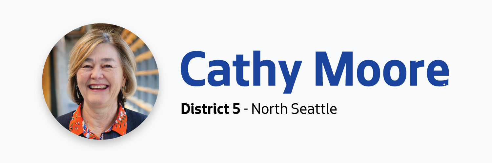

          

 *  [Home](https://council.seattle.gov) 
 *  [News](https://council.seattle.gov/news) 
 *  [Press Releases](https://council.seattle.gov/press-releases) 
 *  [Video](https://council.seattle.gov/video) 
 *  [Councilmembers](https://council.seattle.gov/seattle-city-councilmembers) 
   *  [Rob Saka](https://council.seattle.gov/saka) 
   *  [Mark Solomon](https://council.seattle.gov/solomon) 
   *  [Joy Hollingsworth](https://council.seattle.gov/hollingsworth) 
   *  [Maritza Rivera](https://council.seattle.gov/rivera) 
   *  [Cathy Moore](https://council.seattle.gov/moore) 
   *  [Dan Strauss](https://council.seattle.gov/strauss) 
   *  [Robert Kettle](https://council.seattle.gov/kettle) 
   *  [Alexis Mercedes Rinck](https://council.seattle.gov/rinck) 
   *  [Sara Nelson](https://council.seattle.gov/nelson) 
   *  [Councilmembers (Past)](https://council.seattle.gov/councilmembers-2022) 
 *  [About](https://council.seattle.gov/about) 

# Cathy Moore

  [Home](https://council.seattle.gov)  » Cathy Moore    

# Blog Posts from Councilmember Moore

 March 25, 2025 March 26, 2025  [Councilmember Moore](https://council.seattle.gov/category/councilmember-moore) , [Councilmember Nelson](https://council.seattle.gov/category/councilmember-nelson) , [Councilmember Rivera](https://council.seattle.gov/category/councilmember-rivera) , [Moore](https://council.seattle.gov/category/news-releases/moore) , [Nelson](https://council.seattle.gov/category/news-releases/nelson) , [News](https://council.seattle.gov/category/news) , [News Releases](https://council.seattle.gov/category/news-releases) , [Rivera](https://council.seattle.gov/category/news-releases/rivera)  By [City Council News Releases](https://council.seattle.gov/author/city-council-news-releases)   [0](https://moore.seattle.gov#)  

##  [Council President Sara Nelson celebrates passage of Shield Law and other state protections](https://council.seattle.gov/2025/03/25/council-president-sara-nelson-celebrates-passage-of-shield-law-and-other-state-protections) 

Measure taken in direct response to federal actions, resident concerns Today, Council President Sara Nelson (Position 9) praised legislation passed by the full Council strengthening protections from harmful federal actions, specifically for people seeking reproductive health care and gender-affirming treatment. The amended bill, co-sponsored with Councilmember Cathy Moore (District 5) and Councilmember Maritza Rivera (District 4), creates a firewall preventing...

  [Read More](https://council.seattle.gov/2025/03/25/council-president-sara-nelson-celebrates-passage-of-shield-law-and-other-state-protections)  January 28, 2025 January 29, 2025  [Councilmember Moore](https://council.seattle.gov/category/councilmember-moore) , [Moore](https://council.seattle.gov/category/news-releases/moore) , [News](https://council.seattle.gov/category/news) , [News Releases](https://council.seattle.gov/category/news-releases)  By [City Council News Releases](https://council.seattle.gov/author/city-council-news-releases)   [0](https://moore.seattle.gov#)  

##  [Councilmember Moore releases statement following Seattle Police Department arrest of Maserati drive-by shooting suspect](https://council.seattle.gov/2025/01/28/councilmember-moore-releases-statement-following-seattle-police-department-arrest-of-maserati-drive-by-shooting-suspect) 

City Councilmember Cathy Moore (District 5) released this statement after news of the arrest of a suspect believed to have been involved in a shooting in the Greenwood neighborhood on December 28, 2024. “I would like to thank the Seattle Police Department, north Precinct, and the Gun Violence Reduction unit for their great investigative work that has led to the...

  [Read More](https://council.seattle.gov/2025/01/28/councilmember-moore-releases-statement-following-seattle-police-department-arrest-of-maserati-drive-by-shooting-suspect)  January 10, 2025 January 10, 2025  [Councilmember Moore](https://council.seattle.gov/category/councilmember-moore) , [Moore](https://council.seattle.gov/category/news-releases/moore) , [News](https://council.seattle.gov/category/news) , [News Releases](https://council.seattle.gov/category/news-releases)  By [City Council News Releases](https://council.seattle.gov/author/city-council-news-releases)   [0](https://moore.seattle.gov#)  

##  [Councilmember Moore proposes reforms to limit blast ball use and enhance oversight of crowd control tactics](https://council.seattle.gov/2025/01/10/councilmember-moore-proposes-reforms-to-limit-blast-ball-use-and-enhance-oversight-of-crowd-control-tactics) 

Councilmember Cathy Moore (District 5) today introduced a set of proposed amendments to restrict the use of blast balls by the Seattle Police Department (SPD) for crowd control and to strengthen City Council oversight over SPD’s crowd management practices, including the deployment of new less-lethal weapons. Currently under review by the Public Safety Committee, the proposed legislation mandates that SPD...

  [Read More](https://council.seattle.gov/2025/01/10/councilmember-moore-proposes-reforms-to-limit-blast-ball-use-and-enhance-oversight-of-crowd-control-tactics)  November 21, 2024 November 21, 2024  [Budget](https://council.seattle.gov/category/news/budget) , [Councilmember Moore](https://council.seattle.gov/category/councilmember-moore) , [Moore](https://council.seattle.gov/category/news-releases/moore) , [News](https://council.seattle.gov/category/news) , [News Releases](https://council.seattle.gov/category/news-releases)  By [City Council News Releases](https://council.seattle.gov/author/city-council-news-releases)   [0](https://moore.seattle.gov#)  

##  [Councilmember Moore Announces District 5 budget wins for public safety, housing and human services](https://council.seattle.gov/2024/11/21/councilmember-moore-announces-district-5-budget-wins-for-public-safety-housing-and-human-services) 

Councilmember Cathy Moore (District 5) released the following statement after the City Council adopted the 2025-26 City of Seattle budget, and endorsed the 2026 budget:    “Affordable housing, public safety, human services and addressing homelessness are critically important to District 5 residents and Seattle as a whole,” said Councilmember Moore. “As the District 5 councilmember, I zealously advocated for and secured the following funding...

  [Read More](https://council.seattle.gov/2024/11/21/councilmember-moore-announces-district-5-budget-wins-for-public-safety-housing-and-human-services)  November 08, 2024 November 8, 2024  [Councilmember Moore](https://council.seattle.gov/category/councilmember-moore) , [Moore](https://council.seattle.gov/category/news-releases/moore) , [News Releases](https://council.seattle.gov/category/news-releases)  By [City Council News Releases](https://council.seattle.gov/author/city-council-news-releases)   [0](https://moore.seattle.gov#)  

##  [Councilmember Cathy Moore proposes progressive capital gains excise tax to fund rental assistance, home ownership, and fight food insecurity](https://council.seattle.gov/2024/11/08/councilmember-cathy-moore-proposes-progressive-capital-gains-excise-tax-to-fund-rental-assistance-home-ownership-and-fight-food-insecurity) 

City Councilmember Cathy Moore (District 5) announced this week that she will introduce a budget amendment to create a new form of progressive revenue to fund rental assistance for rent-burdened households, down payment assistance for low-and moderate-income home ownership, and food assistance for food-insecure households. The proposed 2% capital gains excise tax will be applicable to non-retirement financial gains over...

  [Read More](https://council.seattle.gov/2024/11/08/councilmember-cathy-moore-proposes-progressive-capital-gains-excise-tax-to-fund-rental-assistance-home-ownership-and-fight-food-insecurity)  November 05, 2024 November 5, 2024  [Councilmember Moore](https://council.seattle.gov/category/councilmember-moore) , [Councilmember Saka](https://council.seattle.gov/category/councilmember-saka) , [Moore](https://council.seattle.gov/category/news-releases/moore) , [News Releases](https://council.seattle.gov/category/news-releases)  By [City Council News Releases](https://council.seattle.gov/author/city-council-news-releases)   [0](https://moore.seattle.gov#)  

##  [Councilmember Moore Celebrates Passage of City’s Transportation Levy](https://council.seattle.gov/2024/11/05/councilmember-moore-celebrates-passage-of-citys-transportation-levy) 

Huge Win for New Sidewalks and Pedestrian Safety in District 5 Following tonight’s first round of election results showing Proposition 1 the City of Seattle’s Transportation Levy being approved by voters, District 5 Seattle City Councilmember Cathy Moore released the following statement:   “Passage of Prop 1 is a huge win for new sidewalks in District 5, which has 36%...

  [Read More](https://council.seattle.gov/2024/11/05/councilmember-moore-celebrates-passage-of-citys-transportation-levy)  October 30, 2024 October 30, 2024  [Budget](https://council.seattle.gov/category/news/budget) , [Councilmember Moore](https://council.seattle.gov/category/councilmember-moore) , [Moore](https://council.seattle.gov/category/news-releases/moore) , [News](https://council.seattle.gov/category/news) , [News Releases](https://council.seattle.gov/category/news-releases)  By [City Council News Releases](https://council.seattle.gov/author/city-council-news-releases)   [0](https://moore.seattle.gov#)  

##  [Councilmember Cathy Moore’s major budget priorities included in balancing package](https://council.seattle.gov/2024/10/30/councilmember-cathy-moores-budget-major-priorities-included-in-balancing-package) 

Today Seattle Councilmember Cathy Moore (District 5) praised the recently released budget chair balancing package and highlighted several district priorities that were included in the proposal.   “Affordable housing, human services and public safety continue to be of critical importance for District 5 neighborhoods and Seattle as a whole,” said Councilmember Moore. “I want to thank Chair Strauss for his collaborative...

  [Read More](https://council.seattle.gov/2024/10/30/councilmember-cathy-moores-budget-major-priorities-included-in-balancing-package)  October 30, 2024 October 30, 2024  [Budget](https://council.seattle.gov/category/news/budget) , [Councilmember Moore](https://council.seattle.gov/category/councilmember-moore) , [Councilmember Saka](https://council.seattle.gov/category/councilmember-saka) , [Councilmember Strauss](https://council.seattle.gov/category/councilmember-strauss) , [Moore](https://council.seattle.gov/category/news-releases/moore) , [News](https://council.seattle.gov/category/news) , [News Releases](https://council.seattle.gov/category/news-releases) , [Saka](https://council.seattle.gov/category/news-releases/saka) , [Strauss](https://council.seattle.gov/category/news-releases/strauss)  By [City Council News Releases](https://council.seattle.gov/author/city-council-news-releases)   [0](https://moore.seattle.gov#)  

##  [Councilmember Rob Saka Funds Women in Policing Initiative](https://council.seattle.gov/2024/10/30/councilmember-rob-saka-funds-women-in-policing-initiative) 

Includes one professional staff to coordinate the ‘30×30’ Initiative Today, as part of the Council’s balancing package, Councilmember Rob Saka (District 1) adds one additional Seattle Police Department staff to advance a department-wide effort to meet the goal of having 30% women on the police force by 2030. The program, known as the 30×30, is designed to bolster the participation...

  [Read More](https://council.seattle.gov/2024/10/30/councilmember-rob-saka-funds-women-in-policing-initiative)     October 11, 2024 October 11, 2024  [Councilmember Moore](https://council.seattle.gov/category/councilmember-moore) , [Moore](https://council.seattle.gov/category/news-releases/moore) , [Nelson](https://council.seattle.gov/category/news-releases/nelson) , [News](https://council.seattle.gov/category/news) , [News Releases](https://council.seattle.gov/category/news-releases)  By [City Council News Releases](https://council.seattle.gov/author/city-council-news-releases)   [0](https://moore.seattle.gov#)  

##  [City of Seattle and King County Approve New Agreement to Streamline Governance Structure of the King County Regional Homelessness Authority](https://council.seattle.gov/2024/10/11/city-of-seattle-and-king-county-approve-new-agreement-to-streamline-governance-structure-of-the-king-county-regional-homelessness-authority) 

New structure creates one decision-making board to enhance coordination, oversight, and accountability Original post can be found here. Following votes from the Seattle City Council and King County Council, Seattle Mayor Bruce Harrell and King County Executive Dow Constantine will sign a revised interlocal agreement (ILA) to streamline the governance structure of the King County Regional Homelessness Authority (KCRHA).  The amended ILA reaffirms the...

  [Read More](https://council.seattle.gov/2024/10/11/city-of-seattle-and-king-county-approve-new-agreement-to-streamline-governance-structure-of-the-king-county-regional-homelessness-authority)     September 17, 2024 September 19, 2024  [Councilmember Moore](https://council.seattle.gov/category/councilmember-moore) , [Moore](https://council.seattle.gov/category/news-releases/moore) , [Nelson](https://council.seattle.gov/category/news-releases/nelson) , [News Releases](https://council.seattle.gov/category/news-releases) , [Public Safety](https://council.seattle.gov/category/news/public-safety) , [Rivera](https://council.seattle.gov/category/news-releases/rivera)  By [City Council News Releases](https://council.seattle.gov/author/city-council-news-releases)   [0](https://moore.seattle.gov#)  

##  [Seattle City Council passes legislation combatting commercial sexual exploitation](https://council.seattle.gov/2024/09/17/seattle-city-council-passes-legislation-combatting-commercial-sexual-exploitation) 

Today the Seattle City Council passed by an 8-1 vote Councilmember Cathy Moore’s (District 5) bill to fight commercial sexual exploitation and the violence associated with it. The legislation includes a prohibition on loitering for buying, selling or promoting prostitution, as well as a separate provision that allows a judge to issue a Stay Out of Area Prostitution (SOAP) order...

  [Read More](https://council.seattle.gov/2024/09/17/seattle-city-council-passes-legislation-combatting-commercial-sexual-exploitation)  September 06, 2024 September 9, 2024  [Councilmember Moore](https://council.seattle.gov/category/councilmember-moore) , [Moore](https://council.seattle.gov/category/news-releases/moore) , [News Releases](https://council.seattle.gov/category/news-releases)  By [City Council News Releases](https://council.seattle.gov/author/city-council-news-releases)   [0](https://moore.seattle.gov#)  

##  [Councilmember Moore proposes amendments to commercial sexual exploitation legislation](https://council.seattle.gov/2024/09/06/councilmember-moore-proposes-amendments-to-commercial-sexual-exploitation-legislation) 

Changes address stakeholder feedback and create tools to support victims Seattle City Councilmember Cathy Moore (District 5) on Friday announced that she is introducing a package of amendments to modify her legislation to address commercial sexual exploitation (CSE). The legislation includes a prohibition on loitering for buying, selling or promoting prostitution, as well as a separate provision that allows a...

  [Read More](https://council.seattle.gov/2024/09/06/councilmember-moore-proposes-amendments-to-commercial-sexual-exploitation-legislation)     August 06, 2024 August 14, 2024  [Councilmember Moore](https://council.seattle.gov/category/councilmember-moore)  By [City Council News Releases](https://council.seattle.gov/author/city-council-news-releases)   [0](https://moore.seattle.gov#)  

##  [Keep Aurora Neighbors Safe](https://council.seattle.gov/2024/08/06/proposed-legislation-to-address-commercial-sexual-exploitation) 

Councilmember Cathy Moore (District 5) announced new legislation on Aug. 1, 2024 aimed at cracking down on commercial sexual exploitation and rampant and escalating gun violence associated with it. The proposal is in response the escalating gun violence and sex trade on Aurora Avenue and in adjoining neighborhoods. How the legislation would work  The legislation would give police new tools to address...

  [Read More](https://council.seattle.gov/2024/08/06/proposed-legislation-to-address-commercial-sexual-exploitation)  

 *  1 
 *  [2](https://council.seattle.gov/moore/page/2) 
 *  [Next](https://council.seattle.gov/moore/page/2) 

 __Learn More about Councilmember Moore:__ 

 [Visit her website](https://www.seattle.gov/council/moore) 

 [Sign up for her newsletter](https://seattle.us12.list-manage.com/subscribe?u=11a79978ca7225050bfabf7ad&id=75c0562362) 

# News Releases

 March 25, 2025March 26, 2025 

###  [Council President Sara Nelson celebrates passage of Shield Law and other state protections](https://council.seattle.gov/2025/03/25/council-president-sara-nelson-celebrates-passage-of-shield-law-and-other-state-protections) 

Measure taken in direct response to federal actions, resident concerns Today, Council President Sara Nelson (Position 9) praised legislation passed...

  [Read More](https://council.seattle.gov/2025/03/25/council-president-sara-nelson-celebrates-passage-of-shield-law-and-other-state-protections)  January 28, 2025January 29, 2025 

###  [Councilmember Moore releases statement following Seattle Police Department arrest of Maserati drive-by shooting suspect](https://council.seattle.gov/2025/01/28/councilmember-moore-releases-statement-following-seattle-police-department-arrest-of-maserati-drive-by-shooting-suspect) 

City Councilmember Cathy Moore (District 5) released this statement after news of the arrest of a suspect believed to have...

  [Read More](https://council.seattle.gov/2025/01/28/councilmember-moore-releases-statement-following-seattle-police-department-arrest-of-maserati-drive-by-shooting-suspect)  January 10, 2025January 10, 2025 

###  [Councilmember Moore proposes reforms to limit blast ball use and enhance oversight of crowd control tactics](https://council.seattle.gov/2025/01/10/councilmember-moore-proposes-reforms-to-limit-blast-ball-use-and-enhance-oversight-of-crowd-control-tactics) 

Councilmember Cathy Moore (District 5) today introduced a set of proposed amendments to restrict the use of blast balls by...

  [Read More](https://council.seattle.gov/2025/01/10/councilmember-moore-proposes-reforms-to-limit-blast-ball-use-and-enhance-oversight-of-crowd-control-tactics)  November 21, 2024November 21, 2024 

###  [Councilmember Moore Announces District 5 budget wins for public safety, housing and human services](https://council.seattle.gov/2024/11/21/councilmember-moore-announces-district-5-budget-wins-for-public-safety-housing-and-human-services) 

Councilmember Cathy Moore (District 5) released the following statement after the City Council adopted the 2025-26 City of Seattle budget,...

  [Read More](https://council.seattle.gov/2024/11/21/councilmember-moore-announces-district-5-budget-wins-for-public-safety-housing-and-human-services)  

  

### HELPFUL LINKS

 *  [Meet the Council](https://seattle.gov/council/meet-the-council) 
 *  [Mayor’s Office](https://seattle.gov/mayor) 
 *  [Council Calendar](https://seattle.gov/council/calendar) 
 *  [Council Agendas](https://seattle.legistar.com/Calendar.aspx) 
 *  [Council Committees](https://seattle.gov/council/committees) 
 *  [Watch Council Live](https://seattle.gov/council/watch-council-live) 

### Make your voice heard

 [Find Your Council District](https://www.seattle.gov/cityclerk/agendas-and-legislative-resources/find-your-council-district) 

 [Contact the Council](https://www.seattle.gov/cityclerk/agendas-and-legislative-resources/city-council-agendas/contact-the-city-council) 

 [Sign up for Public Comment](https://www.seattle.gov/council/committees/public-comment#:~:text=Register%2520to%2520speak%2520on%2520the,be%2520recognized%2520by%2520the%2520Chair.) 

 [Register to Vote](https://kingcounty.gov/depts/elections/how-to-vote/register-to-vote.aspx) 

### Councilmembers

 *  [Rob Saka](https://seattle.gov/council/meet-the-council/rob-saka) 
 *  [Joy Hollingsworth](https://seattle.gov/council/meet-the-council/joy-hollingsworth) 
 *  [Maritza Rivera](https://seattle.gov/council/meet-the-council/maritza-rivera) 
 *  [Cathy Moore](https://seattle.gov/council/meet-the-council/cathy-moore) 
 *  [Dan Strauss](https://seattle.gov/council/strauss) 
 *  [Robert Kettle](https://seattle.gov/council/meet-the-council/robert-kettle) 
 *  [Alexis Mercedes Rinck](https://seattle.gov/council/rinck) 
 *  [Sara Nelson](https://seattle.gov/council/meet-the-council/sara-nelson) 
    The official blog of the Seattle City Council 7ads6x98y 