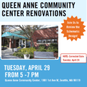
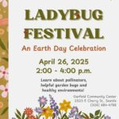
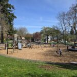
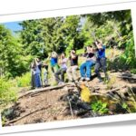
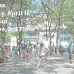
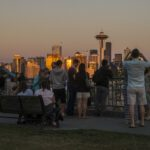
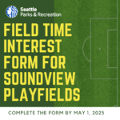
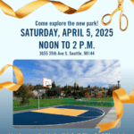
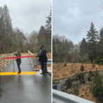
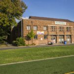

  [Parkways](http://parkways.seattle.gov)  [Seattle Parks and Recreation](https://seattle.gov/parks)  

 *  [Home](http://parkways.seattle.gov) 
 * Topics
 * 
 Search Search 

## Find Posts By Topic

 *  [Events](https://parkways.seattle.gov/category/events) 
 *  [Fun and Wellness](https://parkways.seattle.gov/category/fun-and-wellness) 
 *  [Nature and the Environment](https://parkways.seattle.gov/category/nature-and-the-environment) 
 *  [Planning and Policies](https://parkways.seattle.gov/category/planning-and-policies) 
 *  [Projects and Improvements](https://parkways.seattle.gov/category/projects-and-improvements) 
 *  [Public Input](https://parkways.seattle.gov/category/public-input) 
 *  [Recreation Classes and Activities](https://parkways.seattle.gov/category/recreation-classes-and-activities) 
 *  [Service Updates](https://parkways.seattle.gov/category/service-updates) 
    

##  [Queen Anne Community Center Open House](https://parkways.seattle.gov/2025/04/10/queen-anne-community-center-open-house) 

 April 10, 2025 

Join us! Tuesday, April 29 Seattle Parks and Recreation invites the community to an Open House to review the schematic design for the Queen Anne Community Center Renovation.  Please join us on Tuesday, April 29 at the Queen Anne Community Center, 1901 1st Ave. W. from 5 to 7 p.m. … [[ Keep reading ]](https://parkways.seattle.gov/2025/04/10/queen-anne-community-center-open-house) 

 Filed Under: [Parkways](https://parkways.seattle.gov/category/parkways)     

##  [2025 Earth Month Events & Activities with Seattle Parks and Recreation](https://parkways.seattle.gov/2025/04/06/2025-earth-month-events-activities-with-seattle-parks-and-recreation) 

 April 6, 2025 

Join Seattle Parks and Recreation (SPR) and our partners to celebrate Earth Month! Whether you want to volunteer, learn, or simply spend time outdoors, we’ve outlined a variety of activities and events below for every Earth enthusiast. If you’re interested in additional volunteer opportunities, check out Green Seattle Partnership for… [[ Keep reading ]](https://parkways.seattle.gov/2025/04/06/2025-earth-month-events-activities-with-seattle-parks-and-recreation) 

 Filed Under: [Parkways](https://parkways.seattle.gov/category/parkways)     

##  [Salmon Bay Park Play Area Renovation Opens!](https://parkways.seattle.gov/2025/04/04/salmon-bay-park-play-area-renovation-opens) 

 April 4, 2025 

Join us for a Ribbon Cutting Celebration on April 27! Seattle Parks and Recreation (SPR) is excited to announce the reopening of the Salmon Bay Park play area, located at 2001 NW Canoe Place, Seattle, WA 98117. The fencing at the site came down on Friday, April 4, officially opening… [[ Keep reading ]](https://parkways.seattle.gov/2025/04/04/salmon-bay-park-play-area-renovation-opens) 

 Filed Under: [Parkways](https://parkways.seattle.gov/category/parkways)     

##  [Don’t miss out on Seattle Parks Natural History Courses!](https://parkways.seattle.gov/2025/04/03/dont-miss-out-on-seattle-parks-natural-history-courses) 

 April 3, 2025 

Curious about the natural world? Would you like to learn more about the habitats of Seattle Parks? Delve into bird watching in the Pacific Northwest, exploring the intertidal zone, learn about forests and meadow habitats, watersheds and the wildlife that depend on these unique urban spaces. These intensive multi day… [[ Keep reading ]](https://parkways.seattle.gov/2025/04/03/dont-miss-out-on-seattle-parks-natural-history-courses) 

 Filed Under: [Parkways](https://parkways.seattle.gov/category/parkways)     

##  [Learn about the Westlake Park Improvements](https://parkways.seattle.gov/2025/04/02/learn-about-the-westlake-park-improvements) 

 April 2, 2025 

Seattle Parks and Recreation, in collaboration with Seattle Parks Foundation, is hosting an open house to share information on the park improvements at Westlake Park. Join us on Wednesday, April 16, 2025, in the Seaboard Building (1500 4th Avenue, 3rd Floor) from 4:30 pm to 6:30 pm. The April 16… [[ Keep reading ]](https://parkways.seattle.gov/2025/04/02/learn-about-the-westlake-park-improvements) 

 Filed Under: [Parkways](https://parkways.seattle.gov/category/parkways)     

##  [Park Proposed Operating Hour Modifications](https://parkways.seattle.gov/2025/04/02/park-proposed-operating-hour-modifications) 

 April 2, 2025 

Public Input and Public Hearing The Seattle Board of Parks and Recreation Commissioners (BPRC) is taking public input on proposed operating hours modifications for select Seattle Parks and Recreation parks and boat ramps. Community members can provide oral comments at the BPRC public hearing on Thursday, April 10, beginning at… [[ Keep reading ]](https://parkways.seattle.gov/2025/04/02/park-proposed-operating-hour-modifications) 

 Filed Under: [Parkways](https://parkways.seattle.gov/category/parkways)     

##  [New Field Time Opportunities Coming to Soundview Playfield ](https://parkways.seattle.gov/2025/04/02/new-field-time-opportunities-coming-to-soundview-playfield) 

 April 2, 2025 

Seattle Parks and Recreation (SPR) is excited to be moving the capital improvement project at Soundview Playfields forward. This project transforms Fields 1 and 2 from natural grass to synthetic turf, unlocking additional field time for the community. SPR is committed to equitably distributing field time, with a particular focus… [[ Keep reading ]](https://parkways.seattle.gov/2025/04/02/new-field-time-opportunities-coming-to-soundview-playfield) 

 Filed Under: [Parkways](https://parkways.seattle.gov/category/parkways)     

##  [New Cheryl Chow Park Opens in Rainier Valley ](https://parkways.seattle.gov/2025/03/31/new-cheryl-chow-park-opens-in-rainier-valley) 

 March 31, 2025 

Community Ribbon Cutting Celebration April 5 Seattle Parks and Recreation is excited to announce Cheryl Chow Park is open and  invites the community to celebrate the new 1.2 acre park in Rainier Valley at 3640 35th Ave. S. Seattle WA 98144 on Saturday, April 5 from noon to 2 p.m…. [[ Keep reading ]](https://parkways.seattle.gov/2025/03/31/new-cheryl-chow-park-opens-in-rainier-valley) 

 Filed Under: [Parkways](https://parkways.seattle.gov/category/parkways)     

##  [Willow Creek Fish Passage Restoration Project](https://parkways.seattle.gov/2025/03/28/willow-creek-fish-passage-restoration-project) 

 March 28, 2025 

Seattle Department of Transportation in collaboration with Seattle Parks and Recreation hosted a ribbon cutting event for the opening of the Willow Creek Fish Passage Restoration Project on Thursday, March 27 at 4 p.m. The project is located at 2510 NE 100th St. in northeast Seattle. The project is designed… [[ Keep reading ]](https://parkways.seattle.gov/2025/03/28/willow-creek-fish-passage-restoration-project) 

 Filed Under: [Parkways](https://parkways.seattle.gov/category/parkways)     

##  [Worth the Wait: Update on West Seattle’s Hiawatha Community Center Reopening Acceleration Plan](https://parkways.seattle.gov/2025/03/25/worth-the-wait-update-on-west-seattles-hiawatha-community-center) 

 March 25, 2025 

Councilmember Rob Saka (District 1) and Seattle Parks and Recreation Superintendent AP Diaz would like to provide some updates to the West Seattle community on the status of projects happening at Hiawatha Community Center and Playfield. Hiawatha Community Center construction is progressing and is set to continue through 2025, with an… [[ Keep reading ]](https://parkways.seattle.gov/2025/03/25/worth-the-wait-update-on-west-seattles-hiawatha-community-center) 

 Filed Under: [Parkways](https://parkways.seattle.gov/category/parkways)  

 *  [1](https://parkways.seattle.gov) 
 *  [2](https://parkways.seattle.gov/page/2) 
 *  [3](https://parkways.seattle.gov/page/3) 
 * …
 *  [246](https://parkways.seattle.gov/page/246) 
 *  [Next](https://parkways.seattle.gov/page/2) 

## Popular Tags

 *  [Press Releases](https://parkways.seattle.gov/tag/press-releases) 
 *  [Park District](https://parkways.seattle.gov/tag/park-district) 
 *  [COVID-19](https://parkways.seattle.gov/tag/covid-19) 
 *  [Volunteer](https://parkways.seattle.gov/tag/volunteer) 
 *  [Environment and Sustainability](https://parkways.seattle.gov/tag/environment-and-sustainability) 

#### Browse the Archive

 Choose a Month  April 2025  (7)  March 2025  (14)  February 2025  (19)  January 2025  (9)  December 2024  (10)  November 2024  (25)  October 2024  (22)  September 2024  (15)  August 2024  (13)  July 2024  (21)  June 2024  (19)  May 2024  (22)  April 2024  (27)  March 2024  (23)  February 2024  (20)  January 2024  (16)  December 2023  (17)  November 2023  (19)  October 2023  (21)  September 2023  (20)  August 2023  (25)  July 2023  (23)  June 2023  (20)  May 2023  (16)  April 2023  (9)  March 2023  (17)  February 2023  (5)  January 2023  (8)  December 2022  (10)  November 2022  (15)  October 2022  (22)  September 2022  (19)  August 2022  (13)  July 2022  (24)  June 2022  (17)  May 2022  (19)  April 2022  (11)  March 2022  (16)  February 2022  (8)  January 2022  (13)  December 2021  (12)  November 2021  (10)  October 2021  (6)  September 2021  (9)  August 2021  (8)  July 2021  (19)  June 2021  (20)  May 2021  (15)  April 2021  (16)  March 2021  (17)  February 2021  (16)  January 2021  (12)  December 2020  (9)  November 2020  (11)  October 2020  (12)  September 2020  (21)  August 2020  (15)  July 2020  (13)  June 2020  (16)  May 2020  (18)  April 2020  (11)  March 2020  (19)  February 2020  (20)  January 2020  (17)  December 2019  (29)  November 2019  (24)  October 2019  (16)  September 2019  (25)  August 2019  (26)  July 2019  (24)  June 2019  (36)  May 2019  (19)  April 2019  (18)  March 2019  (25)  February 2019  (31)  January 2019  (22)  December 2018  (17)  November 2018  (22)  October 2018  (37)  September 2018  (27)  August 2018  (34)  July 2018  (22)  June 2018  (34)  May 2018  (34)  April 2018  (24)  March 2018  (30)  February 2018  (21)  January 2018  (26)  December 2017  (24)  November 2017  (18)  October 2017  (17)  September 2017  (13)  August 2017  (16)  July 2017  (15)  June 2017  (25)  May 2017  (33)  April 2017  (21)  March 2017  (24)  February 2017  (21)  January 2017  (21)  December 2016  (23)  November 2016  (17)  October 2016  (28)  September 2016  (23)  August 2016  (27)  July 2016  (27)  June 2016  (31)  May 2016  (27)  April 2016  (15)  March 2016  (18)  February 2016  (19)  January 2016  (23)  December 2015  (14)  November 2015  (18)  October 2015  (19)  September 2015  (28)  August 2015  (28)  July 2015  (34)  June 2015  (38)  May 2015  (26)  April 2015  (29)  March 2015  (27)  February 2015  (16)  January 2015  (19) All Seattle.gov Blogs 

### Animals

 *  [The Scoop](https://thescoop.seattle.gov) 

### Assistance

 *  [Human Interests](https://humaninterests.seattle.gov) 

### For Businesses

 *  [The Bottom Line](https://bottomline.seattle.gov) 
 *  [The Buy Line](https://thebuyline.seattle.gov) 
 *  [Consultant Connection](https://consultants.seattle.gov) 
 *  [Finance and Administrative Services](https://fasblog.seattle.gov) 

### Civil Rights

 *  [Civil Rights Now](https://ocr.seattle.gov) 

### Elected Officials

 *  [Office of the Mayor](https://harrell.seattle.gov) 
 *  [Seattle City Council Blog](https://council.seattle.gov) 
 *  [Joy Hollingsworth](https://hollingsworth.seattle.gov) 
 *  [Bob Kettle](https://kettle.seattle.gov) 
 *  [Cathy Moore](https://moore.seattle.gov) 
 *  [Sara Nelson](https://nelson.seattle.gov) 
 *  [Alexis Mercedes Rinck](https://council.seattle.gov/rinck) 
 *  [Maritza Rivera](https://rivera.seattle.gov) 
 *  [Rob Saka](https://saka.seattle.gov) 
 *  [Mark Solomon](https://council.seattle.gov/solomon) 
 *  [Dan Strauss](https://strauss.seattle.gov) 

### Explore the City

 *  [Art Beat](https://artbeat.seattle.gov) 
 *  [Parkways](https://parkways.seattle.gov) 
 *  [Take 21](https://take21.seattlechannel.org) 
 *  [Center Spotlight](https://centerspotlight.seattle.gov) 
 *  [News.Seattle.gov](https://news.seattle.gov) 

### Get Involved

 *  [Front Porch](https://frontporch.seattle.gov) 

### Immigrants and Refugees

 *  [Welcoming Seattle](https://welcoming.seattle.gov) 

### Issues and Initiatives

 *  [At Home](https://housing.seattle.gov) 
 *  [Greenspace](https://greenspace.seattle.gov) 
 *  [Innovation Hub](https://innovation-hub.seattle.gov) 

### Learning and Education

 *  [What's the DEEL?](https://education.seattle.gov) 

### Public Safety

 *  [Alert Seattle](https://alert.seattle.gov) 
 *  [Fire Line](https://fireline.seattle.gov) 
 *  [SPD Blotter](https://spdblotter.seattle.gov) 

### Transportation and Development

 *  [Building Connections](https://buildingconnections.seattle.gov) 
 *  [Daily Plan It](https://dailyplanit.seattle.gov) 
 *  [Seattle Department of Transportation (SDOT)](https://sdotblog.seattle.gov) 

### Technology

 *  [TechTalk](https://techtalk.seattle.gov) 

### Utilities

 *  [Powerlines](https://powerlines.seattle.gov) 
 *  [At Your Service](https://atyourservice.seattle.gov) 

Seattle Parks and Recreation promotes healthy people, a healthy environment, and strong communities.

## Policies

  [About Our Digital Properties](http://www.seattle.gov/digital)   [Privacy Policy](http://www.seattle.gov/tech/initiatives/privacy/about-the-privacy-program)   [ADA Notice](http://www.seattle.gov/americans-with-disabilities-act)  7ads6x98y    Original text Rate this translation Your feedback will be used to help improve Google Translate 