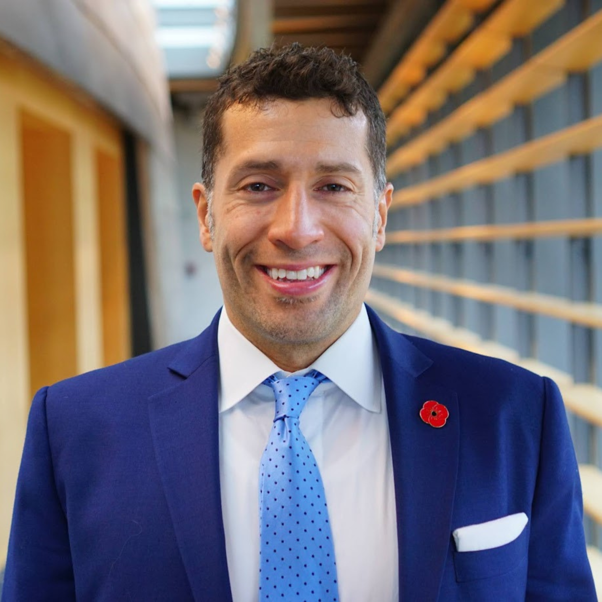

          This is an official government website. Here's how you know  __Official websites use.gov__ 

Website addresses ending in.gov belong to official government organizations in the United States.  __Secure.gov websites use HTTPS__ 

A lock () or https:// means you've safely connected to the.gov website. Only share sensitive information on official, secure websites.  [Skip to main content](https://seattle.gov/council/kettle#content)   [Seattle]()     English 

 *  [English]() 
 *  [Español]() 
 *  [繁體中文]() 
 *  [简体中文]() 
 *  [Tiếng Việt]() 
 *  [Af-Soomaali]() 
 *  [Tagalog]() 
 *  [한국어]() 
 *  [አማርኛ]() 
 *  [русский язык]() 
 *  [日本語]() 
 *  [ትግርኛ]() 
 *  [Oromiffa]() 
 *  [हिन्दी]() 
 *  [Français]() 
 *  [Українська]() 
 *  [ภาษาไทย]() 
 *  [ភាសាខ្មែរ]() 
 *  [ພາສາລາວ]() 
 *  [ਪੰਜਾਬੀ]() 
 *  [عربى]() 
     [Select Language​▼](https://seattle.gov/council/kettle)  Search Pay or Apply Menu Google Translate may not accurately translate all content. [Read disclaimer]().

For general City questions, please call [206-684-2489](). Tell us your requested language in English, and we can connect you with an interpreter. Es posible que Google Translate no traduzca con precisión todo el contenido. [Lea el descargo de responsabilidad]().

Si necesita ayuda en otro idioma, díganos en inglés nombre del idioma que necesita y lo conectaremos con un intérprete: [206-684-2489]()  Google 翻譯可能無法準確翻譯所有內容。 [閱讀免責聲明]() 。

如果您需要翻譯，請用英語説出您所需要的語言，我們將爲你連接口譯員: [206-684-2489]()  Google 翻译可能无法准确翻译所有内容。 [阅读免责声明]() 。

如果您需要翻译，请用英语说出您所需要的语言，我们将为你连接口译员: [206-684-2489]()  Google Dịch có thể không dịch chính xác tất cả nội dung. [Đọc tuyên bố từ chối trách nhiệm]().

Nếu quý vị cần hỗ trợ về ngôn ngữ, xin vui lòng cho chúng tôi biết ngôn ngữ quý vị cần hỗ trợ bằng tiếng Anh (ví dụ “Vietnamese”), chúng tôi sẽ kết nối quý vị với một thông dịch viên: [206-684-2489]()  Google Translate не может точно перевести весь контент. [Прочтите отказ от ответственности]().

Если вам нужна языковая помощь, сообщите нам на английском, какой язык вам нужен, и мы свяжем вас с переводчиком: [206-684-2489]()  Google Translate ayaan si sax ah u turjumi karin dhammaan waxyaabaha ku jira. [Akhri afeef]().

Haddii aad u baahan tahay caawimaad luqadeed, fadlan noogu sheeg Ingiriisiga luqadda aad u baahan tahay, ka dib waxaan kugu xiri doonnaa turjubaan: [206-684-2489]()  የጉግል ትርጉም ሁሉንም ይዘቶች በትክክል መተርጎም ላይችል ይችላል። [ማስተባበያ አንብብ]() ፡፡

ኣስተርጓሚ ካስፈለግዎ የሚፈልጉትን ቋንቋ በእንግልዝኛ ይንገሩን፣ ከኣስተርጓሚ እናገናኝዎታለን። [206-684-2489]()  구글은 정확하게 모든 내용을 번역하지 않을 수 있습니다 번역. [읽기 면책 조항]().

언어지원이 필요한 경우, 필요한 언어를 영어로 말씀해 주시면 통역사와 연결해 드리겠습니다: [206-684-2489]()  Maaaring hindi tumpak na isalin ng Google Translate ang lahat ng nilalaman. [Basahin ang disclaimer]().

Para sa mga pangkalahatang katanungan sa Lungsod, mangyaring tawagan ang [206-684-2489](). Sabihin sa amin ang hiniling mong wika sa Ingles, at maikokonekta ka namin sa isang interpreter. Google Translate อาจแปลเนื้อหาทั้งหมดไม่ถูกต้อง [อ่านข้อจำกัดความรับผิดชอบ]() 

สำหรับคำถามทั่วไปเกี่ยวกับเมืองโปรดโทร [206-684-2489]() บอกภาษาที่คุณต้องการเป็นภาษาอังกฤษและเราสามารถติดต่อคุณกับล่ามได้ Google 翻訳は、すべてのコンテンツを正確に翻訳するとは限りません. [免責事項をお読みください]() 。

市の一般的な質問については [206-684-2489]() に電話してください。ご希望の言語を英語で教えていただければ、通訳をご案内いたします。 កម្មវិធីបកប្រែហ្គូហ្គោលមិនអាចបកប្រែមាតិកាទាំងអស់បានត្រឹមត្រូវទេ។ [អានការបដិសេធ។]() 

សម្រាប់សំណួរទូទៅរបស់ទីក្រុងសូមទូរស័ព្ទមក [206-684-2489]() ។ ប្រាប់យើងពីភាសាដែលអ្នកស្នើសុំជាភាសាអង់គ្លេសហើយយើងអាចភ្ជាប់អ្នកជាមួយអ្នកបកប្រែភាសា។ Google Translate ອາດຈະບໍ່ແປເນື້ອຫາທັງ ໝົດ ຢ່າງຖືກຕ້ອງ. [ອ່ານປະຕິເສດ]().

ສຳ ລັບ ຄຳ ຖາມທົ່ວໄປຂອງເມືອງ, ກະລຸນາໂທຫາ [206-684-2489](). ບອກພວກເຮົາເປັນພາສາອັງກິດທີ່ທ່ານຮ້ອງຂໍ, ແລະພວກເຮົາສາມາດເຊື່ອມຕໍ່ທ່ານກັບນາຍແປພາສາ. Перекладач Google може не точно перекласти весь вміст. [Прочитайте застереження]().

За загальними запитаннями про місто, будь ласка, телефонуйте [206-684-2489](). Розкажіть нам про вашу мову англійською мовою, і ми можемо зв’язати вас із перекладачем. Google Traduction peut ne pas traduire correctement tout le contenu. [Lisez la clause de non-responsabilité]().

Pour des questions générales sur la ville, veuillez appeler le [206-684-2489](). Dites-nous votre langue souhaitée en anglais, et nous pourrons vous mettre en contact avec un interprète. قد لا تترجم خدمة "ترجمة Google" كل المحتوى بدقة. [قراءة إخلاء المسؤولية]().

للأسئلة العامة حول المدينة ، يرجى الاتصال [206-684-2489](). أخبرنا بلغتك المطلوبة باللغة الإنجليزية ، ويمكننا توصيلك بمترجم فوري. हो सकता है कि Google अनुवाद सभी सामग्री का सटीक अनुवाद न करे. [अस्वीकरण पढ़ें]().

सामान्य शहर के प्रश्नों के लिए, कृपया कॉल करें [206-684-2489]() । हमें अंग्रेजी में अपनी अनुरोधित भाषा बताएं, और हम आपको एक दुभाषिया से जोड़ सकते हैं। Google Translate qabiyyee hunda sirritti hiikuu dhiisuu danda'a. [Itti gaafatamummaa ofirraa ittisuu dubbisaa]().

Gaaffii waliigalaa Magaalaa yoo qabaattan bilbilaa [206-684-2489](). Afaan Ingiliffaan isin gaafattan nuuf himaa, nama afaan hiiku waliin isin wal qunnamsiisuu dandeenya. ਹੋ ਸਕਦਾ ਹੈ ਕਿ Google ਅਨੁਵਾਦ ਸਾਰੀ ਸਮੱਗਰੀ ਦਾ ਸਹੀ ਅਨੁਵਾਦ ਨਾ ਕਰੇ। [ਬੇਦਾਅਵਾ ਪੜ੍ਹੋ]().

ਸਿਟੀ ਦੇ ਆਮ ਸਵਾਲਾਂ ਲਈ, ਕਿਰਪਾ ਕਰਕੇ ਕਾਲ ਕਰੋ [206-684-2489]() । ਸਾਨੂੰ ਆਪਣੀ ਬੇਨਤੀ ਕੀਤੀ ਭਾਸ਼ਾ ਅੰਗਰੇਜ਼ੀ ਵਿੱਚ ਦੱਸੋ, ਅਤੇ ਅਸੀਂ ਤੁਹਾਨੂੰ ਦੁਭਾਸ਼ੀਏ ਨਾਲ ਜੋੜ ਸਕਦੇ ਹਾਂ। Google Translate ንኹሉ ትሕዝቶ ብትኽክል ከይትርጉሞ ይኽእል እዩ። [ሓላፍነት ምውሳድ ኣንብብ]() ።

ንሓፈሻዊ ሕቶታት ከተማ ክትድውሉ ትኽእሉ ኢኹም። [206-684-2489]() ። ዝሓተትኩሞ ቋንቋ ብእንግሊዝኛ ንገሩና፡ ምስ ተርጓሚ ከነራኽበኩም ንኽእል ኢና።  [Continue]()  [Cancel]()  

 * Close
 * 
   *  Main Menu 
   *  [Council](https://seattle.gov/council/council) 
   *  [Meet the Council](https://seattle.gov/council/meet-the-council) 
     *  [Newsletter Signup](https://seattle.gov/council/meet-the-council/newsletter-signup) 
     *  [Find Your District and Councilmembers](https://seattle.gov/council/meet-the-council/find-your-district-and-councilmembers) 
     *  [Visiting City Hall](https://seattle.gov/council/meet-the-council/visiting-city-hall) 
     *  [Visitor Sign In Sheets](https://seattle.gov/council/meet-the-council/visitor-sign-in-sheets) 
     *  [Rob Saka](https://seattle.gov/council/saka) 
       *  [About Councilmember Rob Saka](https://seattle.gov/council/meet-the-council/rob-saka/about-rob) 
       *  [Councilmember Rob Saka's Staff](https://seattle.gov/council/meet-the-council/rob-saka/staff) 
       *  [Rob's Committees & Calendar](https://seattle.gov/council/meet-the-council/rob-saka/committees-and-calendar) 
       *  [Request a Meeting](https://forms.office.com/Pages/ResponsePage.aspx?id=RR7meOtrCUCPmTWdi1T0G4F4Xp8Qwp1Jlw6kY-dCCslUOVM0MEExWTNVT0dJQkU5TExHS0FMNjlHTi4u) 
       *  [Newsletter Archives](https://us12.campaign-archive.com/home/?u=11a79978ca7225050bfabf7ad&id=026c7aa0f5) 
       *  [Newsletter Sign Up](https://seattle.us12.list-manage.com/subscribe?u=11a79978ca7225050bfabf7ad&id=026c7aa0f5) 
       *  [Rob's Blog](https://saka.seattle.gov) 
     *  [Mark Solomon](https://seattle.gov/council/solomon) 
       *  [Councilmember Mark Solomon's Staff](https://seattle.gov/council/meet-the-council/mark-solomon/staff) 
       *  [Mark's Committees & Calendar](https://seattle.gov/council/meet-the-council/mark-solomon/committees-and-calendar) 
       *  [Newsletter Archive](https://us12.campaign-archive.com/home/?u=11a79978ca7225050bfabf7ad&id=e205296124) 
       *  [Newsletter Sign Up](https://seattle.us12.list-manage.com/subscribe?u=11a79978ca7225050bfabf7ad&id=e205296124) 
       *  [Mark's Blog](https://council.seattle.gov/solomon) 
       *  [About Councilmember Mark Solomon](https://seattle.gov/council/meet-the-council/mark-solomon/about-mark) 
     *  [Joy Hollingsworth](https://seattle.gov/council/hollingsworth) 
       *  [About Councilmember Joy Hollingsworth](https://seattle.gov/council/meet-the-council/joy-hollingsworth/about-joy) 
       *  [Councilmember Joy Hollingsworth's Staff](https://seattle.gov/council/meet-the-council/joy-hollingsworth/staff) 
       *  [Joy's Committees & Calendar](https://seattle.gov/council/meet-the-council/joy-hollingsworth/committees-and-calendar) 
       *  [Newsletter Archive](https://us12.campaign-archive.com/home/?u=11a79978ca7225050bfabf7ad&id=95e60b79b0) 
       *  [Newsletter Sign Up](https://seattle.us12.list-manage.com/subscribe?u=11a79978ca7225050bfabf7ad&id=95e60b79b0) 
       *  [Joy's Blog](https://hollingsworth.seattle.gov) 
     *  [Maritza Rivera](https://seattle.gov/council/rivera) 
       *  [About Councilmember Maritza Rivera](https://seattle.gov/council/meet-the-council/maritza-rivera/about-maritza) 
       *  [Councilmember Maritza Rivera's Staff](https://seattle.gov/council/meet-the-council/maritza-rivera/staff) 
       *  [Maritza's Committees & Calendar](https://seattle.gov/council/meet-the-council/maritza-rivera/committees-and-calendar) 
       *  [News Releases](https://seattle.gov/council/meet-the-council/maritza-rivera/news-releases) 
       *  [Newsletter Archive](https://us12.campaign-archive.com/home/?u=11a79978ca7225050bfabf7ad&id=307be6bfce) 
       *  [Newsletter Sign Up](https://seattle.us12.list-manage.com/subscribe?u=11a79978ca7225050bfabf7ad&id=307be6bfce) 
       *  [Maritza's Blog](https://rivera.seattle.gov) 
     *  [Cathy Moore](https://seattle.gov/council/moore) 
       *  [About Councilmember Cathy Moore](https://seattle.gov/council/meet-the-council/cathy-moore/about-cathy) 
       *  [Councilmember Cathy Moore's Staff](https://seattle.gov/council/meet-the-council/cathy-moore/staff) 
       *  [Cathy's Committees & Calendar](https://seattle.gov/council/meet-the-council/cathy-moore/committees-and-calendar) 
       *  [Request a Meeting](https://outlook.office365.com/owa/calendar/CouncilmemberCathyMooreDistrict5@seattlegov.onmicrosoft.com/bookings) 
       *  [Newsletter Archive](https://us12.campaign-archive.com/home/?u=11a79978ca7225050bfabf7ad&id=75c0562362) 
       *  [Newsletter Sign Up](https://seattle.us12.list-manage.com/subscribe?u=11a79978ca7225050bfabf7ad&id=75c0562362) 
       *  [Cathy's Blog](https://moore.seattle.gov) 
     *  [Dan Strauss](https://seattle.gov/council/strauss) 
       *  [About Councilmember Dan Strauss](https://seattle.gov/council/meet-the-council/dan-strauss/about-dan) 
       *  [Councilmember Dan Strauss' Staff](https://seattle.gov/council/meet-the-council/dan-strauss/staff) 
       *  [Dan's Committees & Calendar](https://seattle.gov/council/meet-the-council/dan-strauss/committees-and-calendar) 
       *  [Request a Meeting](https://outlook.office365.com/book/OfficeofCouncilmemberDanStraussOfficeHours@seattle.gov) 
       *  [District 6 Town Halls](https://seattle.gov/council/meet-the-council/dan-strauss/district-6-town-halls) 
       *  [Newsletter Archive](https://us12.campaign-archive.com/home/?u=11a79978ca7225050bfabf7ad&id=d57b26f739) 
       *  [Newsletter Sign Up](https://seattle.us12.list-manage.com/subscribe?u=11a79978ca7225050bfabf7ad&id=d57b26f739) 
       *  [Video Updates](https://seattle.gov/council/meet-the-council/dan-strauss/video-updates) 
       *  [Dan's Blog](http://strauss.seattle.gov) 
     *  [Robert Kettle](https://seattle.gov/council/kettle) 
       *  [About Councilmember Robert Kettle](https://seattle.gov/council/meet-the-council/robert-kettle/about-robert) 
       *  [Councilmember Robert Kettle's Staff](https://seattle.gov/council/meet-the-council/robert-kettle/staff) 
       *  [Robert's Committees & Calendar](https://seattle.gov/council/meet-the-council/robert-kettle/committees-and-calendar) 
       *  [Newsletter Archive](https://us12.campaign-archive.com/home/?u=11a79978ca7225050bfabf7ad&id=689952e8cd) 
       *  [Newsletter Sign Up](https://seattle.us12.list-manage.com/subscribe?u=11a79978ca7225050bfabf7ad&id=689952e8cd) 
       *  [Request a Meeting](https://outlook.office365.com/book/CMKettleTeamMeetings@seattlegov.onmicrosoft.com/s/_G0Y_al2iEi-8DdMN9h-yg2) 
       *  [Robert's Blog](https://kettle.seattle.gov) 
       *  [Good Governance Pledge](https://seattle.gov/council/meet-the-council/robert-kettle/good-governance-pledge) 
     *  [Alexis Mercedes Rinck](https://seattle.gov/council/rinck) 
       *  [About Councilmember Alexis Mercedes Rinck](https://seattle.gov/council/meet-the-council/alexis-mercedes-rinck/about-alexis) 
       *  [Councilmember Alexis Mercedes Rinck's Staff](https://seattle.gov/council/meet-the-council/alexis-mercedes-rinck/staff) 
       *  [Alexis' Committees & Calendar](https://seattle.gov/council/meet-the-council/alexis-mercedes-rinck/committees-and-calendar) 
       *  [Newsletter Archive](https://us12.campaign-archive.com/home/?u=11a79978ca7225050bfabf7ad&id=f60af58778) 
       *  [Newsletter Sign Up](https://eepurl.com/i47iEs) 
       *  [Alexis' Blog](https://council.seattle.gov/rinck) 
       *  [Protecting our community from changes at the federal level](https://seattle.gov/council/meet-the-council/alexis-mercedes-rinck/federal-changes-and-city-protections) 
     *  [Sara Nelson](https://seattle.gov/council/meet-the-council/sara-nelson) 
       *  [About Councilmember Sara Nelson](https://seattle.gov/council/meet-the-council/sara-nelson/about-sara) 
       *  [Councilmember Sara Nelson's Staff](https://seattle.gov/council/meet-the-council/sara-nelson/staff) 
       *  [Drug Possession and Public Use Legislation](https://seattle.gov/council/meet-the-council/sara-nelson/drug-possession-and-public-use-legislation) 
       *  [Seattle Film Commission](https://seattle.gov/council/meet-the-council/sara-nelson/seattle-film-commission) 
       *  [Helping Small Businesses](https://seattle.gov/council/meet-the-council/sara-nelson/helping-small-businesses) 
       *  [Sara's Committees & Calendar](https://seattle.gov/council/meet-the-council/sara-nelson/committees-and-calendar) 
       *  [Newsletter Sign Up](https://seattle.us12.list-manage.com/subscribe?u=11a79978ca7225050bfabf7ad&id=974e33336d) 
       *  [Sara's Newsletters](https://us12.campaign-archive.com/home/?u=11a79978ca7225050bfabf7ad&id=974e33336d) 
       *  [Sara's Blog](https://nelson.seattle.gov) 
       *  [News Releases](https://seattle.gov/council/meet-the-council/sara-nelson/news-releases) 
   *  [Current Issues](https://seattle.gov/council/issues) 
   *  [News](https://seattle.gov/council/news) 
     *  [Seattle Channel Videos](http://www.seattlechannel.org/CityCouncil) 
     *  [Request a List of Names](https://seattle.gov/documents/Departments/Council/SignIn/ListOfNamesDeclaration.pdf) 
   *  [Committees and Agendas](https://seattle.gov/council/committees) 
     *  [Committees](https://seattle.gov/x60873.xml) 
       *  [Select Committee on the Families, Education, Preschool, and Promise (FEPP) Levy](https://seattle.gov/council/committees/fepp-levy) 
       *  [Select Committee on Federal Administration and Policy Changes](https://seattle.gov/council/committees/select-committee-on-federal-administration-and-policy-changes) 
       *  [Select Committee on the Comprehensive Plan](https://seattle.gov/council/committees/select-committee-on-the-comprehensive-plan) 
       *  [Select Budget Committee](https://seattle.gov/council/committees/select-budget-committee) 
         *  [Mayor's 2023-2024 Proposed Budget](https://www.seattle.gov/city-budget-office/budget-archives/2023-2024-proposed-budget) 
         *  [Mayor's 2023-2028 Proposed Capital Improvement Program](https://www.seattle.gov/city-budget-office/capital-improvement-program-archives/2023-2028-proposed-cip) 
         *  [Budget Glossary of Terms](https://seattle.gov/council/committees/select-budget-committee/glossary-of-terms) 
       *  [Budget](https://seattle.gov/x11967.xml) 
       *  [Select Committee on Citywide Mandatory Housing Affordability](https://seattle.gov/council/committees/citywidemha) 
         *  [Citywide MHA Amendments](https://seattle.gov/council/committees/citywidemha/citywide-mha-amendments) 
       *  [Finance, Native Communities & Tribal Governments](https://seattle.gov/council/committees/finance-native-communities-and-tribal-governments) 
       *  [Governance, Accountability & Economic Development](https://seattle.gov/council/committees/governance-accountability-and-economic-development) 
       *  [Housing & Human Services](https://seattle.gov/council/committees/housing-and-human-services) 
       *  [Land Use](https://seattle.gov/council/committees/land-use) 
       *  [Libraries, Education & Neighborhoods](https://seattle.gov/council/committees/libraries-education-and-neighborhoods) 
       *  [Parks, Public Utilities & Technology](https://seattle.gov/council/committees/parks-public-utilities-and-technology) 
       *  [Public Safety](https://seattle.gov/council/committees/public-safety) 
       *  [Sustainability, City Light, Arts & Culture](https://seattle.gov/council/committees/sustainability-city-light-arts-and-culture) 
       *  [Transportation](https://seattle.gov/council/committees/transportation) 
       *  [Select Committee on the 2024 Transportation Levy](https://seattle.gov/council/committees/select-committee-on-the-2024-transportation-levy) 
       *  [Select Labor Committee for 2024-25](https://seattle.gov/council/committees/select-labor-committee-for-2024-25) 
       *  [2024 Select Budget Committee](https://seattle.gov/council/committees/2024-select-budget-committee) 
     *  [Agenda Sign Up](https://seattle.gov/council/committees/agenda-sign-up) 
     *  [Public Comment](https://seattle.gov/council/committees/public-comment) 
   *  [Legislation & Research](https://seattle.gov/council/legislation-and-research) 
     *  [Legislative Process Guide](https://seattle.gov/council/cityclerk/agendas-and-legislative-resources) 
     *  [Council Agendas](https://seattle.legistar.com/Calendar.aspx) 
     *  [Seattle Municipal Code (SMC)](http://clerk.seattle.gov/~public/code1.htm) 
     *  [Council Rules](http://clerk.seattle.gov/search/council-rules) 
     *  [City Charter](http://clerk.seattle.gov/~public/char1.htm) 
     *  [City Clerk](https://seattle.gov/council/cityclerk) 
   *  [Calendar](https://seattle.gov/council/calendar) 
   *  [Watch Council Live](https://seattle.gov/council/watch-council-live) 
   *  [Elected Officials](https://seattle.gov/elected-officials) 
   *  [Departments](https://seattle.gov/departments) 
   *  [News.Seattle.Gov](https://news.seattle.gov) 
   *  [Events](https://seattle.gov/event-calendar) 

  [Seattle City Council](https://seattle.gov/council/council)  

 *  [Meet the Council](https://seattle.gov/council/council/meet-the-council) 
 *  [Issues](https://seattle.gov/council/council/issues) 
 *  [News](https://seattle.gov/council/council/news) 
 *  [Committees](https://seattle.gov/council/council/committees) 
 *  [Legislation & Research](https://seattle.gov/council/council/legislation-and-research) 
 *  [Calendar](https://seattle.gov/council/council/calendar) 
    [Home](https://seattle.gov/council/council)  [Meet the Council](https://seattle.gov/council/council/meet-the-council)  

#  Robert Kettle 

 *  [Welcome](https://seattle.gov/council/kettle#welcome) 
 *  [Staff](https://seattle.gov/council/kettle#p_section1) 
 *  [Calendar](https://seattle.gov/council/kettle#p_section2) 

Welcome!

I am honored to serve as your District 7 Councilmember and to represent the diverse neighborhoods of District 7: Magnolia, Queen Anne, Uptown, Westlake, Interbay, Eastlake, South Lake Union, Belltown, and Downtown.

I know that Seattle is home to people of every imaginable background, and whether you’re a born-and-raised Seattleite or a transplant, I am dedicated to making Seattle a city and a home not just for us, right now, but for generations to come. That means placing a renewed and dedicated focus on our District’s and City’s public safety, reducing the permissive environment, expanding public health, and securing the future of the Port of Seattle to keep it a working, viable port for the next 100 years – one that can serve Seattle, the region, and the nation.

My priorities as your Councilmember are to focus on our greatest challenges, right now: public safety, public health, and homelessness. I will strive to have an office that responds to constituents and directly addresses your needs. As stated in my Good Governance Pledge, "I will strive to represent and listen to all of my constituents, and I will prioritize fulfilling my oversight responsibilities over city departments to make sure that they are delivering results. I will work hard to create good policy based on proven evidence-based programs and studies to best meet the needs of the city and the district."

 Receive Updates from Councilmember Robert Kettle

### Contact Us

 Phone: [(206) 684-8807]()  Email:Robert.Kettle@seattle.gov Address: [Office](https://seattle.gov/council/kettle#tileOffice)  |  [Mailing](https://seattle.gov/council/kettle#tileMailing)   __Street Address:__ 

Seattle City Hall

600 Fourth Avenue

2nd Floor

Seattle, WA 98104

  __Mailing Address:__ 

PO Box 34025

Seattle, WA 98124-4025  [See All Members](https://seattle.gov/council/council/meet-the-council) 

 *   [Newsletter Signup](https://seattle.gov/council/meet-the-council/newsletter-signup)  
 *   [Find Your District and Councilmembers](https://seattle.gov/council/meet-the-council/find-your-district-and-councilmembers)  
 *   [Visiting City Hall](https://seattle.gov/council/meet-the-council/visiting-city-hall)  
 *   [Visitor Sign In Sheets](https://seattle.gov/council/meet-the-council/visitor-sign-in-sheets)  
 *   [Rob Saka](https://seattle.gov/council/saka)  Toggle children of Rob Saka 
   *   [About Rob](https://seattle.gov/council/meet-the-council/rob-saka/about-rob)  
   *   [Staff](https://seattle.gov/council/meet-the-council/rob-saka/staff)  
   *   [Committees & Calendar](https://seattle.gov/council/meet-the-council/rob-saka/committees-and-calendar)  
   *   [Request a Meeting](https://forms.office.com/Pages/ResponsePage.aspx?id=RR7meOtrCUCPmTWdi1T0G4F4Xp8Qwp1Jlw6kY-dCCslUOVM0MEExWTNVT0dJQkU5TExHS0FMNjlHTi4u)  
   *   [Newsletter Archives](https://us12.campaign-archive.com/home/?u=11a79978ca7225050bfabf7ad&id=026c7aa0f5)  
   *   [Newsletter Sign Up](https://seattle.us12.list-manage.com/subscribe?u=11a79978ca7225050bfabf7ad&id=026c7aa0f5)  
   *   [Rob's Blog](https://saka.seattle.gov)  
 *   [Mark Solomon](https://seattle.gov/council/solomon)  Toggle children of Mark Solomon 
   *   [Staff](https://seattle.gov/council/meet-the-council/mark-solomon/staff)  
   *   [Committees & Calendar](https://seattle.gov/council/meet-the-council/mark-solomon/committees-and-calendar)  
   *   [Newsletter Archive](https://us12.campaign-archive.com/home/?u=11a79978ca7225050bfabf7ad&id=e205296124)  
   *   [Newsletter Sign Up](https://seattle.us12.list-manage.com/subscribe?u=11a79978ca7225050bfabf7ad&id=e205296124)  
   *   [Mark's Blog](https://council.seattle.gov/solomon)  
   *   [About Mark](https://seattle.gov/council/meet-the-council/mark-solomon/about-mark)  
 *   [Joy Hollingsworth](https://seattle.gov/council/hollingsworth)  Toggle children of Joy Hollingsworth 
   *   [About Joy](https://seattle.gov/council/meet-the-council/joy-hollingsworth/about-joy)  
   *   [Staff](https://seattle.gov/council/meet-the-council/joy-hollingsworth/staff)  
   *   [Committees & Calendar](https://seattle.gov/council/meet-the-council/joy-hollingsworth/committees-and-calendar)  
   *   [Newsletter Archive](https://us12.campaign-archive.com/home/?u=11a79978ca7225050bfabf7ad&id=95e60b79b0)  
   *   [Newsletter Sign Up](https://seattle.us12.list-manage.com/subscribe?u=11a79978ca7225050bfabf7ad&id=95e60b79b0)  
   *   [Joy's Blog](https://hollingsworth.seattle.gov)  
 *   [Maritza Rivera](https://seattle.gov/council/rivera)  Toggle children of Maritza Rivera 
   *   [About Maritza](https://seattle.gov/council/meet-the-council/maritza-rivera/about-maritza)  
   *   [Staff](https://seattle.gov/council/meet-the-council/maritza-rivera/staff)  
   *   [Committees & Calendar](https://seattle.gov/council/meet-the-council/maritza-rivera/committees-and-calendar)  
   *   [News Releases](https://seattle.gov/council/meet-the-council/maritza-rivera/news-releases)  
   *   [Newsletter Archive](https://us12.campaign-archive.com/home/?u=11a79978ca7225050bfabf7ad&id=307be6bfce)  
   *   [Newsletter Sign Up](https://seattle.us12.list-manage.com/subscribe?u=11a79978ca7225050bfabf7ad&id=307be6bfce)  
   *   [Maritza's Blog](https://rivera.seattle.gov)  
 *   [Cathy Moore](https://seattle.gov/council/moore)  Toggle children of Cathy Moore 
   *   [About Cathy](https://seattle.gov/council/meet-the-council/cathy-moore/about-cathy)  
   *   [Staff](https://seattle.gov/council/meet-the-council/cathy-moore/staff)  
   *   [Committees & Calendar](https://seattle.gov/council/meet-the-council/cathy-moore/committees-and-calendar)  
   *   [Request a Meeting](https://outlook.office365.com/owa/calendar/CouncilmemberCathyMooreDistrict5@seattlegov.onmicrosoft.com/bookings)  
   *   [Newsletter Archive](https://us12.campaign-archive.com/home/?u=11a79978ca7225050bfabf7ad&id=75c0562362)  
   *   [Newsletter Sign Up](https://seattle.us12.list-manage.com/subscribe?u=11a79978ca7225050bfabf7ad&id=75c0562362)  
   *   [Cathy's Blog](https://moore.seattle.gov)  
 *   [Dan Strauss](https://seattle.gov/council/strauss)  Toggle children of Dan Strauss 
   *   [About Dan](https://seattle.gov/council/meet-the-council/dan-strauss/about-dan)  
   *   [Staff](https://seattle.gov/council/meet-the-council/dan-strauss/staff)  
   *   [Committees & Calendar](https://seattle.gov/council/meet-the-council/dan-strauss/committees-and-calendar)  
   *   [Request a Meeting](https://outlook.office365.com/book/OfficeofCouncilmemberDanStraussOfficeHours@seattle.gov)  
   *   [District 6 Town Halls](https://seattle.gov/council/meet-the-council/dan-strauss/district-6-town-halls)  
   *   [Newsletter Archive](https://us12.campaign-archive.com/home/?u=11a79978ca7225050bfabf7ad&id=d57b26f739)  
   *   [Newsletter Sign Up](https://seattle.us12.list-manage.com/subscribe?u=11a79978ca7225050bfabf7ad&id=d57b26f739)  
   *   [Video Updates](https://seattle.gov/council/meet-the-council/dan-strauss/video-updates)  
   *   [Dan's Blog](http://strauss.seattle.gov)  
 *   [Robert Kettle](https://seattle.gov/council/kettle)  Toggle children of Robert Kettle 
   *   [About Robert](https://seattle.gov/council/meet-the-council/robert-kettle/about-robert)  
   *   [Staff](https://seattle.gov/council/meet-the-council/robert-kettle/staff)  
   *   [Committees & Calendar](https://seattle.gov/council/meet-the-council/robert-kettle/committees-and-calendar)  
   *   [Newsletter Archive](https://us12.campaign-archive.com/home/?u=11a79978ca7225050bfabf7ad&id=689952e8cd)  
   *   [Newsletter Sign Up](https://seattle.us12.list-manage.com/subscribe?u=11a79978ca7225050bfabf7ad&id=689952e8cd)  
   *   [Request a Meeting](https://outlook.office365.com/book/CMKettleTeamMeetings@seattlegov.onmicrosoft.com/s/_G0Y_al2iEi-8DdMN9h-yg2)  
   *   [Robert's Blog](https://kettle.seattle.gov)  
   *   [Good Governance Pledge](https://seattle.gov/council/meet-the-council/robert-kettle/good-governance-pledge)  
 *   [Alexis Mercedes Rinck](https://seattle.gov/council/rinck)  Toggle children of Alexis Mercedes Rinck 
   *   [About Alexis](https://seattle.gov/council/meet-the-council/alexis-mercedes-rinck/about-alexis)  
   *   [Staff](https://seattle.gov/council/meet-the-council/alexis-mercedes-rinck/staff)  
   *   [Committees & Calendar](https://seattle.gov/council/meet-the-council/alexis-mercedes-rinck/committees-and-calendar)  
   *   [Newsletter Archive](https://us12.campaign-archive.com/home/?u=11a79978ca7225050bfabf7ad&id=f60af58778)  
   *   [Newsletter Sign Up](https://eepurl.com/i47iEs)  
   *   [Alexis' Blog](https://council.seattle.gov/rinck)  
   *   [Federal Changes and City Protections](https://seattle.gov/council/meet-the-council/alexis-mercedes-rinck/federal-changes-and-city-protections)  
 *   [Sara Nelson](https://seattle.gov/council/meet-the-council/sara-nelson)  Toggle children of Sara Nelson 
   *   [About Sara](https://seattle.gov/council/meet-the-council/sara-nelson/about-sara)  
   *   [Staff](https://seattle.gov/council/meet-the-council/sara-nelson/staff)  
   *   [Drug Possession and Public Use Legislation](https://seattle.gov/council/meet-the-council/sara-nelson/drug-possession-and-public-use-legislation)  
   *   [Seattle Film Commission](https://seattle.gov/council/meet-the-council/sara-nelson/seattle-film-commission)  
   *   [Helping Small Businesses](https://seattle.gov/council/meet-the-council/sara-nelson/helping-small-businesses)  
   *   [Committees & Calendar](https://seattle.gov/council/meet-the-council/sara-nelson/committees-and-calendar)  
   *   [Newsletter Sign Up](https://seattle.us12.list-manage.com/subscribe?u=11a79978ca7225050bfabf7ad&id=974e33336d)  
   *   [Sara's Newsletters](https://us12.campaign-archive.com/home/?u=11a79978ca7225050bfabf7ad&id=974e33336d)  
   *   [Sara's Blog](https://nelson.seattle.gov)  
   *   [News Releases](https://seattle.gov/council/meet-the-council/sara-nelson/news-releases)  

## Staff

    

### Robert Kettle

Bob Kettle is a career Naval Officer with leadership and management experience in naval, joint service, interagency, and multinational assignments supporting U.S. interests in Europe, Asia, and Africa. Bob has been a leader over the past decade within veteran service and non-profit organizations. He has served on the board of the Queen Anne Community Council, where he stood up and chaired its Public Safety Committee, and was also a board member of the World Affairs Council.

  [About Robert](https://seattle.gov/council/council/meet-the-council/robert-kettle/about-robert)   [### Steve SmithChief of Staff](https://seattle.gov/council/council/meet-the-council/robert-kettle/staff#SteveSmith)   [### Brent LoPolicy Director](https://seattle.gov/council/council/meet-the-council/robert-kettle/staff#BrentLo)   [### Rebecca DuranExecutive Aide and District Director of Constituent Affairs](https://seattle.gov/council/council/meet-the-council/robert-kettle/staff#RebeccaDuran)   [Staff](https://seattle.gov/council/council/meet-the-council/robert-kettle/staff)  

## Calendar

  [### Committees & Calendar](https://seattle.gov/council/council/meet-the-council/robert-kettle/committees-and-calendar)   [### Agenda Sign Up](https://seattle.gov/council/council/committees/agenda-sign-up)     

## Policies

  [About Our Digital Properties](https://seattle.gov/council/about-our-digital-properties)   [Privacy Policy](https://seattle.gov/council/tech/data-privacy/privacy-statement)   [Title II: Americans with Disabilities Act](https://seattle.gov/council/americans-with-disabilities-act)   [Title VI: Civil Rights Act](https://seattle.gov/council/civilrights/laws-we-enforce/title-vi-civil-rights-act)   [Sitemap](https://www.seattle.gov/sitemap)     Original text Rate this translation Your feedback will be used to help improve Google Translate 