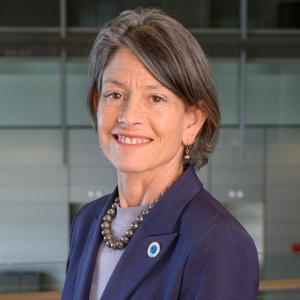

 

  [Seattle City Council](https://seattle.gov/council/meet-the-council/council)  

 *  [Meet the Council](https://seattle.gov/council/meet-the-council/council/meet-the-council) 
 *  [Issues](https://seattle.gov/council/meet-the-council/council/issues) 
 *  [News](https://seattle.gov/council/meet-the-council/council/news) 
 *  [Committees](https://seattle.gov/council/meet-the-council/council/committees) 
 *  [Legislation & Research](https://seattle.gov/council/meet-the-council/council/legislation-and-research) 
 *  [Calendar](https://seattle.gov/council/meet-the-council/council/calendar) 
    [Home](https://seattle.gov/council/meet-the-council/council)  [Meet the Council](https://seattle.gov/council/meet-the-council/council/meet-the-council)  

# Find Your District and Councilmembers

 Search 2024 Council Districts Loading... We couldn't find that Seattle address. Please try again. 

# Your District and Councilmembers

  [Email Your Three Councilmembers](mailto:Rob.Saka@seattle.gov;AlexisMercedes.Rinck@seattle.gov;Sara.Nelson@seattle.gov)  Your Council District: District 0 Important 

Your Council District is changing in 2024.

***

 Current District 1 District in 2024 0 District Councilmember Rob Saka    District 1 West Seattle, South Park, Georgetown, SODO, and Pioneer Square  [Email Rob Saka](mailto:Rob.Saka@seattle.gov)  [Rob Saka's Website](https://www.seattle.gov/council/saka)  [206-684-8801]()  Citywide Councilmember Alexis Mercedes Rinck    Position 8 Citywide  [Email Alexis Mercedes Rinck](mailto:AlexisMercedes.Rinck@seattle.gov)  [Alexis Mercedes Rinck's Website](https://www.seattle.gov/council/rinck)  [206-684-8808]()  Citywide Councilmember Sara Nelson    Position 9 Citywide  [Email Sara Nelson](mailto:Sara.Nelson@seattle.gov)  [Sara Nelson's Website](https://www.seattle.gov/x134233.xml)  [206-684-8809]()  

## City Council

 Address:  [600 Fourth Ave. 2nd Floor, Seattle, WA, 98104](https://www.google.com/maps/place/600%2520Fourth%2520Ave.%25202nd%2520Floor,%2520Seattle,%2520WA,%252098104) 

 Mailing Address: PO Box 34025, Seattle, WA , 98124-4025

 Phone:  [(206) 684-8888]() 

 Phone Alt: Listen Line: [(206) 684-8566]() 

 Fax:  [(206) 684-8587]() 

 [Meet the Council](https://seattle.gov/council/meet-the-council/council/meet-the-council) 

          

## Citywide Information

 *  [Elected Officials](https://seattle.gov/council/meet-the-council/elected-officials) 
 *  [Open Data Portal](https://data.seattle.gov) 
 *  [Public Records](https://seattle.gov/council/meet-the-council/public-records) 
 *  [City Holidays and Closures](https://seattle.gov/council/meet-the-council/holidays-and-closures) 

 *  [City News Feed](https://news.seattle.gov) 
 *  [City Event Calendar](https://seattle.gov/council/meet-the-council/event-calendar) 
 *  [All City Newsletters](https://public.govdelivery.com/accounts/WASEATTLE/subscriber/topics?qsp=CODE_RED) 
 *  [View the Departments & Agencies List](https://seattle.gov/council/meet-the-council/departments) 

### Popular Pages

 1.  [Meet The Council](https://seattle.gov/council/meet-the-council/council/meet-the-council) 
 1.  [Watch Council Meetings Live](https://seattle.gov/council/meet-the-council/council/watch-council-live) 
 1.  [Learn About Council Committees](https://seattle.gov/council/meet-the-council/council/committees) 
 1.  [Find Your District and Councilmembers](https://seattle.gov/council/meet-the-council/council/meet-the-council/find-your-district-and-councilmembers) 
 1.  [View a Calendar of Upcoming Meetings](https://seattle.gov/council/meet-the-council/council/calendar) 

The Seattle City Council establishes City policy through enactment of ordinances (laws) and adoption of resolutions. The City Council also approves and adopts the City's budget. The nine Council members and their legislative assistants are part of the City of Seattle Legislative Department.

## Policies

  [About Our Digital Properties](https://seattle.gov/council/meet-the-council/about-our-digital-properties)   [Privacy Policy](https://seattle.gov/council/meet-the-council/tech/data-privacy/privacy-statement)   [Title II: Americans with Disabilities Act](https://seattle.gov/council/meet-the-council/americans-with-disabilities-act)   [Title VI: Civil Rights Act](https://seattle.gov/council/meet-the-council/civilrights/laws-we-enforce/title-vi-civil-rights-act)   [Sitemap](https://www.seattle.gov/sitemap)     Original text Rate this translation Your feedback will be used to help improve Google Translate 