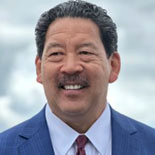

 

# Elected Officials

  [Bruce HarrellMayor](https://seattle.gov/mayor)  

## Council Members (Legislative)

## Council Members (Legislative)

  [Rob SakaCouncilmember

District 1](https://seattle.gov/council/saka)   [Mark SolomonCouncilmember

District 2](https://seattle.gov/council/solomon)   [Joy HollingsworthCouncilmember

District 3](https://seattle.gov/council/hollingsworth)   [Maritza RiveraCouncilmember

District 4](https://seattle.gov/council/rivera)   [Cathy MooreCouncilmember

District 5](https://seattle.gov/council/moore)   [Dan StraussCouncilmember

District 6](https://seattle.gov/council/strauss)   [Bob KettleCouncilmember

District 7](https://seattle.gov/council/kettle)   [Alexis Mercedes RinckCouncilmember

Position 8](https://seattle.gov/council/rinck)   [Sara NelsonCouncilmember

Position 9](https://seattle.gov/council/meet-the-council/sara-nelson)   [Meet the Council](https://seattle.gov/council/meet-the-council)  

## Law

## Law

  [Ann DavisonCity Attorney](https://seattle.gov/cityattorney)  

## Judicial

## Judicial

  [Anita Crawford-WillisPresiding Judge](https://seattle.gov/courts/about/seattle-municipal-court-judges/honorable-anita-crawford-willis)   [Damon ShadidAssistant Presiding Judge](https://seattle.gov/courts/about/seattle-municipal-court-judges/honorable-damon-shadid)   [Faye ChessJudge](https://seattle.gov/courts/about/seattle-municipal-court-judges/honorable-faye-chess)   [Andrea ChinJudge](https://seattle.gov/courts/about/seattle-municipal-court-judges/honorable-andrea-chin)   [Willie GregoryJudge](https://seattle.gov/courts/about/seattle-municipal-court-judges/honorable-willie-gregory)   [Catherine McDowallJudge](https://seattle.gov/courts/about/seattle-municipal-court-judges/honorable-catherine-mcdowall)   [Pooja VaddadiJudge](https://seattle.gov/courts/about/seattle-municipal-court-judges/honorable-pooja-vaddadi)   [Seattle Municipal CourtGeneral Information](https://seattle.gov/courts)  

 *   [Departments](https://seattle.gov/departments)  
 *   [Elected Officials](https://seattle.gov/elected-officials)  Toggle children of Elected Officials 
   *   [2012-2023 Websites of Elected Officials](https://seattle.gov/elected-officials/2012-2023-websites-of-elected-officials)  
 *   [Boards & Commissions](https://seattle.gov/boards-and-commissions)  Toggle children of Boards & Commissions 
   *   [Meeting Calendar](https://seattle.gov/boards-and-commissions/calendar)  
 *   [Media Contacts](https://seattle.gov/media-contacts)  
 *   [Holidays and Closures](https://seattle.gov/holidays-and-closures)  
 No left sidebar 

 *  [About Seattle](https://seattle.gov/opcd/population-and-demographics/about-seattle) 
 *  [Downtown Campus Map](https://seattle.gov/customer-service-bureau/downtown-campus-map) 
 *  [City Jobs](https://www.governmentjobs.com/careers/seattle) 
 *  [Seattle Facts](https://seattle.gov/cityarchives/seattle-facts) 

## Contact Us

  [Customer Service Bureau](https://seattle.gov/customer-service-bureau)  Phone:  [(206) 684-2489]()  Address:  [City Hall, 600 Fourth Ave. Seattle, WA 98104](https://www.google.com/maps/place/Seattle+City+Hall/47.6038466,-122.3322341,17z/data=!3m1!4b1!4m5!3m4!1s0x54906ab0a0d78d55:0xad777eeba185ebef!8m2!3d47.603843!4d-122.3300454)   [City Hall, 600 Fourth Ave.Seattle, WA 98104](https://www.google.com/maps/place/Seattle+City+Hall/47.6038466,-122.3322341,17z/data=!3m1!4b1!4m5!3m4!1s0x54906ab0a0d78d55:0xad777eeba185ebef!8m2!3d47.603843!4d-122.3300454)          [Customer Service Centers](https://seattle.gov/customer-service-centers)  Report a Problem About...

 *  [Get the Find It, Fix it Mobile App](https://seattle.gov/customer-service-bureau/find-it-fix-it-mobile-app) 
 *  [Abandoned Vehicles](https://seattle-cwiprod.motorolasolutions.com/cwi/direct/ABANDVEH) 
 *  [Animals and Pets](https://seattle.gov/animal-shelter/animal-control) 
 *  [Clogged Street Drains](https://seattle.gov/utilities/your-services/sewer-and-drainage/side-sewers) 
 *  [Damaged Sidewalks](https://seattle.gov/transportation/projects-and-programs/programs/maintenance-and-paving/sidewalk-repair-program) 
 *  [Graffiti](https://seattle.gov/police/need-help/neighborhood-issues/graffiti) 
 *  [Overgrown Trees or Bushes](https://seattle.gov/sdci/codes/common-code-questions/weedsand-overgrown-vegetation) 
 *  [Police](https://seattle.gov/opa/complaints/file-a-complaint) 
 *  [Potholes](https://seattle.gov/transportation/projects-and-programs/programs/maintenance-and-paving/potholes) 
 *  [Property or Buildings](https://seattle.gov/sdci/codes) 
 *  [Signals or Signs](https://seattle.gov/transportation/permits-and-services/report-a-problem) 
 *  [Junk Storage or Dumping](https://seattle.gov/sdci/codes/common-code-questions/junk-storage-and-illegal-dumping-rules) 
 *  [See Full List of Issues](https://seattle-cwiprod.motorolasolutions.com/cwi/select) 

## Citywide Information

 *  [Elected Officials](https://seattle.gov/elected-officials) 
 *  [Open Data Portal](https://data.seattle.gov) 
 *  [Public Records](https://seattle.gov/public-records) 
 *  [City Holidays and Closures](https://seattle.gov/holidays-and-closures) 

 *  [City News Feed](https://news.seattle.gov) 
 *  [City Event Calendar](https://seattle.gov/event-calendar) 
 *  [All City Newsletters](https://public.govdelivery.com/accounts/WASEATTLE/subscriber/topics?qsp=CODE_RED) 
 *  [View the Departments & Agencies List](https://seattle.gov/departments) 

### Popular Pages

 1.  [Power Outages](https://seattle.gov/city-light/outages) 
 1.  [Police Jobs](https://seattle.gov/police/police-jobs) 
 1.  [Pay My Ticket](https://seattle.gov/courts/tickets-and-payments/pay-my-ticket) 
 1.  [Adopt a Pet](https://seattle.gov/animal-shelter/find-an-animal/adopt) 
 1.  [Utility Bills & Payments](https://seattle.gov/utilities/your-services/accounts-and-payments/bills-and-payments) 

## Policies

  [About Our Digital Properties](https://seattle.gov/about-our-digital-properties)   [Privacy Policy](https://seattle.gov/tech/data-privacy/privacy-statement)   [Title II: Americans with Disabilities Act](https://seattle.gov/americans-with-disabilities-act)   [Title VI: Civil Rights Act](https://seattle.gov/civilrights/laws-we-enforce/title-vi-civil-rights-act)   [Sitemap](https://www.seattle.gov/sitemap)     Original text Rate this translation Your feedback will be used to help improve Google Translate 