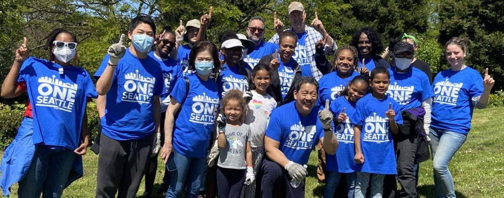

 

  [Office of the Mayor](https://seattle.gov/mayor/one-seattle-initiatives/mayor)  

 *  [One Seattle Initiatives](https://seattle.gov/mayor/one-seattle-initiatives/mayor/one-seattle-initiatives) 
 *  [Contact](https://seattle.gov/mayor/one-seattle-initiatives/mayor/contact) 
 *  [Mayor's Team](https://seattle.gov/mayor/one-seattle-initiatives/mayor/team) 
 *  [About the Mayor](https://seattle.gov/mayor/one-seattle-initiatives/mayor/about) 
    [Home](https://seattle.gov/mayor/one-seattle-initiatives/mayor)  [One Seattle Initiatives](https://seattle.gov/mayor/one-seattle-initiatives/mayor/one-seattle-initiatives)  

# One Seattle Day of Service

 The One Seattle Day of Service is a citywide day of volunteerism to give back and take action to improve the city we love.    

## Volunteer Opportunities

The * __One Seattle Day of Service__* turns the values behind Mayor Harrell’s vision for One Seattle – inclusion, collaboration, cooperation, and service – into shared action and improvement for our City.

On __Saturday, July 12th, 2025__ we will again invite thousands of Seattleites to spend one day serving one another, just under one year out from the FIFA World Cup!

The event is an invitation to every neighbor to roll up their sleeves, come together, and give back with volunteer opportunities in each neighborhood across the city.

Joining together with a diverse group of of public, private, and non-profit partners and organizations, the City will offer a wide array of service opportunities including cleaning and beautification, gardening and restoration, helping neighbors in need, and more.

Stay tuned for more information for 2025.

  

  

## Volunteer Resources

 [Volunteer Safety Handbook](https://seattle.gov/mayor/one-seattle-initiatives/documents/Departments/Mayor/One%2520Seattle%2520Initiatives/Day%2520of%2520Service/Handbook_SafetyGuidelines.pdf) 

## Related Information

 [Explore ongoing City volunteer opportunities](https://seattle.gov/get-involved) 

 *  [About Seattle](https://seattle.gov/mayor/one-seattle-initiatives/opcd/population-and-demographics/about-seattle) 
 *  [Downtown Campus Map](https://seattle.gov/mayor/one-seattle-initiatives/customer-service-bureau/downtown-campus-map) 
 *  [City Jobs](https://www.governmentjobs.com/careers/seattle) 
 *  [Seattle Facts](https://seattle.gov/mayor/one-seattle-initiatives/cityarchives/seattle-facts) 

## Mayor Bruce Harrell

 Address:  [600 4th Ave, Seattle, WA, 7th Floor, Seattle, WA, 98104](https://www.google.com/maps/place/600%25204th%2520Ave,%2520Seattle,%2520WA,%25207th%2520Floor,%2520Seattle,%2520WA,%252098104) 

 Mailing Address: P.O. Box 94749, Seattle, WA, 98124-4749

 Phone:  [(206) 684-4000]() 

        

Newsletter Updates

 [Subscribe](https://public.govdelivery.com/accounts/WASEATTLE/subscriber/topics?qsp=WASEATTLE_12) 

Sign up for the latest updates from Mayor Bruce Harrell

## Citywide Information

 *  [Elected Officials](https://seattle.gov/mayor/one-seattle-initiatives/elected-officials) 
 *  [Open Data Portal](https://data.seattle.gov) 
 *  [Public Records](https://seattle.gov/mayor/one-seattle-initiatives/public-records) 
 *  [City Holidays and Closures](https://seattle.gov/mayor/one-seattle-initiatives/holidays-and-closures) 

 *  [City News Feed](https://news.seattle.gov) 
 *  [City Event Calendar](https://seattle.gov/mayor/one-seattle-initiatives/event-calendar) 
 *  [All City Newsletters](https://public.govdelivery.com/accounts/WASEATTLE/subscriber/topics?qsp=CODE_RED) 
 *  [View the Departments & Agencies List](https://seattle.gov/mayor/one-seattle-initiatives/departments) 

### Popular Pages

 1.  [Power Outages](https://seattle.gov/mayor/one-seattle-initiatives/city-light/outages) 
 1.  [Police Jobs](https://seattle.gov/mayor/one-seattle-initiatives/police/police-jobs) 
 1.  [Pay My Ticket](https://seattle.gov/mayor/one-seattle-initiatives/courts/tickets-and-payments/pay-my-ticket) 
 1.  [Adopt a Pet](https://seattle.gov/mayor/one-seattle-initiatives/animal-shelter/find-an-animal/adopt) 
 1.  [Utility Bills & Payments](https://seattle.gov/mayor/one-seattle-initiatives/utilities/your-services/accounts-and-payments/bills-and-payments) 

Seattle's Mayor is the head of the Executive department. The Mayor directs and controls all City offices and departments except where that authority is granted to another office by the City Charter.

## Policies

  [About Our Digital Properties](https://seattle.gov/mayor/one-seattle-initiatives/about-our-digital-properties)   [Privacy Policy](https://seattle.gov/mayor/one-seattle-initiatives/tech/data-privacy/privacy-statement)   [Title II: Americans with Disabilities Act](https://seattle.gov/mayor/one-seattle-initiatives/americans-with-disabilities-act)   [Title VI: Civil Rights Act](https://seattle.gov/mayor/one-seattle-initiatives/civilrights/laws-we-enforce/title-vi-civil-rights-act)   [Sitemap](https://www.seattle.gov/sitemap)     Original text Rate this translation Your feedback will be used to help improve Google Translate 