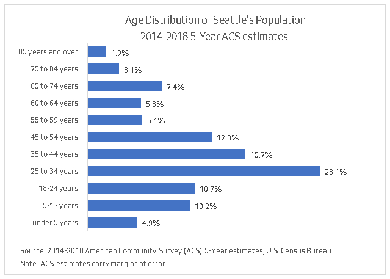
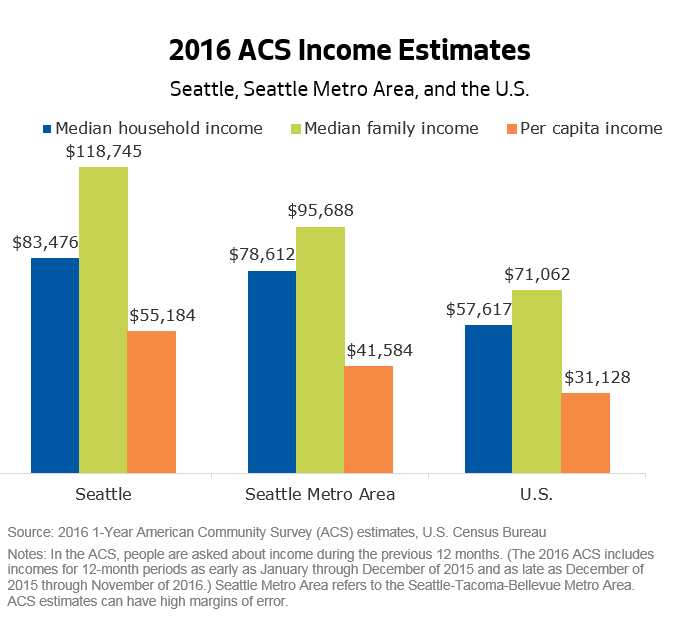
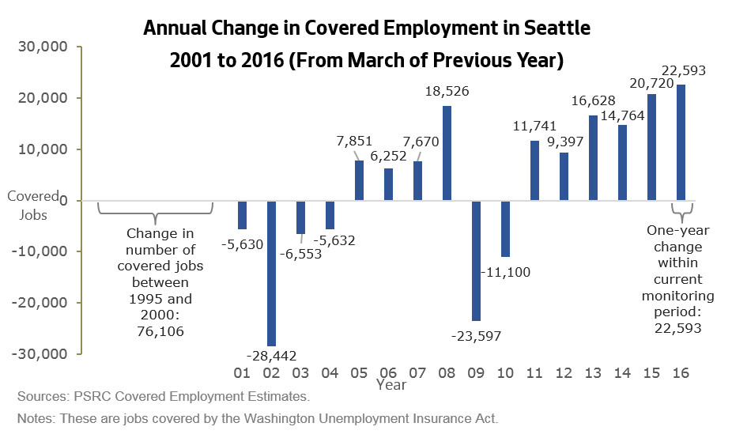
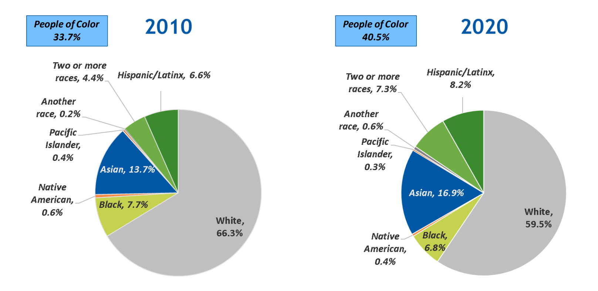

 

  [Office of Planning & Community Development](https://seattle.gov/opcd/population-and-demographics/opcd)  

 *  [About Us](https://seattle.gov/opcd/population-and-demographics/opcd/about-us) 
 *  [Current Projects](https://seattle.gov/opcd/population-and-demographics/opcd/current-projects) 
 *  [Our Stories](https://seattle.gov/opcd/population-and-demographics/opcd/our-stories) 
 *  [Meetings & Events](https://seattle.gov/opcd/population-and-demographics/opcd/meetings-and-events) 
 *  [Population & Demographics](https://seattle.gov/opcd/population-and-demographics/opcd/population-and-demographics) 
 *  [Archived Projects](https://seattle.gov/opcd/population-and-demographics/opcd/vault) 
    [Home](https://seattle.gov/opcd/population-and-demographics/opcd)  [Population & Demographics](https://seattle.gov/opcd/population-and-demographics/opcd/population-and-demographics)  

# About Seattle

 <  [Population]()  [Housing]()  [Prosperity]()  [Race & Ethnicity]()  [Land Use]()  [Neighborhoods]()  

 __Census 2020 Data__ 

On August 12, 2021 the U.S. Census Bureau released the 2020 Census Redistricting Data for states and local communities. This data will include the following statistics at a variety of geographic levels:

 * Population totals
 * Population by race & Hispanic/Latino origin and by broad age group (under 18, 18+)
 * Housing unit counts and occupancy status

Resources include [this short video](https://www.youtube.com/watch?v=O0MhAue2Tuk) and the [News Conference about the Release of 2020 Census Redistricting Data](https://www.census.gov/newsroom/press-releases/2021/news-conference-2020-census-redistricting-data.html). To find the Redistricting Data and information about future releases of more detailed 2020 Census datasets, visit the Bureau's [2020 Census Results](https://www.census.gov/programs-surveys/decennial-census/decade/2020/2020-census-results.html) webpage.

The Census Bureau will be providing tools for the public to access *some* of the Redistricting Data on the release date of August 12. However, the full Redistricting Data file will be released in a legacy technical format that requires analysists to do additional work to extract the data.

We will prepare information and materials to help people access and understand the 2020 Census data and changes since 2010 for Seattle as a whole; and for the city's urban centers and villages, community reporting areas, and council districts. We will provide these materials as they become available.

Some highlights are below. For more details, [visit our Census 2020 page](https://www.seattle.gov/opcd/population-and-demographics/decennial-census).

 __Population & Households Quick Statistics__ 

2020 Census estimates for Seattle from the U.S. Census Bureau - Redistricting Data (August 12, 2021):

 * Population count: 737,015
 * Population under 18 years of age: 106,841
 * Population age 18 and over: 630,174
 * Population of color: 298,847
 * Population in households: 707,097
 * Number of households: 345,627
 * Average household size: 2.05
 * Population in group quarters: 29,918

2010 Census estimates for Seattle from the U.S. Census Bureau:

 * 2010 population count: 608,660
 * Population under 18 years of age: 93,513
 * Population age 18 and over: 515,147
 * Population of color: 205,082
 * Population in households: 583,735
 * Number of households: 283,510
 * Average household size: 2.06
 * Average family size: 2.87
 * Population in group quarters: 24,925

2014-2018 5-year American Community Survey (ACS) estimates on demographic characteristics in Seattle

 * Population: 708,823 (+/- 63)
 * Population in households: 686,262 (+/- 1,122)
 * Number of households: 323,446 (+/- 1,814)
 * Average household size: 2.12 (+/- 0.01)
 * Average family size: 2.85 (+/- 0.02)
 * Population in group quarters: 22,561 (+/- 1,117)

The most up to date American Community Survey  [1-year estimates](https://data.census.gov/cedsci/table?q=seattle%2520city&g=1600000US5363000&hidePreview=false&tid=ACSDP1Y2018.DP05&vintage=2018&layer=VT_2018_160_00_PY_D1&cid=DP05_0001E) and [5-year estimates](https://data.census.gov/cedsci/table?q=seattle%2520city&g=1600000US5363000&hidePreview=false&tid=ACSDP5Y2018.DP05&vintage=2018&layer=VT_2018_160_00_PY_D1&cid=DP05_0001E) about Seattle's residents and households are available on the Census Bureau's new data portal, [data.census.gov](https://data.census.gov/cedsci).  Keep in mind that ACS estimates carry margins of error and are intended to provide an overview of characteristics, not precise counts.

 __Highlights__ 

 * With a population of 737,015 in 2020, Seattle is the 18th most populous city in the U.S. and has the largest population of cities in King County, the broader Seattle-Tacoma-Bellevue Metro Area (itself the 14th largest metro area in the nation), and the state of Washington.
 * Seattle's population grew rapidly between 2010 and 2020:
   * Seattle's 21.1% growth in population between 2010 and 2020 was more than twice the rates of growth the city saw over each of the two preceding decades.
   * Seattle's population growth between 2010 and 2020 was also faster than the 17.5% growth in King County as a whole, 16.8% growth in our broader metro area, 14.6% growth in Washington state, and 7.4% growth in the U.S.
   * Seattle was one of 14 cities in the U.S. that grew by more than 100,000 people in the last decade, as highlighted by the Census Bureau in releasing the 2020 Census Redistricting data:    

  

 *  __Household size: __ Decennial census data show that Seattle has experienced a downward trend in average household size for decades. While American Community Survey (ACS) estimates suggest that this trend reversed during the middle of the past decade, the 2020 Census shows that Seattle's average household size has resumed a downward trajectory. Between the 2010 and 2020 censuses, the average number of people per household in Seattle decreased slightly from 2.06 to 2.05.
 *  __Age distribution: __ The 2020 Census data available thus far include only two broad age categories: children (under 18 years of age) and adults (age 18 and above). Between 2010 and 2020, Seattle's adult population increased more quickly than our child population, continuing a trend seen in previous recent decades. The 2020 Census count for Seattle included 106,841 residents under 18 (about 14.5% of our total population) and 630,174 residents aged 18 and over.
 * The following chart is based on estimates from the 2014-2018 5-year ACS estimates because we do not yet have estimates for detailed age groups from the 2020 Census. As of the 2014-2018 time period, three-quarters of Seattle residents were adults between 18 and 64 years of age, with an especially high and growing concentration of young adults ages 25 to 34. Comparing those ACS estimates to 2010 data indicates that the 65 to 74 age category had the highest growth rate, reflecting aging of the baby boom population.  

  

 __Featured Products__ 

Mapping apps for accessing neighborhood-level data

 *  [Explore the Patterns of People in Seattle and King County](https://seattlecitygis.maps.arcgis.com/apps/MapSeries/index.html?appid=a447494df6e14dbba356963a9442834a) : Use this app to see patterns for variety of population and household characteristics, not just in Seattle, but also in surrounding neighborhoods.
 *  [View data about Seattle's Neighborhoods](http://seattlecitygis.maps.arcgis.com/apps/MapSeries/index.html?appid=bf93420ee86147e9ba6de9cadecfc57e) including neighborhood profiles with population and household characteristics for Council Districts and Community Reporting Areas. (Currently shows the 5-Year ACS data for 2013 to 2017.)
 * Access estimates of [population and housing down to the census tract and block group level](http://seattlecitygis.maps.arcgis.com/apps/webappviewer/index.html?id=0e218f5a70894dddb6f7639aa1c3ba92) from the WA State OFM Small Area Estimates Program and Small Area Demographic Estimates. Includes estimated density and growth.

Census 2010 Reports for Seattle

 *  [Basic Population and Housing Characteristics](https://www.seattle.gov/Documents/Departments/OPCD/Demographics/AboutSeattle/CensusBasicPopulationandHousingCharacteristics.pdf)  from 1990, 2000, and 2010 includes total, occupied, and vacant housing unit count with change between censuses
 *  [Seattle 2010 Census Profile](https://www.seattle.gov/Documents/Departments/OPCD/Demographics/AboutSeattle/2010CensusProfileCityofSeattle.pdf)  with detailed population, household, and housing data

 __Key Data Sources__ 

 [U.S. Census Bureau Data](https://www.census.gov/data.html) 

Two major Census Bureau programs that provide data on housing at a community and neighborhood level are:

 *  [The decennial census](https://www.census.gov/programs-surveys/decennial-census/decade.2020.html)  is done every 10 years to provide counts and basic information about population, households, and housing units. Housing characteristics covered in the census include occupancy and vacancy rates and tenure (owner or renter) for occupied units.
 *  [The American Community Survey](https://www.census.gov/programs-surveys/acs)  (ACS) is a continuous survey that produces estimates on a broad set of population, social, economic, and housing characteristics. Housing topics on the ACS extend beyond those on the decennial census and include type of structure (single-family or multifamily), home value, monthly housing costs, and more.  

The ACS has replaced the long form that used to be part of the decennial Census. Because the ACS is a sample survey, ACS estimates carry margins of error.

 [The Census Bureau's Population Estimates Program](https://www.census.gov/programs-surveys/popest.html)  (PEP) provides estimates for the U.S., states, metropolitan statistical areas, counties, and cities. PEP estimates for Seattle are best used for comparisons with geographies outside Washington state.

 [The Washington State Office of Financial Management](http://www.ofm.wa.gov/pop/default.asp)  __ (OFM)__  __:__ 

 * OFM produces  [official population estimates for cities and towns](http://www.ofm.wa.gov/pop/april1/default.asp)  and produces  [population projections](http://www.ofm.wa.gov/pop/forecasts.asp)  to assist with growth management.
 * OFM's  [Small Area Estimates Program](https://www.ofm.wa.gov/washington-data-research/population-demographics/population-estimates/small-area-estimates-program)  (SAEP) provides small area population and housing estimates.
 * OFM is also the Census Bureau's official  [State Data Center program](https://ofm.wa.gov/washington-data-research/population-demographics/state-data-center-program)  partner for disseminating data in Washington state.

 [The Puget Sound Regional Council](https://www.psrc.org/data-and-resources/data-psrc) 

 * PSRC provides estimates, [forecasts](https://www.psrc.org/projections-cities-and-other-places) , and analysis at a range of geographic scales as part of the work to support planning in the central Puget Sound region. Check out their [Puget Sound Trends bulletins](https://www.psrc.org/puget-sound-trends).

 __Where to Go From Here__ 

 * For a wealth of related information about Seattle, click on the [Housing](https://www.seattle.gov/opcd/population-and-demographics/about-seattle#housing) , [Race & Ethnicity](https://www.seattle.gov/opcd/population-and-demographics/about-seattle#raceethnicity) , and [Prosperity](https://www.seattle.gov/opcd/population-and-demographics/about-seattle#prosperity) tiles on our Population and Demographics homepage.
 * Dig deeper into the data we've compiled from the [decennial Census](https://seattle.gov/opcd/population-and-demographics/decennial-census) and [ACS](https://seattle.gov/opcd/population-and-demographics/american-community-survey) , and get important tips on how to use the data and avoid common pitfalls.
 * Find  [links to related information and resources](http://www.seattle.gov/opcd/population-and-demographics/related-links).
 * See our  [geographic files and maps](http://www.seattle.gov/opcd/population-and-demographics/geographic-files-and-maps)  to check out how characteristics vary by neighborhood, get reference maps, and download associated information.
 * See our  [Neighborhoods page](https://www.seattle.gov/opcd/population-and-demographics/about-seattle#neighborhoods)  to access data and reference maps for different neighborhoods.

 __Housing Quick Statistics__ 

2019 Estimates for Seattle from the WA State Office of Financial Management (OFM) (April 1, 2019 estimates)

 * Total housing units: 367,806
 * Occupied housing units: 351,503
 * Household population: 718,136
 * Group quarters population: 29,114  

2014-2018 5-year American Community Survey (ACS) estimates on housing characteristics in Seattle

 * Total housing units: 344,503 (+/- 1,632)
 * Occupied housing units: 323,446 (+/- 1,814)
 * Owner-occupied housing units: 149,017 (+/- 2,207) (or 46.1 percent)
 * Renter-occupied housing units: 174,429 (+/- 2,393) (or 53.9 percent)
 * Ave. household size in owner-occupied units: 2.40 persons (+/- 0.02)
 * Ave. household size in renter-occupied units: 1.89 persons (+/- 0.02)

More detail on housing characteristics from the ACS [1-year estimates](https://data.census.gov/cedsci/table?q=seattle%2520city%2520DP04&g=1600000US5363000&hidePreview=false&tid=ACSDP1Y2018.DP04&vintage=2018&layer=VT_2018_160_00_PY_D1&cid=DP04_0001E) and [5-year estimates](https://data.census.gov/cedsci/table?q=seattle%2520city%2520DP04&g=1600000US5363000&hidePreview=false&tid=ACSDP5Y2018.DP04&vintage=2018&layer=VT_2018_160_00_PY_D1&cid=DP04_0001E) are available on the Census Bureau's new data portal, [data.census.gov](https://data.census.gov/cedsci). Keep in mind that ACS estimates carry margins of error and are intended to provide estimates related to characteristics rather than official counts.

2010 Census Estimates:

 * Total housing units: 308,516
 * Occupied housing units: 283,510
 * Owner-occupied housing units: 136,362 (48.1 percent)
 * Renter-occupied housing units: 147,148 (51.9 percent)
 * Average household size: 2.06 persons
 * Ave. household size in owner-occupied units: 2.31 persons
 * Ave. household size in renter-occupied units: 1.83 persons

 __Highlights__ 

Housing growth trends: As of 2019, there were 367,806 housing units in Seattle, representing a 19 percent increase since 2010 (according to OFM). The growth in the number of housing units in Seattle from 2010 to 2019 surpassed the 14 percent growth seen between 2000 and 2010.  However, even with the rapid increase this decade, expansion of our housing stock has not kept up with Seattle's population growth of 22 percent between 2010 and 2019.

As King County's largest and densest city, Seattle typically adds housing at a slower pace than the county as a whole.  However, the city has added housing at an accelerating pace each decade since 1960 and outpaced countywide growth (which was about 12%) between 2010 and 2019. 

 *  __Occupied housing units:__ The ACS estimates for the 2014-2018 five-year period show 93.8 percent of an estimated 323,446 total housing units in Seattle as occupied.
 *  __Tenure (owner- and renter-occupancy):__ The 2010 census showed a bit more than half of Seattle's occupied housing units (51.9%) were renter-occupied. In comparison, the five-year ACS estimates for 2014-2018 show 53.9 percent of occupied units as rentals.  The increase in the prevalence of renting since 2010 extends the path of declining homeownership rates that Seattle has been following each decade since 1960.  (This trend was briefly interrupted when homeownership rates in Seattle increased in the 2000s before the Great Recession wiped away those gains.)

Household sizes tend to be larger in owner-occupied housing than in renter-occupied housing. In 2010 there were 2.31 persons per household in Seattle's owner-occupied units compared to 1.83 persons per household in renter-occupied units. Departing from trends in past decades, average household sizes in Seattle increased between the 2010 census and the five years represented in the 2014-2018 ACS. This happened in both owner-occupied and renter-occupied housing. (Average household size went from 2.31 persons to 2.40 persons among owner households and went from 1.83 to 1.89 among renter households). As of the 2014-2018 ACS, owner-occupied units still house more than half of Seattle's overall household population even though these owner-occupied housing units are outnumbered by renter-occupied units.

Housing costs

 * An analysis that weconducted using a special tabulation of 5-year ACS data for 2011-2015 showed that over two-thirds of low-income households in Seattle were cost-burdened, i.e., paying more than 30 percent of their income for housing. Cost burdens are disproportionately shouldered by people of color.  The same data showed that more than a quarter of Black households were paying *over half* of their income for housing.
 * Housing costs have increased. The most recent data we have from the ACS, single-year data shows that the median cost for rent and basic utilities was roughly 35 percent higher in 2018 than it was in the 2011-2015 five-year period-and this is after adjusting for inflation. The run-up in rents has placed more housing outside the reach of low- and moderate-income renters.
 * None of these data reflect the extreme difficulty with paying for housing that many people are having now after being laid off during the new coronavirus pandemic.

Seattle's Comprehensive Plan Growth Strategy

 *  [Seattle's current Comprehensive Plan](https://www.seattle.gov/opcd/ongoing-initiatives/comprehensive-plan) anticipates at least 70,000 housing units citywide over the 20-year planning period from 2015 to 2035. These estimates are based on the city's share of the growth that OFM had previously projected for King County. Seattle's Growth Strategy guides most of the city's growth to urban centers and urban villages.
   * As shown in [the Urban Center / Village Residential Growth Report](https://www.seattle.gov/Documents/Departments/OPCD/Demographics/AboutSeattle/UCUV_Growth_Report.pdf) , Seattle added 34,117 housing units from the beginning of 2016 to the end of 2019.  This represents roughly 49 percent of the 70,000 housing units that the current Comprehensive Plan anticipated for the 20-year planning period ending in 2035.  In addition, more than 20,000 units were in the pipeline (permitted to be built but not yet finished) as of the end of 2019.
   * Our [Urban Village Indicators Monitoring Report](https://www.seattle.gov/Documents/Departments/OPCD/OngoingInitiatives/SeattlesComprehensivePlan/OPCD%2520Comprehensive%2520Plan%2520Urban%2520Village%2520Indicators%2520Monitoring%2520Rpt%25206%252026%25202018%2520w_pg%252047%2520corr.pdf) analyzes additional indicators related to housing growth and affordability and other key aspects of livability to gauge progress in implementing the Comprehensive Plan. We will be analyzing these indicators again to inform the next Comprehensive Plan update.  In the meantime, see our [Monitoring Dashboard](http://seattlecitygis.maps.arcgis.com/apps/opsdashboard/index.html#/e405125f0082485fb250e29c58a48a4c) for regular updates on indicators related to housing growth and employment growth.
   * New growth projections will be incorporated in the next major update of the Comprehensive Plan, which is due in 2024.

 * In partnership with King County, the City is updating the existing [Buildable Lands Report](https://www.kingcounty.gov/~/media/depts/executive/performance-strategy-budget/regional-planning/buildable-lands-report/king-county-buildable-lands-report-2014.ashx?la=en) to support the upcoming update to the Comprehensive Plan.  The report will update the City's development capacity estimates, ensuring that we have room for projected growth in housing and jobs. 

 __Featured Products__ 

New Housing Units in Seattle - Our [Residential Permit Reports mapping app and data portal](https://seattlecitygis.maps.arcgis.com/apps/webappviewer/index.html?id=e4de9798da444df799fd802f6f3fa16b) provides access to handy reports that we update periodically based on our building permit data. The reports available include: 

 * The [Citywide Residential Permits Report](http://seattlecitygis.maps.arcgis.com/sharing/rest/content/items/933d291b4e29490ebb261497436bc41a/data) - this shows the number of permits in recent years-by housing type-for new units and for demolished units. Completed permits are reported by year the permit was finaled.  The report also shows the number of building permits that have been issued.
 * The [Urban Center / Village Residential Growth Report](https://www.seattle.gov/Documents/Departments/OPCD/Demographics/AboutSeattle/UCUV_Growth_Report.pdf) - this shows the net number of housing units added in the city and in individual urban centers and villages during the current Comprehensive Plan planning period.

Mapping apps for accessing neighborhood-level data

 *  [View data about Seattle's Neighborhoods ](http://seattlecitygis.maps.arcgis.com/apps/MapSeries/index.html?appid=bf93420ee86147e9ba6de9cadecfc57e) including neighborhood profiles with housing characteristics for Council Districts and Community Reporting Areas. (Currently shows the 5-Year ACS data 2013-2017.)
 *  [Explore the Patterns of People in Seattle and King County](https://seattlecitygis.maps.arcgis.com/apps/MapSeries/index.html?appid=a447494df6e14dbba356963a9442834a) : Estimates from the 2013-2017 5-Year ACS are presented at the census tract level. Use this app to see patterns related to housing type and other topics.
 * Access estimates of  [population and housing down to the census tract and block group level](http://seattlecitygis.maps.arcgis.com/apps/webappviewer/index.html?id=0e218f5a70894dddb6f7639aa1c3ba92) from the WA State OFM Small Area Estimates Program and Small Area Demographic Estimates. Includes estimated density and growth.

Census 2010 Reports for Seattle

 *  [Basic Population and Housing Characteristics](https://www.seattle.gov/Documents/Departments/OPCD/Demographics/AboutSeattle/CensusBasicPopulationandHousingCharacteristics.pdf)  from 1990, 2000, and 2010 includes total, occupied, and vacant housing unit count with change between censuses.
 *  [Seattle 2010 Census Profile](https://www.seattle.gov/Documents/Departments/OPCD/Demographics/AboutSeattle/2010CensusProfileCityofSeattle.pdf) with detailed population, household, and housing data.

 __Key Data Sources__ 

 [U.S. Census Bureau Data](https://www.census.gov/data.html) - Two major Census Bureau programs that provide data on housing at a community and neighborhood level are:

 *  [The decennial census](https://www.seattle.gov/opcd/population-and-demographics/decennial-census) - done every 10 years to provide counts and basic information about population, households, and housing units. Housing characteristics covered in the census include occupancy and vacancy rates and tenure (owner or renter) for occupied units.

 *  [The American Community Survey](https://www.seattle.gov/opcd/population-and-demographics/american-community-survey) (ACS) - a continuous survey that produces estimates on a broad set of population, social, economic, and housing characteristics. Housing topics on the ACS extend beyond those on the decennial census and include type of structure (single-family or multifamily), home value, monthly housing costs, and more. Because the ACS is a sample survey, ACS estimates carry margins of error.

 [The Census Bureau's Population Estimates Program](https://www.census.gov/programs-surveys/popest.html) (PEP) - provides estimates for the U.S., states, metropolitan statistical areas, counties, and cities. PEP estimates for Seattle are best used for comparisons with geographies outside Washington state.

 [The Washington State Office of Financial Management](http://www.ofm.wa.gov/pop/default.asp) (OFM) - The Office of Financial Management's Forecasting Division compiles [housing data](http://www.ofm.wa.gov/pop/april1/default.asp#housing) as part of its financial and growth management functions.

 [The Puget Sound Regional Council](https://www.psrc.org/data-and-resources/data-psrc) - PSRC provides forecasts and a wealth of data at a range of geographic scales as part of its work to support planning in the region. These data resources include:

 * A [regional forecast](https://www.psrc.org/regional-macroeconomic-forecast) that includes households, persons, jobs, and other variables through the year 2050
 * A set of [Land Use Vision (LUV)](https://www.psrc.org/projections-cities-and-other-places) projections indicating how cities and other areas in the region could grow based on assumptions developed with help from local planners

 __Where to Go from Here__ 

 * Read the [Seattle Comprehensive Plan](https://www.seattle.gov/opcd/ongoing-initiatives/comprehensive-plan) to find out about Seattle's guiding policies for housing and growth management, and see the [Housing Appendix](https://www.seattle.gov/Documents/Departments/OPCD/Demographics/AboutSeattle/CouncilAdopted2016_Appendices.pdf) (page 57 of this pdf) for the detailed analysis of housing needs that informed these policies
 * Learn about the City's [Mandatory Housing Affordability](https://www.seattle.gov/hala/about/mandatory-housing-affordability-(mha)) requirements
 * See the [Evolving Seattle's Growth Strategy](https://www.seattle.gov/Documents/Departments/SeattlePlanningCommission/SPC%2520Growth%2520Strategy%2520White%2520Paper%25201072020(0).pdf) , [Neighborhoods for All Report](https://www.seattle.gov/planningcommission/our-work/neighborhoods-for-all) , and [Family Size Housing](https://www.seattle.gov/Documents/Departments/SeattlePlanningCommission/AffordableHousingAgenda/FamSizePC_dig_final1.pdf) reports from the Planning Commission
 * Learn about how countywide and regional planning policies provide the framework for Seattle's Comprehensive Plan. An update of the [King County Countywide Planning Policies](https://www.kingcounty.gov/depts/executive/performance-strategy-budget/regional-planning/CPPs.aspx) is being prepared and is scheduled for adoption by [Growth Management Planning Council](https://www.kingcounty.gov/depts/executive/performance-strategy-budget/regional-planning/Growth-Management/GMPC/MeetingInfo.aspx) in December of 2020 and [Vision 2050](https://www.psrc.org/vision) , a an extension of the current Vision 2040 regional plan is (as of April 2020) awaiting final review and adoption by PSRC's Executive Board.
 * Go to the Seattle [Office of Housing](https://www.seattle.gov/housing) (OH) website to learn housing programs dedicated to serving low-income households.  Visit their [data and reports](https://www.seattle.gov/housing/data-and-reports) webpage and see the [Affordable Housing Dashboard](https://www.seattle.gov/housing/underdevelopment) to explore information about income- and rent-restricted affordable homes under development.
 * Read the 2017 [Assessment of Fair Housing](https://www.seattle.gov/Documents/Departments/HumanServices/CDBG/2017%2520AFH%2520Final.4.25.17V2.pdf) prepared jointly by the City and the Seattle Housing Authority and see other documents related to [Consolidated Plan for Housing and Community Development](https://www.seattle.gov/humanservices/funding-and-reports/cdbg-funding-and-reports) 
 * Check out [Moving Toward Age-Friendly Housing in King County](http://www.agingkingcounty.org/wp-content/uploads/sites/185/2018/02/MovingTowardAgeFriendlyHousingInKingCounty.pdf) , a report commissioned by the City of Seattle and King County
 * Get insights into the [Affordability of Unsubsidized Rental Housing in Seattle](https://seattle.gov/opcd/population-and-demographics/documents/Departments/OPCD/Demographics/AboutSeattle/2016%2520Unsubsidized%2520Housing%2520Monitoring%2520Report%2520Final%2520OH%2520OPCD.pdf) based on the City's analysis of surveys conducted by Dupre + Scott Apartment Advisors, Inc. (Note: this is an older report.)
 * See how the City is ____  [addressing homelessness](http://www.seattle.gov/humanservices/about-us/initiatives/addressing-homelessness).
 * Dig deeper into the tables we've compiled from the [decennial census](https://www.seattle.gov/opcd/population-and-demographics/decennial-census#2010) and [American Community Survey](https://www.seattle.gov/opcd/population-and-demographics/american-community-survey) , and get important tips on how to use the data from these programs and avoid common pitfalls.
 * See our [geographic files and maps](https://www.seattle.gov/opcd/population-and-demographics/geographic-files-and-maps) to check out how characteristics vary by neighborhood.
 * Take a look at additional [related links](https://www.seattle.gov/opcd/population-and-demographics/related-links).

## Prosperity Quick Statistics

 __About People Living in Seattle__ 

2016 American Community Survey (ACS) estimates:

 * Share of population (25 years and older) with a bachelor's degree or higher: 63%
 * Most common type of occupation (for civilian employed residents 16 years and older): 60% work in management, business, science, and arts
 * Household median income: $83,476
 * Family median income: $118,745
 * Per capita income: $55,184
 * Poverty rate: 11.5% 

 __About Jobs in Seattle__ 

2016 Covered Employment Estimates from the Puget Sound Regional Council:

 * Number of jobs located in Seattle: 567,000, not including construction/resource jobs

Job Growth Planned for in Seattle's Comprehensive Plan:

 * Anticipated growth in jobs during the 20-year planning period of 2016 to 2035: 115,000

## Highlights

  

 *  __Educational attainment:__ Seattleites as a group are highly educated. Estimates for 2016 from the American Community Survey (ACS) indicate that 63 percent of Seattle residents 25 years and older have a bachelor's degree or higher and 27 percent have a graduate or professional degree.  

In the Seattle metro area, 42 percent of people in this age group have at least a bachelor's degree. In the U.S. as a whole, 31 percent have a bachelor's degree or higher, which is less than half the share in Seattle.  

 *  __Labor force and occupations: __ Seattle has a high concentration of people in prime working-age groups and a high labor force participation rate. A large share of Seattle's residents work in management, business, science, and arts occupations. In 2016, 60 percent of Seattle's civilian employed population 16 and older worked in this general category of occupations. This compares to 46 percent in the broader metro area and 38 percent in the nation as a whole.

  

 * Median incomes: The 2016 American Community Survey (ACS) estimated the Seattle median household income to be about $83,500. This is well above the national median household income, and slightly higher than the median household income for the Seattle metro area. The 2016 ACS estimate for Seattle's median family income is $119,000, a figure markedly higher than median family income in the broader Seattle metro area.
 * Poverty: The 2016 ACS estimated that 11.5 percent of Seattle residents had incomes below the poverty threshold. This compares to 9.6 percent in the broader metro area, and 14.0 percent in the U.S. as a whole. Poverty rates captured in the 2016 ACS are somewhat lower than those from the 2011 ACS, reflecting the ongoing recovery from the Great Recession and recent economic growth in the region. (The poverty threshold in 2016 for a family of three with one child under 18 was roughly $19,000.)
 * Jobs in Seattle: The City historically used covered employment to track employment. Puget Sound Regional Council (PSRC) estimates that that there were 558,023 covered jobs in Seattle workplaces as of March of 2016. Covered jobs are those covered by the Washington state Unemployment Insurance Act and typically comprise about 85 to 90 percent of the total employment in an area.  

The chart below shows annual changes in covered employment, including declines due to the two recessions that began in 2001 (when the dot-com bubble burst) and in 2008 (when the Great Recession began) as well as increases during periods of recovery.  

Between 2015 and 2016, the city gained about 22,600 covered jobs. This was sixth straight year that Seattle experienced job growth within the current economic expansion and the largest one-year increase in Seattle recorded since PSRC began tracking covered employment.  

  
 *  __Job Growth Planned for in Seattle's Comprehensive Plan:__ In the Puget Sound Region, jurisdictions adopt growth targets for jobs as well as housing. The City of Seattle is anticipating an additional 115,000 jobs between the beginning of 2016 and the end of 2035.

## Featured Products and Resources

 __Decennial Census and ACS Estimates for Seattle__ 

 *  [ACS Social Characteristics](https://seattle.gov/opcd/population-and-demographics/documents/Departments/OPCD/Demographics/AboutSeattle/ACS_16_1YR_DP02.pdf) (pdf) includes school enrollment, educational attainment, computer use, and other topics. (Link to [data profile](https://factfinder.census.gov/bkmk/table/1.0/en/ACS/16_1YR/DP02/0100000US%7C1600000US5363000%7C310M300US42660) on Census Bureau's Factfinder data portal)
 *  [ACS Economic Characteristics](https://seattle.gov/opcd/population-and-demographics/documents/Departments/OPCD/Demographics/AboutSeattle/ACS_16_1YR_DP03.pdf) (pdf) includes income, earnings, occupation, and other topics. (Link to [data profile](https://factfinder.census.gov/bkmk/table/1.0/en/ACS/16_1YR/DP03/0100000US%7C1600000US5363000%7C310M300US42660) on Census Bureau's Factfinder)

Jobs and Employment Report

 *  [Urban Center / Village Employment Growth Report](https://seattle.gov/opcd/population-and-demographics/documents/Departments/OPCD/Demographics/growth_report_2016.pdf) provides employment estimates over time for the city as a whole and for individual centers and villages. We update this report each March with data from the Puget Sound Regional Council.
 *  [Citywide Employment Report](https://seattle.gov/opcd/population-and-demographics/documents/Departments/OPCD/Demographics/City%2520-%2520Change%2520in%2520Covered%2520Employment%25202016.pdf) provides covered employment by 2-Digit NAICS and 3-Digit NAICS sectors.

## Key Data Sources

 [U.S. Census Bureau Data](http://www.census.gov) 

Census Bureau programs that provide data on housing at a community and neighborhood level include:

The Census Bureau operates two major programs that provide data on people and households based on place of residence down to the city level and neighborhood levels:

 *  __The decennial census__ is done every 10 years to count the population and gather basic information about population demographics, households, and housing units. Census topics include age, sex, race, Hispanic ethnicity, household composition, owner / renter status, and group quarters populations.
 *  __The American Community Survey__ is a continuous survey that produces estimates on a broad set of population, social, economic, and housing characteristics. Examples of survey topics include education, labor force participation, incomes, earnings, commutes to work, and the occupations and industries in which residents are employed. The survey also asks about housing values and rents. The American Community Survey has replaced the long form that used to be part of the decennial census.

 __Puget Sound Regional Council (PSRC)__ 

PSRC provides a variety of [economic data](https://www.psrc.org/data-and-resources/data-psrc) , including estimates of [employment](https://www.psrc.org/covered-employment-estimates) , and produces [forecasts](https://www.psrc.org/projections-cities-and-other-places) at a wide range of geographic scales as part of their work to support planning in the region.

## Where to Go From Here

 * Dig deeper into the data we've compiled from the [Decennial Census](http://www.seattle.gov/opcd/population-and-demographics/decennial-census#2010) and [American Community Survey](http://www.seattle.gov/opcd/population-and-demographics/american-community-survey) , and get important tips on how to use the data from these programs and avoid common pitfalls.
 * Check out our mapping app that provides estimates of [households, population, and jobs (including PSRC forecasts) by census tract](http://seattlecitygis.maps.arcgis.com/apps/webappviewer/index.html?id=3fa49c5e95174a18ad18caeb2fdf3675).
 * Use another one of our mapping aps to [explore Seattle's demographics](http://seattlecitygis.maps.arcgis.com/apps/MapSeries/index.html?appid=3eb44a4fdf9a4fff9e1c105cd5e7fe27) at a census tract level. This mapping app also serves up ACS estimates on social, economic, and housing characteristics.
 * See our [geographic files and maps](http://www.seattle.gov/opcd/population-and-demographics/geographic-files-and-maps) 
 * Learn about the ways in which the [King County Countywide Planning Policies](http://www.kingcounty.gov/depts/executive/performance-strategy-budget/regional-planning/CPPs.aspx) and the [Vision 2040 Regional Growth Strategy](https://www.psrc.org/vision-2040-documents) provide the framework for the policies and growth targets in Seattle's own Comprehensive Plan. Learn about work to  [update](https://www.psrc.org/our-work/regional-planning/vision-2050/learn-more) the regional Vision.
 * On the website of the city's Office of Economic Development, explore [data visualizations](http://www.seattle.gov/economicdevelopment/data) and links to local and state economic data produced by the City and its economic development partners.
 * See [covered employment estimates](https://www.psrc.org/covered-employment-estimates) and [employment forecasts](https://www.psrc.org/projections-cities-and-other-places) from Puget Sound Regional Council
 * Go to [related links](http://www.seattle.gov/opcd/population-and-demographics/related-links) for quick access to additional resources

 __Quick Statistics__ 

2020 Decennial Census (U.S. Census Bureau)

 * Persons of color: 40.5%
 * Race/ethnicity:
   * American Indian & Alaska Native - 0.4%
   * Asian - 16.9%
   * Black or African American - 6.8%
   * Native Hawaiian & Other Pacific Islander - 0.3%
   * White – 59.5%
   * Another race - 0.6%
   * Two or more races - 7.3%
   * Hispanic or Latino ethnicity (of any race): 8.2%

2021 American Community Survey (ACS) 5-Year Estimates (U.S. Census Bureau)

 * Foreign born: 19.3% (+/- 0.4 percentage pts.)
 * Population (age 5+) speaking language other than English at home: 22.1% (+/- 0.5 percentage pts.)

 __Highlights__ 

 *   

 __Based on 2020 Census estimates, four out of every 10 Seattle residents are people of color.__   

 *   

 __Largest racial/ethnic groups of color in Seattle:__ Asians comprise the largest group of color (16.9% of the city's population). The next two most populous groups of color are persons who are of Hispanic/Latino ethnicity (8.2%) and persons of Black or African American race (6.8%). About seven percent of Seattle residents indicated two or more races.  

 *   

 __Fastest growing groups in Seattle:__  Since 2010, multiracial people, Asians, and people of Hispanic/Latino ethnicity have been the fastest growing groups.  

    

 *Click on image to enlarge*   

While people of color have been increasing as a share of the population, the increase in Seattle has been slower than in the rest of King County.  

 *   

 __Continued deep disparities in the social and economic well-being of Seattle residents:__ Disparities by race and ethnicity due to inequitable conditions and a legacy of institutionalized racism are evident in every major indicator of well-being measured in the ACS: education, income, unemployment rates, homeownership, housing costs burdens, vehicle availability, and others.  

Our [Community Indicators report](https://www.seattle.gov/documents/Departments/OPCD/Demographics/CommunityIndicatorsReport2020.pdf) documents some of these disparities. In general, the data show that White, non-Hispanic people are the most advantaged while Blacks, Native Americans, and Pacific Islanders tend to be the most disadvantaged. Indicators of well-being are also commonly worse for Hispanics and Latinos that for the White, non-Hispanic population. Asians and multi-race persons are also doing more poorly than non-Hispanic Whites on some of these indicators. Among Asians in Seattle, those who are Cambodian, Hmong, Thai, or Vietnamese tend to have lower household income levels and education levels than residents who are Asian Indian, Chinese, or Taiwanese.  

Seattle's [Race and Social Justice Initiative](http://www.seattle.gov/rsji) (RSJI) is working to reduce these kinds of socioeconomic disparities.  

 __Featured Products__ 

The __Racial and Social Equity (RSE) Index__ combines three sub-indices related to race & ethnicity, socioeconomic disadvantage, and health disadvantage to identify where RSJI priority populations and disadvantaged populations make up relatively large proportions of residents.

The City demographer designed the RSE index with interdepartmental consultation to help prioritize neighborhoods for programs, planning, and investments.

Access the 2023 update of the RSE Index in this [interactive mapping app](https://maps.seattle.gov/RSEIndex) or [printable map](https://www.seattle.gov/Documents/Departments/OPCD/Demographics/RacialSocialEquityIndex2023.pdf).

The index is also available on  [ArcGIS Online](https://seattlecitygis.maps.arcgis.com/home/item.html?id=3a6bcc7fa4c14c4daabdb1cd8f329758) , [Seattle GeoData](https://data-seattlecitygis.opendata.arcgis.com/datasets/SeattleCityGIS::racial-and-social-equity-composite-index-current/explore?location=47.614546%252C-122.336904%252C12.43) , and the City’s internal GIS server.

  

See our [RSE Index Users’ Guide](https://seattle.gov/opcd/population-and-demographics/documents/Departments/OPCD/Demographics/RacialSocialEquityIndexUsersGuide2023.pdf) for tips on using the index, details on its construction, and examples of how departments are applying the index. The 2019 version of the RSE index remains available on [ArcGIS Online](https://seattlecitygis.maps.arcgis.com/home/item.html?id=aef63cd2f07d4d468859277b807260a0) and the City’s internal GIS production Server.

The __Equitable Development Monitoring Program__ provides an ongoing source of data and analysis to inform work to reduce race-based disparities, advance equity, and combat displacement. This Includes:

 *  [Community Indicators](https://www.seattle.gov/documents/Departments/OPCD/Demographics/CommunityIndicatorsReport2020.pdf) to gauge progress on broad aspects of equitable development including home ownership and housing affordability, neighborhood livability, transportation, and education and economic opportunity. Includes analysis of disparities by race and ethnicity and by neighborhood.
 *  [Heightened Displacement Risk Indicators](https://population-and-demographics-seattlecitygis.hub.arcgis.com/pages/displacement-risk) to increase our understanding of displacement and detect increases in near-term displacement risks.
 *  [Information on Neighborhood Change](https://population-and-demographics-seattlecitygis.hub.arcgis.com/pages/neighborhood-change.xml) so that indicators can be viewed alongside historical context and recent shifts in racial and ethnic demographics.

 __Basic population and demographics__ are available in [Seattle GeoData](https://data-seattlecitygis.opendata.arcgis.com/search?q=census&tags=census%25202020) and the following PDF reports for:

 *  [Urban Village/Centers](https://www.seattle.gov/documents/Departments/OPCD/Demographics/DecennialCensus/2020%2520PL%2520Report%2520UCUV.pdf) 
 *  [Community Reporting Areas](https://www.seattle.gov/documents/Departments/OPCD/Demographics/DecennialCensus/2020%2520PL%2520Report%2520CRA.pdf) 

The 2010 and 2020 [Census Map Viewer](https://seattlecitygis.maps.arcgis.com/apps/MapSeries/index.html?appid=1ea08d098a2a40498d59165133ffa7c5) includes colorful, detailed dot density maps and thematic maps of race and ethnicity by census block in Seattle and surrounding neighborhoods in King County.

The [I Love Census Data](https://frontporch.seattle.gov/2021/03/22/join-our-i-love-census-data-virtual-conversation) conversation series was coordinated in 2021 by the Seattle Department of Neighborhoods, OPCD City Demographer, and the Seattle Office for Civil Rights. Sessions included the following:

 * Our First Look at Local Data from the 2020 [Census presentation](http://www.seattle.gov/Documents/Departments/Neighborhoods/Shared/ILove%2520CensusData_08.31.2021.pdf) and [handout](https://seattle.gov/opcd/population-and-demographics/documents/Departments/OPCD/Demographics/AboutSeattle/ILoveCensusDataSeriesResources.pdf)  
 *  [Presentations focused on youth](https://seattle.gov/opcd/population-and-demographics/documents/Departments/OPCD/Demographics/AboutSeattle/ILoveCensusDataHowDataHelpsYouthSucceed.pdf) , including decennial trends in racial and ethnic demographics of the <18 population in Seattle and its neighborhoods and tips on using census data for grant applications
 *  [Understanding and Addressing Displacement](http://www.seattle.gov/Documents/Departments/Neighborhoods/Shared/ILoveCensusData_Understanding_Addressing_Displacement_7.2021-slidedeck.pdf) 

 [Race and Ethnicity Through Time](https://seattlecitygis.maps.arcgis.com/apps/instant/slider/index.html?appid=88565b36e67e44448d567df6167a937e) (1950-2020): This animated map shows Race Through Time based on decennial census data. Race and ethnicity categories reported in the census have changed as shown in the [Measurement of Race and Ethnicity Across the Decades](https://www.census.gov/library/visualizations/interactive/decennial-census-measurement-of-race-and-ethnicity-across-the-decades-1790-2020.html) (1790–2020).

 __Maps with neighborhood-level data on languages and more__ 

 *  [Exploring the Patterns of People](https://seattlecitygis.maps.arcgis.com/apps/MapSeries/index.html?appid=a447494df6e14dbba356963a9442834a) provides access to census tract-level ACS estimates on race/ethnicity, language spoken, region of birth, and other topics.
 * This [mapping app](http://seattlecitygis.maps.arcgis.com/apps/MapSeries/index.html?appid=d21c05ff5c9f41b98c2585497072586a) on languages spoken provides tract-level estimates from the ACS for the shares of population (age five and older) who speak languages other than English at home. ACS estimates can have large margins of error. Concentrations on these maps are best viewed as general locations of language communities. Click on a tract to get more detail on languages spoken there. The 2013 five-year estimates in the app provide the widest variety of languages. The Census Bureau has reduced the languages it reports at the tract level.

 __Key Data Sources__ 

 [U.S. Census Bureau Data](https://www.census.gov/data.html) : Two Census Bureau programs—the American Community Survey and the decennial census—provide the most commonly used demographic data available at a community and neighborhood level. The Bureau provides guidance on how to [access race data](https://www.census.gov/data/academy/data-gems/2019/access-race-data.html).

 * The [decennial Census](https://www.census.gov/programs-surveys/decennial-census.html) is conducted by the U.S. Census Bureau every 10 years to provide a full count of the U.S. population and gather basic information on population, households, and housing characteristics. The population data collected includes age, sex, race, and Hispanic or Latino origin.
 * As of early 2023, the only 2020 decennial Census statistics available for local communities are those in the [Redistricting Dataset](https://www.census.gov/programs-surveys/decennial-census/about/rdo/summary-files.html) (The dataset is so named because it is used for state and local legislative redistricting). This dataset includes tabulations for general race categories and Hispanic/Latino origin and crosstabulations by broad age groups (under 18, 18+). With the 2020 Census data, the Bureau released these related materials:
   *  [Press Kit](https://www.census.gov/newsroom/press-kits/2021/2020-census-redistricting.html) 
   *  [Video with observations](https://www.census.gov/library/video/2021/news-conference-on-release-of-2020-census-redistricting-data.html) on trends related to race and ethnicity
   *  [Race and Hispanic Origin Questions](https://www.census.gov/newsroom/blogs/random-samplings/2021/08/improvements-to-2020-census-race-hispanic-origin-question-designs.html) 
   *  [Measuring Racial and Ethnic Diversity](https://www.census.gov/newsroom/blogs/random-samplings/2021/08/measuring-racial-ethnic-diversity-2020-census.html) 

We created an [in-depth guide](https://www.seattle.gov/opcd/population-and-demographics/disaggregated-data-for-race-and-ethnic-groups) to help data users to access statistics for detailed race/ethnic groups from the Census Bureau and other sources. We are hoping to update this guide soon.

 [COVID-19 Race & Ethnicity Dashboard](https://www.kingcounty.gov/depts/health/covid-19/data/race-ethnicity.aspx) : COVID-19 is having disproportionately large impacts on communities of color. This dashboard from Public Health - Seattle & King County provides weekly updates of case statistics by race and ethnicity as well as by neighborhood.

 __Where to Go From Here__ 

 * View the [2017 Assessment of Fair Housing](https://www.seattle.gov/Documents/Departments/HumanServices/CDBG/2017%2520AFH%2520Final.4.25.17V2.pdf) , in particular the Demographic Summary, analysis of trends in neighborhood racial and ethnic composition, and sections on Segregation/Integration and Racially/Ethnically Concentrated Areas of Poverty.
 * The [Displacement Risk map and index in the Growth and Equity Analysis](https://www.seattle.gov/Documents/Departments/OPCD/OngoingInitiatives/SeattlesComprehensivePlan/FinalGrowthandEquityAnalysis.pdf) (May 2016) accompanied the Seattle 2035 update of the Comprehensive Plan. View [our preliminary update](https://www.seattle.gov/documents/Departments/OPCD/SeattlePlan/DisplacementRiskIndexUpdate.pdf) of the Displacement Risk Index being compiled for the major update of Seattle Comprehensive Plan.
 *  [Public Health - Seattle & King County (PHSKC) data & reports,](https://kingcounty.gov/depts/health/data.aspx) including [Community health indicators](https://www.kingcounty.gov/depts/health/data/community-health-indicators.aspx) including breakouts by race and ethnicity and by geography.
 *  [Communities Count: Social & Health Indicators](https://www.communitiescount.org/home) and [COVID-19 Vulnerable Communities Data Tool](https://www.communitiescount.org/covid19vulnerable) 
 *  [Seattle Public Schools demographics and enrollment planning](http://www.seattleschools.org/cms/One.aspx?portalId=627&pageId=26211025) 
 *  [National Equity Atlas from PolicyLink](http://nationalequityatlas.org) 
 *  [King County Race/Ethnicity and Language Maps](https://www.kingcounty.gov/elected/executive/equity-social-justice/tools-resources/maps.aspx) 
 *  [Trends bulletins](https://www.psrc.org/puget-sound-trends) produced by the Puget Sound Regional Council (PSRC):
   *  [Racial and Ethnic Diversity in the Central Puget Sound Region](https://www.psrc.org/media/4944) 
   *  [Multiracial/Ethnic Households](https://www.psrc.org/media/5165) 
   *  [Housing Affordability and People of Color](https://www.psrc.org/media/7428) 
 *  [Opportunity Mapping](https://www.psrc.org/opportunity-mapping)  and [Displacement Risk Mapping](https://www.psrc.org/our-work/displacement-risk-mapping) by PSRC
 *  [Segregated Seattle](https://depts.washington.edu/civilr/segregated.htm) : The Seattle Civil Rights & Labor History Project at the University of Washington documents the history and legacy of segregation in Seattle. Includes [race and segregation maps](https://depts.washington.edu/civilr/segregation_maps.htm) for 1920-2010, information on [racial restrictive covenants,](https://depts.washington.edu/civilr/covenants.htm)  and more.
 *  ["Southeast Seattle ZIP Code 98118: Neighborhood of Nations"](https://www.historylink.org/File/10164) via Historylink
 * Seattle’s 2010 Census maps on Race and Ethnicity show 2010 Census estimates for Census tracts in Seattle:
   *  [Black or African American](http://www.seattle.gov/Documents/Departments/OPCD/Demographics/AboutSeattle/PercentageofPopulationWhoAreBlackorAfricanAmerican.pdf.xml) 
   *  [American Indian & Alaska Native](http://www.seattle.gov/Documents/Departments/OPCD/Demographics/AboutSeattle/PercentageofPopulationWhoAreAmericanIndianorAlaskanNative.pdf) 
   *  [Asian](http://www.seattle.gov/Documents/Departments/OPCD/Demographics/AboutSeattle/PercentageofPopulationWhoAreAsian.pdf) 
   *  [Pacific Islander](http://www.seattle.gov/Documents/Departments/OPCD/Demographics/AboutSeattle/PercentageofPopulationwhoareNativeHawaiianandOtherPacificIslander.pdf) 
   *  [Two or More Races](http://www.seattle.gov/Documents/Departments/OPCD/Demographics/AboutSeattle/PercentagofPopulationwhoareTwoorMoreRaces.pdf) 
   *  [Hispanic or Latino Origin](http://www.seattle.gov/Documents/Departments/OPCD/Demographics/AboutSeattle/PercentageofPopulationWhoAreHispanicorLatino.pdf) (Any Race)
   *  [Persons of Color](http://www.seattle.gov/Documents/Departments/OPCD/Demographics/AboutSeattle/PercentageofPopulationWhoArePersonsofColor.pdf) 
 *  [Take a look at additional ]()  [related links](http://www.seattle.gov/opcd/population-and-demographics/related-links) 

## Land Use Quick Statistics

 __How Seattle's Land Is Used__ 

 * Seattle's area: 53,113 acres (83 square miles)
 * People per acre in 2012: 11.6
 * Acres of rights-of-way: 14,170
 * Acres of parks and open space owned by the City of Seattle: 5,003
 * Acres of open space per 1,000 residents in 2012: 8.9
 * Percent of the population that lives with ¼ mile of a city-owned open space: 85%
 * Percent of the city in single-family zoning (excluding parks and rights-of-way): 54%

 __How Seattle's Transit Measures Up__ 

 * Nearly all of Seattle’s population, 97.5%, lives within ¼ mile of a transit stop with some level of service
 * Ranks 7th of the 25 largest U.S. cities in transit service with a Transit Score of 59 (Walk Score)
 * Ranks 6th of the 50 largest U.S. cities for walkability with a Walk Score of 74 (Walk Score)

## Highlights

    ____    ____ 

 *  __Residential construction permits:__ Seattle is experiencing high volumes of residential permits with historic highs of residential units in the permit pipeline for 2012. View the [new residential unit graph](https://seattle.gov/Images/Departments/OPCD/Demographics/AboutSeattle/Unit%2520Count%2520Line%2520Graph.png).
 *  __Land use distribution:__ Seattle's land area remains mostly single-family in nature, but most residential development capacity, 93.5 percent, is in the multifamily zoning types with 73 percent in designated growth areas. View the [existing land use pie chart](https://seattle.gov/Images/Departments/OPCD/Demographics/AboutSeattle/Existing%2520Land%2520Use%2520Full%2520Size.png).
 *  __Seattle Comprehensive Plan growth estimates for 2024:__ From 2004-2012 Seattle added 29,330 net new housing units representing 62 percent of the City’s 20-year growth estimate of 47,000 housing units. Much of that residential growth, 73 percent, has been occurring in the multifamily urban centers and villages. View the [residential capacity pie chart](https://seattle.gov/Images/Departments/OPCD/Demographics/AboutSeattle/Residential%2520Capacity%2520Pie%2520Chart.png).

## Featured Products

 *  [Future Land Use Map Viewer](https://seattlecitygis.maps.arcgis.com/apps/instant/sidebar/index.html?appid=5a18de8626a643889625309e8f8bcbcf) (Updated August 2023)
 *  [Citywide Existing and Future Land Use Report](https://seattle.gov/opcd/population-and-demographics/documents/Departments/OPCD/Demographics/AboutSeattle/Citywide%2520Existing%2520and%2520Future%2520Land%2520Use%2520Report%25202017.pdf) 
 *  [Comprehensive Plan Housing Target Growth Report for Urban Centers and Villages](https://seattle.gov/opcd/population-and-demographics/documents/Departments/OPCD/Demographics/AboutSeattle/UrbanCenterandVillageResidentialGrowthReport.pdf) - Table of Seattle's Urban Centers and Villages housing unit growth estimates and their progress
 *  [Citywide Residential Construction Permit Types Table](https://seattle.gov/opcd/population-and-demographics/documents/Departments/OPCD/Demographics/AboutSeattle/CitywideResidentialPermitInformation.pdf) - Table of residential construction permits completed since 1995 and currently in the permit pipeline
 *  [Residential Construction Permits Map](https://seattle.gov/opcd/population-and-demographics/documents/Departments/OPCD/Demographics/AboutSeattle/CitywideFinalandActiveResidentialPermitsMap.pdf) - Map that displays the distribution of recently completed and currently active residential construction permits
 *  [Citywide Land Use and Zoning Acreage Table](https://seattle.gov/opcd/population-and-demographics/documents/Departments/OPCD/Demographics/AboutSeattle/Citywide%2520Land%2520Use%2520Zoning%2520Details%25202016.pdf) - Table of Seattle’s distribution of existing and zoned land use

## Key Data Sources

 __Seattle Department of Construction and Inspections__ 

 *  [Permit Tracking System](https://www.seattle.gov/dpd/toolsresources/Map) 
 *  [Geographic Information System](http://seattlecitygis.maps.arcgis.com/apps/webappviewer/index.html?id=f822b2c6498c4163b0cf908e2241e9c2) 

 __King County__ 

 *  [Department of Assessments](http://www.kingcounty.gov/Assessor.aspx) 
 *  [Metro](http://metro.kingcounty.gov) 
 *  [Geographic Information System](http://www.kingcounty.gov/operations/GIS.aspx) 

## Where to Go From Here

 * See our [Neighborhoods page](https://seattle.gov/x73889.xml) for similar information by different neighborhoods
 * Visit the [Department of Neighborhoods](https://www.seattle.gov/neighborhoods) website for similar information, maps, and tables for individual neighborhoods
 * Visit the Department of Construction and Inspections [permit portal](https://www.seattle.gov/dpd/permits) for information about specific permits or obtaining a permit
 * Learn about Seattle’s [Walk Score](http://www.walkscore.com) 

## Seattle's Neighborhoods

Seattle is a city of neighborhoods of diverse character and strong identities. City departments and non-City entities define neighborhoods differently based on many factors. Some districts and neighborhoods are informal with varying boundaries and names. Some neighborhoods may overlap and be referred to by different names by community members.

To clarify neighborhood boundaries for the purposes of data reporting and monitoring, we have selected four different neighborhood geographies.

    

 __Urban Centers and Villages__ 

Urban Centers and Villages are areas designated in [Seattle's Comprehensive Plan](https://seattle.gov/opcd/current-projects/seattle-2035-comprehensive-plan) to accommodate future population and job growth and help guide city planning policies.   

 __Community Reporting Areas__ 

Community Reporting Areas (CRAs) were established as a standard, consistent, citywide geography for the purposes of reporting U.S. Census related information. There are 53 CRAs composed from one to six census tracts.

    

 __Council Districts__ 

There are seven Seattle City Council seats elected in [Council Districts](https://www.seattle.gov/cityclerk/municipal-code-and-city-charter/district-elections-map) 1-7 with another two positions elected "at-large". The other two positions will be elected "at-large" (city-wide) in positions 8 and 9.

 __PUMAs__ 

A PUMA (public use microdata area) is a census area that comprises at least 100,000 people and is the smallest geography for which annual [American Community Survey](https://seattle.gov/opcd/population-and-demographics/american-community-survey) data is available. There are five PUMAs in Seattle.

## Census Data

 __Council Districts__ 

 [Census 2010](https://www.seattle.gov/ssNODELINK/4000462) 

 *  [Population](https://www.seattle.gov/Documents/Departments/OPCD/Demographics/AboutSeattle/Population%2520Characteristics%2520CD.pdf) 
 *  [Households](https://www.seattle.gov/Documents/Departments/OPCD/Demographics/AboutSeattle/Household%2520Characteristics%2520CD.pdf) 
 *  [Housing](https://www.seattle.gov/Documents/Departments/OPCD/Demographics/AboutSeattle/Housing%2520Characteristics%2520CD.pdf) 
 *  [Full Report](https://www.seattle.gov/Documents/Departments/OPCD/Demographics/AboutSeattle/Master%2520Report%2520Three%2520Page%2520CD.pdf)  I  [Excel Version](https://www.seattle.gov/Documents/Departments/OPCD/Demographics/AboutSeattle/2010CharacteristicsReportMultipleNeighborhoods.xlsx)  (three-tab spreadsheet)

 [American Community Survey](https://www.seattle.gov/ssNODELINK/4000470)  5-Year Series 2006-2010

 *  [Selected Social Characteristics](https://www.seattle.gov/Documents/Departments/OPCD/Demographics/AboutSeattle/Council%2520Districts%2520Selected%2520Social%2520Characteristics.pdf) 
 *  [Selected Economic Characteristics](https://www.seattle.gov/Documents/Departments/OPCD/Demographics/AboutSeattle/Council%2520Districts%2520Selected%2520Economic%2520Characteristics.pdf) 
 *  [Selected Housing Characteristics](https://www.seattle.gov/Documents/Departments/OPCD/Demographics/AboutSeattle/Council%2520Districts%2520Selected%2520Housing%2520Characteristics.pdf) 
 *  [Demographic and Housing Estimates](https://www.seattle.gov/Documents/Departments/OPCD/Demographics/AboutSeattle/Council%2520Districts%2520Demographic%2520and%2520Housing%2520Estimates.pdf) 

 __Urban Centers and Villages__ 

Basic Demographic Change

 *  [1990-2010](https://www.seattle.gov/Documents/Departments/OPCD/Demographics/AboutSeattle/Census%25202010%2520Urban%2520Centers%2520and%2520Villages%2520Change%2520from%25201990.pdf) I [Excel Version](https://www.seattle.gov/Documents/Departments/OPCD/Demographics/AboutSeattle/Census%25202010%2520Urban%2520Centers%2520and%2520Villages%2520Change%2520from%25201990.xlsx) 

 [Census 2010](https://www.seattle.gov/ssNODELINK/4000462) 

 *  [Population](https://www.seattle.gov/Documents/Departments/OPCD/Demographics/AboutSeattle/Census%25202010%2520Urban%2520Centers%2520and%2520Villages%2520Population%2520Characteristics.pdf) 
 *  [Households](https://www.seattle.gov/Documents/Departments/OPCD/Demographics/AboutSeattle/Census%25202010%2520Urban%2520Centers%2520and%2520Villages%2520Household%2520Characteristics.pdf) 
 *  [Housing](https://www.seattle.gov/Documents/Departments/OPCD/Demographics/AboutSeattle/Census%25202010%2520Urban%2520Centers%2520and%2520Villages%2520Housing%2520Characteristics.pdf) 
 *  [Full Report](https://www.seattle.gov/Documents/Departments/OPCD/Demographics/AboutSeattle/Census%25202010%2520UrbanCenters%2520and%2520Villages%2520Subject%2520Report.pdf) I [Excel Version____](https://www.seattle.gov/Documents/Departments/OPCD/Demographics/AboutSeattle/Census%25202010%2520UrbanCenters%2520and%2520Villages%2520Subject%2520Report.xlsx) (three-tab spreadsheet)

 [Census 2000](https://www.seattle.gov/ssNODELINK/4000463) 

 *  [Age](https://www.seattle.gov/Documents/Departments/OPCD/Demographics/AboutSeattle/Seattle%2520Urban%2520Centers%2520and%2520Villages%2520Census%25202000%2520Changes%2520Age%2520Profile.pdf) 
 *  [Commuting ("Journey to Work")](https://www.seattle.gov/Documents/Departments/OPCD/Demographics/AboutSeattle/Seattle%2520Urban%2520Centers%2520and%2520Villages%2520Census%25202000%2520Changes%2520Commuting%2520Profile.pdf) 
 *  [Disability](https://www.seattle.gov/Documents/Departments/OPCD/Demographics/AboutSeattle/Seattle%2520Urban%2520Centers%2520and%2520Villages%2520Census%25202000%2520Changes%2520Disability%2520Profile.pdf) 
 *  [Education](https://www.seattle.gov/Documents/Departments/OPCD/Demographics/AboutSeattle/Seattle%2520Urban%2520Centers%2520and%2520Villages%2520Census%25202000%2520Changes%2520Education%2520Profile.pdf) 
 *  [Employment](https://www.seattle.gov/Documents/Departments/OPCD/Demographics/AboutSeattle/Seattle%2520Urban%2520Centers%2520and%2520Villages%2520Census%25202000%2520Changes%2520Employment%2520Profile.pdf) 
 *  [Housing](https://www.seattle.gov/Documents/Departments/OPCD/Demographics/AboutSeattle/Seattle%2520Urban%2520Centers%2520and%2520Villages%2520Census%25202000%2520Changes%2520Housing%2520Profile.pdf) 
 *  [Income](https://www.seattle.gov/Documents/Departments/OPCD/Demographics/AboutSeattle/Seattle%2520Urban%2520Centers%2520and%2520Villages%2520Census%25202000%2520Changes%2520Income%2520Profile.pdf) 
 *  [Language](https://www.seattle.gov/Documents/Departments/OPCD/Demographics/AboutSeattle/Seattle%2520Urban%2520Centers%2520and%2520Villages%2520Census%25202000%2520Changes%2520Language%2520Profile.pdf) 
 *  [Poverty](https://www.seattle.gov/Documents/Departments/OPCD/Demographics/AboutSeattle/Seattle%2520Urban%2520Centers%2520and%2520Villages%2520Census%25202000%2520Changes%2520PovertyProfile.pdf) 
 *  [Residency ("Migration")](https://www.seattle.gov/Documents/Departments/OPCD/Demographics/AboutSeattle/Seattle%2520Urban%2520Centers%2520and%2520Villages%2520Census%25202000%2520Changes%2520Residency%2520Profile.pdf) 

 [American Community Survey](https://www.seattle.gov/ssNODELINK/4000470) data for 2006-2010 is not available for Urban Centers and Villages.

 __Neighborhood Districts & Community Reporting Areas__ 

Basic Demographic Change

 *  [1990-2010](https://www.seattle.gov/Documents/Departments/OPCD/Demographics/AboutSeattle/Census%25202010%2520Population%2520and%2520Housing%2520Change%2520from%25201990.pdf) I [Excel Version](https://www.seattle.gov/Documents/Departments/OPCD/Demographics/AboutSeattle/Community%2520Reporting%2520Areas%25201990%25202000%25202010%2520Census%2520Characteristics.xlsx) 

 [Census 2010](https://www.seattle.gov/ssNODELINK/4000462) 

 *  [Population](https://www.seattle.gov/Documents/Departments/OPCD/Demographics/AboutSeattle/2010%2520Census%2520Community%2520Reporting%2520Areas%2520Population%2520Characteristics.pdf) 
 *  [Households](https://www.seattle.gov/Documents/Departments/OPCD/Demographics/AboutSeattle/2010%2520Census%2520Community%2520Reporting%2520Areas%2520Household%2520Characteristics.pdf) 
 *  [Housing](https://www.seattle.gov/Documents/Departments/OPCD/Demographics/AboutSeattle/2010%2520Census%2520Community%2520Reporting%2520Areas%2520Housing%2520Characteristics.pdf) 
 *  [Full Report](https://www.seattle.gov/Documents/Departments/OPCD/Demographics/AboutSeattle/Census%25202010%2520Community%2520Reporting%2520Areas%2520Subject%2520Report.pdf) I [Excel Version](https://www.seattle.gov/Documents/Departments/OPCD/Demographics/AboutSeattle/Census%25202010%2520Community%2520Reporting%2520Areas%2520Subject%2520Report.xlsx) (three-tab spreadsheet)

 [Census 2000](https://www.seattle.gov/ssNODELINK/4000463) 

 *  [Race and Ethnicity](https://www.seattle.gov/Documents/Departments/OPCD/Demographics/AboutSeattle/Community%2520Reporting%2520Areas%2520Race%2520Census%25202000.pdf) 
 *  [Age](https://www.seattle.gov/Documents/Departments/OPCD/Demographics/AboutSeattle/Community%2520Reporting%2520Areas%2520Age%2520Profile%2520Census%25202000.pdf) 
 *  [Commuting ("Journey to Work")](https://www.seattle.gov/Documents/Departments/OPCD/Demographics/AboutSeattle/Community%2520Reporting%2520Areas%2520Commuting%2520Profile%2520Census%25202000.pdf) 
 *  [Disability](https://www.seattle.gov/Documents/Departments/OPCD/Demographics/AboutSeattle/Community%2520Reporting%2520Areas%2520Disability%2520Profile%2520Census%25202000.pdf) 
 *  [Education](https://www.seattle.gov/Documents/Departments/OPCD/Demographics/AboutSeattle/Community%2520Reporting%2520Areas%2520Education%2520Profile%2520Census%25202000.pdf) 
 *  [Employment](https://www.seattle.gov/Documents/Departments/OPCD/Demographics/AboutSeattle/Community%2520Reporting%2520Areas%2520Employment%2520Profile%2520Census%25202000.pdf) 
 *  [Housing](https://www.seattle.gov/Documents/Departments/OPCD/Demographics/AboutSeattle/Community%2520Reporting%2520Areas%2520Housing%2520Profile%2520Census%25202000.pdf) 
 *  [Income](https://www.seattle.gov/Documents/Departments/OPCD/Demographics/AboutSeattle/Community%2520Reporting%2520Areas%2520Income%2520Profile%2520Census%25202000.pdf) 
 *  [Language](https://www.seattle.gov/Documents/Departments/OPCD/Demographics/AboutSeattle/Community%2520Reporting%2520Areas%2520Language%2520Profile%2520Census%25202000.pdf) 
 *  [Poverty](https://www.seattle.gov/Documents/Departments/OPCD/Demographics/AboutSeattle/Community%2520Reporting%2520Areas%2520Poverty%2520Profile%2520Census%25202000.pdf) 
 *  [Residency ("Migration")](https://www.seattle.gov/Documents/Departments/OPCD/Demographics/AboutSeattle/Community%2520Reporting%2520Areas%2520Residency%2520Profile%2520Census%25202000.pdf) 

 [American Community Survey](https://www.seattle.gov/ssNODELINK/4000470) 5-Year Series 2006-2010

 *  [Selected Social Characteristics](https://www.seattle.gov/Documents/Departments/OPCD/Demographics/AboutSeattle/CRA%2520Selected%2520Social%2520Characteristics%25202010.pdf) 
 *  [Selected Economic Characteristics](https://www.seattle.gov/Documents/Departments/OPCD/Demographics/AboutSeattle/CRA%2520Selected%2520Economic%2520Characteristics%25202010.pdf) 
 *  [Selected Housing Characteristics](https://www.seattle.gov/Documents/Departments/OPCD/Demographics/AboutSeattle/CRA%2520Selected%2520Housing%2520Characteristics%25202010.pdf) 
 *  [Demographic and Housing Estimates](https://www.seattle.gov/Documents/Departments/OPCD/Demographics/AboutSeattle/CRA%2520Demographic%2520and%2520Housing%2520Estimates%25202010.pdf) 

## Land Use Zoning and Permitting

 __Citywide__ 

 *  [Existing and Future Land Use Report](https://www.seattle.gov/Documents/Departments/OPCD/Demographics/AboutSeattle/CitywideExistingandFutureLandUseReport2016.pdf) 
 *  [Residential Permitting Report](https://www.seattle.gov/Documents/Departments/OPCD/Demographics/AboutSeattle/Citywide_Permit_Report.pdf) 
 *  [Residential Growth Report by Land Use Zone](https://www.seattle.gov/Documents/Departments/OPCD/Demographics/AboutSeattle/Zoning_Growth_Report.pdf) 

 __Council Districts __ 

 *  [Existing and Future Land Use Report](https://www.seattle.gov/Documents/Departments/OPCD/Demographics/AboutSeattle/CouncilDistrictsExistingandFutureLandUseReport2016.pdf) 
 *  [Residential Growth Report](https://www.seattle.gov/Documents/Departments/OPCD/Demographics/AboutSeattle/Council_District_Growth_Report.pdf) 
 *  [Residential Permitting Report](https://www.seattle.gov/Documents/Departments/OPCD/Demographics/AboutSeattle/Council_District_Detail_Permit_Report.pdf) 

 __Urban Centers and Villages__ 

 *  [Existing and Future Land Use Report](https://www.seattle.gov/Documents/Departments/OPCD/Demographics/AboutSeattle/UCUVExistingandFutureLandUseReport2016.pdf) 
 *  [Basic Land Use Report](https://www.seattle.gov/Documents/Departments/OPCD/Demographics/AboutSeattle/UCUVBasicLandUseReport2016.pdf) 
 *  [Residential Growth Report](https://www.seattle.gov/Documents/Departments/OPCD/Demographics/AboutSeattle/UCUV_Growth_Report.pdf) 
 *  [Residential Permitting Report](https://www.seattle.gov/Documents/Departments/OPCD/Demographics/AboutSeattle/UCUV_Detail_Permit_Report.pdf) 

 __Neighborhood Districts & Community Reporting Areas__ 

 *  [Existing and Future Land Use Report](https://www.seattle.gov/Documents/Departments/OPCD/Demographics/AboutSeattle/CRAExistingandFutureLandUseReport2016.pdf) 
 *  [Residential Growth Report](https://www.seattle.gov/Documents/Departments/OPCD/Demographics/AboutSeattle/CRA_Growth_Report.pdf) 
 *  [Residential Permitting Report](https://www.seattle.gov/Documents/Departments/OPCD/Demographics/AboutSeattle/CRA_Detail_Permit_Report.pdf) 

## Employment

 __Citywide__ 

 *  [Employment Growth Report - Sector/2-digit NAICS](https://www.seattle.gov/Documents/Departments/OPCD/Demographics/AboutSeattle/Change%2520in%2520Employment%25201995%2520to%25202012.pdf) 
 *  [Employment Sector / 2-digit / 3-digit NAICS 1995, 2000 - 2013](https://www.seattle.gov/Documents/Departments/OPCD/Demographics/AboutSeattle/Citywide%2520Employment%2520Sector.xlsx) 

 __Council Districts__ 

 *  [Employment Growth Report - Total Covered Employment](https://www.seattle.gov/Documents/Departments/OPCD/Demographics/AboutSeattle/Council%2520Districts%2520Employment%2520Growth%2520Report.pdf) 
 *  [Employment Report 2014 - Sector/2-digit NAICS](https://www.seattle.gov/Documents/Departments/OPCD/Demographics/AboutSeattle/Council%2520District%2520Covered%2520Employment.pdf) 
 *  [Employment Sector/2-digit NAICS 1995, 2000-2014](https://www.seattle.gov/Documents/Departments/OPCD/Demographics/AboutSeattle/Council%2520Districts%2520Employment%2520All%2520Years.xlsx) 

 __Urban Centers and Villages__ 

 *  [Employment Growth Report - Total Covered Employment](https://www.seattle.gov/Documents/Departments/OPCD/Demographics/AboutSeattle/Urban%2520Center%2520and%2520%2520Village%2520Employment%2520Growth%2520Report.pdf) 
 *  [Employment Report Urban Village Types 2014 - Sector/2-digit NAICS](https://www.seattle.gov/Documents/Departments/OPCD/Demographics/AboutSeattle/UCUV%2520Covered%2520Employment.pdf) 
 *  [Employment Sector/2-digit NAICS 1995, 2000 - 2014](https://www.seattle.gov/Documents/Departments/OPCD/Demographics/AboutSeattle/UCUV%2520Covered%2520Employment%2520All%2520Years.xls) 

 __Neighborhood Districts & Community Reporting Areas__ 

 *  [Employment Growth Report - Total Covered Employment](https://www.seattle.gov/Documents/Departments/OPCD/Demographics/AboutSeattle/CRA%2520and%2520ND%2520Covered%2520Employment%2520Total%2520by%2520Year%25202011.pdf) 
 *  [Employment Sector 2010 - 2014, Total 1995, 2000 - 2009](https://www.seattle.gov/Documents/Departments/OPCD/Demographics/AboutSeattle/CRA%2520Employment%2520Sector.xlsx) 

 *A note on geography: For U.S. Census data, the City uses different combinations of census tracts, block groups, and blocks to best approximate the various neighborhoods and sub-areas of Seattle. If a neighborhood boundary splits a block group or tract, that block group or tract is included if 50% or more of its population lives within the neighborhood boundary.* 

 

## Data Dashboards

 *  [How We Grow](https://seattlecitygis.maps.arcgis.com/apps/dashboards/c8cfcb827e564623a6fa3af6360141fe) 
 *  [Housing Growth Report](https://seattlecitygis.maps.arcgis.com/apps/dashboards/1111d274c85e4ca48af719da4b26fe9f) 
 *  [Comprehensive Plan Monitoring](http://seattlecitygis.maps.arcgis.com/apps/opsdashboard/index.html#/e405125f0082485fb250e29c58a48a4c) 

## Quick Census Facts

 *  [Seattle Quick Facts](https://www.census.gov/quickfacts/fact/table/seattlecitywashington,US/PST045216) (Population and economy)
 *  [Census 2020 Map Viewer](https://seattlecitygis.maps.arcgis.com/apps/MapSeries/index.html?appid=1ea08d098a2a40498d59165133ffa7c5) 
 *  [Seattle Narrative Profile](https://www.census.gov/acs/www/data/data-tables-and-tools/narrative-profiles/2021/report.php?geotype=place&state=53&place=63000) (Demographic and housing characteristics)
 *  [ACS Neighborhood Profile Builder](https://seattlecitygis.maps.arcgis.com/apps/dashboards/f1d03858ab394ba0ba77d09e49d1e0da) (American Community Survey data on many topics)
 *  [Exploring the Patterns of People](https://seattlecitygis.maps.arcgis.com/apps/MapSeries/index.html?appid=a447494df6e14dbba356963a9442834a)   

(Neighborhood characteristics)

## Dig Deeper

 *  [Decennial Census](https://seattle.gov/opcd/population-and-demographics/decennial-census) 
 *  [American Community Survey](https://seattle.gov/opcd/population-and-demographics/american-community-survey) 
 *  [Geographic Files and Maps](https://seattle.gov/opcd/population-and-demographics/geographic-files-and-maps) 
 *  [Seattle GeoData](http://data-seattlecitygis.opendata.arcgis.com/search?tags=Planning) (Planning Section)
 *  [Related Links](https://seattle.gov/opcd/population-and-demographics/related-links) 

## Still Need Help?

 __Ask Us__ 

 * Diana Canzoneri, Demographer/Strategic Advisor  

 [(206) 615-1269]()   

 [diana.canzoneri@seattle.gov](mailto:diana.canzoneri@seattle.gov) 

 *  [Demographer's Corner](https://seattle.gov/opcd/population-and-demographics/demographers-corner) 

## Planning and Community Development

 Rico Quirindongo, Director 

 Mailing Address: P.O. Box 94788, Seattle, WA, 98124-7088

 Phone:  [(206) 386-1010]() 

 Email:  [opcd@seattle.gov](mailto:opcd@seattle.gov) 

                

Newsletter Updates

 [Subscribe](https://public.govdelivery.com/accounts/WASEATTLE/subscriber/new?qsp=WASEATTLE_64) 

Sign up for the latest updates from Planning and Community Development

## Citywide Information

 *  [Elected Officials](https://seattle.gov/opcd/population-and-demographics/elected-officials) 
 *  [Open Data Portal](https://data.seattle.gov) 
 *  [Public Records](https://seattle.gov/opcd/population-and-demographics/public-records) 
 *  [City Holidays and Closures](https://seattle.gov/opcd/population-and-demographics/holidays-and-closures) 

 *  [City News Feed](https://news.seattle.gov) 
 *  [City Event Calendar](https://seattle.gov/opcd/population-and-demographics/event-calendar) 
 *  [All City Newsletters](https://public.govdelivery.com/accounts/WASEATTLE/subscriber/topics?qsp=CODE_RED) 
 *  [View the Departments & Agencies List](https://seattle.gov/opcd/population-and-demographics/departments) 

### Popular Pages

 1.  [One Seattle Plan](https://seattle.gov/opcd/population-and-demographics/opcd/one-seattle-plan) 
 1.  [Light Rail Expansion in Seattle](https://seattle.gov/opcd/population-and-demographics/opcd/vault/lightrail-expansion-in-seattle) 
 1.  [Seattle 2035 Comprehensive Plan](https://seattle.gov/opcd/population-and-demographics/opcd/current-projects/seattle-2035-comprehensive-plan) 
 1.  [Population and Demographics](https://seattle.gov/opcd/population-and-demographics/opcd/population-and-demographics) 
 1.  [Equitable Development Initiative](https://seattle.gov/opcd/population-and-demographics/opcd/current-projects/equitable-development-initiative) 

The Office of Planning and Community Development (OPCD) develops policies and plans for an equitable and sustainable future. We partner with neighborhoods, businesses, agencies and others to bring about positive change and coordinate investments for our Seattle communities.

## Policies

  [About Our Digital Properties](https://seattle.gov/opcd/population-and-demographics/about-our-digital-properties)   [Privacy Policy](https://seattle.gov/opcd/population-and-demographics/tech/data-privacy/privacy-statement)   [Title II: Americans with Disabilities Act](https://seattle.gov/opcd/population-and-demographics/americans-with-disabilities-act)   [Title VI: Civil Rights Act](https://seattle.gov/opcd/population-and-demographics/civilrights/laws-we-enforce/title-vi-civil-rights-act)   [Sitemap](https://www.seattle.gov/sitemap)     Original text Rate this translation Your feedback will be used to help improve Google Translate 