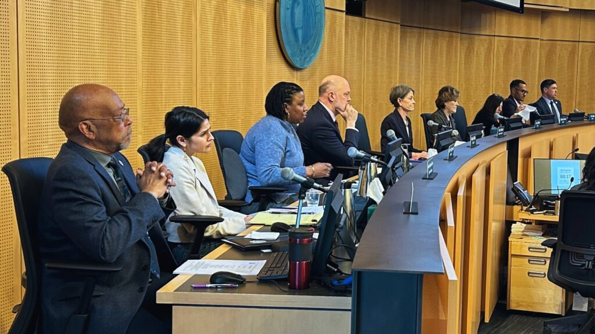

          

 *  [Home](https://council.seattle.gov) 
 *  [News](https://council.seattle.gov/news) 
 *  [Press Releases](https://council.seattle.gov/press-releases) 
 *  [Video](https://council.seattle.gov/video) 
 *  [Councilmembers](https://council.seattle.gov/seattle-city-councilmembers) 
   *  [Rob Saka](https://council.seattle.gov/saka) 
   *  [Mark Solomon](https://council.seattle.gov/solomon) 
   *  [Joy Hollingsworth](https://council.seattle.gov/hollingsworth) 
   *  [Maritza Rivera](https://council.seattle.gov/rivera) 
   *  [Cathy Moore](https://council.seattle.gov/moore) 
   *  [Dan Strauss](https://council.seattle.gov/strauss) 
   *  [Robert Kettle](https://council.seattle.gov/kettle) 
   *  [Alexis Mercedes Rinck](https://council.seattle.gov/rinck) 
   *  [Sara Nelson](https://council.seattle.gov/nelson) 
   *  [Councilmembers (Past)](https://council.seattle.gov/councilmembers-2022) 
 *  [About](https://council.seattle.gov/about) 

# Councilmembers

  [Home](https://council.seattle.gov)  » Councilmembers   

The Seattle City Council is comprised of nine councilmembers — seven representing different districts and two representing Seattle citywide. You can use our  [Find Your District](https://seattle.gov/council/meet-the-council/find-your-district-and-councilmembers)  tool to input your address and find out which district you live in and which councilmembers represent you.  

## Rob Saka (District 1)

 *  [Website](https://seattle.gov/council/saka) 
 *  [Blog](https://council.seattle.gov/saka) 

## Mark Solomon (District 2)

 *  [Website](https://www.seattle.gov/council/meet-the-council/mark-solomon) 
 *  [Blog](https://council.seattle.gov/solomon) 

## Joy Hollingsworth (District 3)

 *  [Website](https://seattle.gov/council/hollingsworth) 
 *  [Blog](https://council.seattle.gov/hollingsworth) 

## Maritza Rivera (District 4)

 *  [Website](https://seattle.gov/council/rivera) 
 *  [Blog](https://council.seattle.gov/rivera) 

## Cathy Moore (District 5)

 *  [Website](https://seattle.gov/council/moore) 
 *  [Blog](https://council.seattle.gov/moore) 

## Dan Strauss (District 6)

 *  [Website](https://seattle.gov/council/strauss) 
 *  [Blog](https://council.seattle.gov/strauss) 

## Robert Kettle (District 7)

 *  [Website](https://seattle.gov/council/kettle) 
 *  [Blog](https://council.seattle.gov/kettle) 

## Alexis Mercedes Rinck (Position 8)

 *  [Website](https://www.seattle.gov/council/rinck) 
 *  [Blog](https://council.seattle.gov/rinck) 

## Sara Nelson (Position 9)

 *  [Website](https://www.seattle.gov/council/nelson) 
 *  [Blog](https://council.seattle.gov/nelson) 
  `` 

  

### HELPFUL LINKS

 *  [Meet the Council](https://seattle.gov/council/meet-the-council) 
 *  [Mayor’s Office](https://seattle.gov/mayor) 
 *  [Council Calendar](https://seattle.gov/council/calendar) 
 *  [Council Agendas](https://seattle.legistar.com/Calendar.aspx) 
 *  [Council Committees](https://seattle.gov/council/committees) 
 *  [Watch Council Live](https://seattle.gov/council/watch-council-live) 

### Make your voice heard

 [Find Your Council District](https://www.seattle.gov/cityclerk/agendas-and-legislative-resources/find-your-council-district) 

 [Contact the Council](https://www.seattle.gov/cityclerk/agendas-and-legislative-resources/city-council-agendas/contact-the-city-council) 

 [Sign up for Public Comment](https://www.seattle.gov/council/committees/public-comment#:~:text=Register%2520to%2520speak%2520on%2520the,be%2520recognized%2520by%2520the%2520Chair.) 

 [Register to Vote](https://kingcounty.gov/depts/elections/how-to-vote/register-to-vote.aspx) 

### Councilmembers

 *  [Rob Saka](https://seattle.gov/council/meet-the-council/rob-saka) 
 *  [Joy Hollingsworth](https://seattle.gov/council/meet-the-council/joy-hollingsworth) 
 *  [Maritza Rivera](https://seattle.gov/council/meet-the-council/maritza-rivera) 
 *  [Cathy Moore](https://seattle.gov/council/meet-the-council/cathy-moore) 
 *  [Dan Strauss](https://seattle.gov/council/strauss) 
 *  [Robert Kettle](https://seattle.gov/council/meet-the-council/robert-kettle) 
 *  [Alexis Mercedes Rinck](https://seattle.gov/council/rinck) 
 *  [Sara Nelson](https://seattle.gov/council/meet-the-council/sara-nelson) 
    The official blog of the Seattle City Council 7ads6x98y 