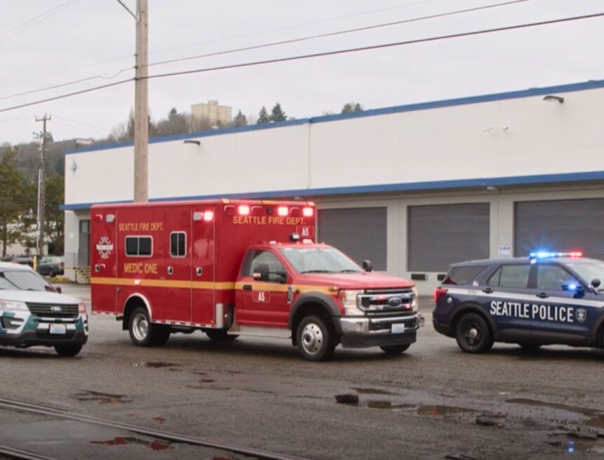
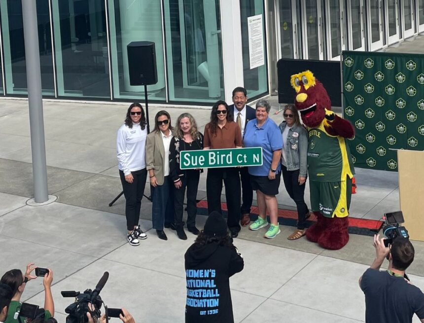

          

 *  [Home](https://council.seattle.gov) 
 *  [News](https://council.seattle.gov/news) 
 *  [Press Releases](https://council.seattle.gov/press-releases) 
 *  [Video](https://council.seattle.gov/video) 
 *  [Councilmembers](https://council.seattle.gov/seattle-city-councilmembers) 
   *  [Rob Saka](https://council.seattle.gov/saka) 
   *  [Mark Solomon](https://council.seattle.gov/solomon) 
   *  [Joy Hollingsworth](https://council.seattle.gov/hollingsworth) 
   *  [Maritza Rivera](https://council.seattle.gov/rivera) 
   *  [Cathy Moore](https://council.seattle.gov/moore) 
   *  [Dan Strauss](https://council.seattle.gov/strauss) 
   *  [Robert Kettle](https://council.seattle.gov/kettle) 
   *  [Alexis Mercedes Rinck](https://council.seattle.gov/rinck) 
   *  [Sara Nelson](https://council.seattle.gov/nelson) 
   *  [Councilmembers (Past)](https://council.seattle.gov/councilmembers-2022) 
 *  [About](https://council.seattle.gov/about) 

# Rob Saka

  [Home](https://council.seattle.gov)  » Rob Saka    

# Blog Posts from Councilmember Saka

    April 01, 2025 April 2, 2025  [Councilmember Kettle](https://council.seattle.gov/category/councilmember-kettle) , [Councilmember Saka](https://council.seattle.gov/category/councilmember-saka) , [Kettle](https://council.seattle.gov/category/news-releases/kettle) , [News](https://council.seattle.gov/category/news) , [News Releases](https://council.seattle.gov/category/news-releases) , [Public Safety](https://council.seattle.gov/category/news/public-safety) , [Saka](https://council.seattle.gov/category/news-releases/saka)  By [City Council News Releases](https://council.seattle.gov/author/city-council-news-releases)   [0](https://saka.seattle.gov#)  

##  [City Council approves resolution endorsing holistic approach to public safety](https://council.seattle.gov/2025/04/01/city-council-approves-resolution-endorsing-holistic-approach-to-public-safety) 

Today the City Council adopted a resolution, sponsored by Councilmember Rob Saka (District 1), strengthening Seattle’s commitment to a comprehensive approach to public safety. The resolution expresses appreciation for the community’s first responders, recognizes work done to reform the Seattle Police Department (SPD), endorses accountability measures, calls for diversified responses to 911 calls as offered by the new Community Assisted...

  [Read More](https://council.seattle.gov/2025/04/01/city-council-approves-resolution-endorsing-holistic-approach-to-public-safety)  March 25, 2025 March 25, 2025  [Councilmember Saka](https://council.seattle.gov/category/councilmember-saka) , [News](https://council.seattle.gov/category/news) , [News Releases](https://council.seattle.gov/category/news-releases) , [Public Safety](https://council.seattle.gov/category/news/public-safety) , [Saka](https://council.seattle.gov/category/news-releases/saka)  By [City Council News Releases](https://council.seattle.gov/author/city-council-news-releases)   [0](https://saka.seattle.gov#)  

##  [Councilmember Saka introduces resolution focused on future of public safety in Seattle](https://council.seattle.gov/2025/03/25/councilmember-saka-introduces-resolution-focused-on-future-of-public-safety-in-seattle) 

Reiterates support for first responders, acknowledges failure of defund movement and embraces focus on underserved communities Today’s 9:30 a.m. meeting of the Public Safety Committee will feature a discussion of Councilmember Rob Saka’s (District 1) recently introduced Resolution 32167, which recognizes the City’s targeted public safety work over the last year. The resolution is another important step towards resolving the...

  [Read More](https://council.seattle.gov/2025/03/25/councilmember-saka-introduces-resolution-focused-on-future-of-public-safety-in-seattle)  December 18, 2024 December 20, 2024  [Councilmember Kettle](https://council.seattle.gov/category/councilmember-kettle) , [Councilmember Saka](https://council.seattle.gov/category/councilmember-saka) , [Kettle](https://council.seattle.gov/category/news-releases/kettle) , [News Releases](https://council.seattle.gov/category/news-releases) , [Saka](https://council.seattle.gov/category/news-releases/saka)  By [City Council News Releases](https://council.seattle.gov/author/city-council-news-releases)   [0](https://saka.seattle.gov#)  

##  [Council’s Public Safety and Transportation chairs call for more transit security funding ](https://council.seattle.gov/2024/12/18/councils-public-safety-and-transportation-chairs-call-for-more-transit-security-funding) 

Today Councilmember Bob Kettle (District 7), chair of the Public Safety Committee, and Councilmember Rob Saka (District 1), chair of the Transportation Committee, released the following joint statement in response to the early morning fatal stabbing of King County Metro bus driver Shawn Yim.   “First and foremost, our thoughts are with the family, friends and colleagues of Shawn Yim. Today’s...

  [Read More](https://council.seattle.gov/2024/12/18/councils-public-safety-and-transportation-chairs-call-for-more-transit-security-funding)  November 13, 2024 November 13, 2024  [Budget](https://council.seattle.gov/category/news/budget) , [Councilmember Rivera](https://council.seattle.gov/category/councilmember-rivera) , [Councilmember Saka](https://council.seattle.gov/category/councilmember-saka) , [News](https://council.seattle.gov/category/news) , [News Releases](https://council.seattle.gov/category/news-releases) , [Rivera](https://council.seattle.gov/category/news-releases/rivera) , [Saka](https://council.seattle.gov/category/news-releases/saka)  By [City Council News Releases](https://council.seattle.gov/author/city-council-news-releases)   [0](https://saka.seattle.gov#)  

##  [Councilmember Saka proposes budget amendment to track success of City’s pothole repair program](https://council.seattle.gov/2024/11/13/councilmember-saka-proposes-budget-amendment-to-track-success-of-citys-pothole-repair-program) 

Councilmember Rob Saka (District 1) introduced an amendment in the 2025-26 Budget process to ensure that the Seattle Department of Transportation (SDOT) is meetings its goals with its pothole repair program, while also providing accountability and transparency for residents who report potholes in their neighborhoods. “Potholes are a concern for every district in Seattle, which is why I’m making it...

  [Read More](https://council.seattle.gov/2024/11/13/councilmember-saka-proposes-budget-amendment-to-track-success-of-citys-pothole-repair-program)  November 13, 2024 November 13, 2024  [Budget](https://council.seattle.gov/category/news/budget) , [Councilmember Saka](https://council.seattle.gov/category/councilmember-saka) , [News Releases](https://council.seattle.gov/category/news-releases) , [Public Safety](https://council.seattle.gov/category/news/public-safety) , [Saka](https://council.seattle.gov/category/news-releases/saka)  By [City Council News Releases](https://council.seattle.gov/author/city-council-news-releases)   [0](https://saka.seattle.gov#)  

##  [Councilmember Saka proposes budget item to advance police hiring and retention efforts ](https://council.seattle.gov/2024/11/13/councilmember-saka-proposes-budget-item-to-advance-police-hiring-and-retention-efforts) 

Councilmember Rob Saka (District 1) will introduce an amendment in the upcoming 2025-26 Budget process to ensure the Seattle Police Department (SPD) is meeting its goals of hiring new staff and retaining officers. If adopted, the Statement of Legislative Intent would require the department to create a plan that includes:  “We need more officers on the street to ensure our...

  [Read More](https://council.seattle.gov/2024/11/13/councilmember-saka-proposes-budget-item-to-advance-police-hiring-and-retention-efforts)  November 11, 2024 November 11, 2024  [Budget](https://council.seattle.gov/category/news/budget) , [Councilmember Saka](https://council.seattle.gov/category/councilmember-saka) , [News](https://council.seattle.gov/category/news) , [News Releases](https://council.seattle.gov/category/news-releases) , [Public Safety](https://council.seattle.gov/category/news/public-safety) , [Saka](https://council.seattle.gov/category/news-releases/saka)  By [City Council News Releases](https://council.seattle.gov/author/city-council-news-releases)   [0](https://saka.seattle.gov#)  

##  [Councilmember Rob Saka proposes amendments exploring new transportation options in South Lake Union and additional transit security](https://council.seattle.gov/2024/11/11/councilmember-rob-saka-proposes-amendments-exploring-new-transportation-options-in-south-lake-union-and-additional-transit-security) 

Today Councilmember Rob Saka (District 1) announced that he’s introducing transit-focused amendments to the 2025-26 Budget package for consideration heading into final stages of the adoption process. With respect to the South Lake Union Streetcar transition amendment: “As Transportation Committee Chair, I’m deeply concerned that residents aren’t getting what they paid for when it comes to the South Lake Union...

  [Read More](https://council.seattle.gov/2024/11/11/councilmember-rob-saka-proposes-amendments-exploring-new-transportation-options-in-south-lake-union-and-additional-transit-security)  November 05, 2024 November 5, 2024  [Councilmember Saka](https://council.seattle.gov/category/councilmember-saka) , [News Releases](https://council.seattle.gov/category/news-releases)  By [City Council News Releases](https://council.seattle.gov/author/city-council-news-releases)   [0](https://saka.seattle.gov#)  

##  [Mayor Harrell and Councilmember Saka Celebrate Transportation Levy Results](https://council.seattle.gov/2024/11/05/mayor-harrell-and-councilmember-saka-celebrate-transportation-levy-results) 

Mayor Bruce Harrell and Councilmember Rob Saka released the below statements following the release of initial transportation levy election results on November 5, 2024. “Tonight’s results demonstrate that Seattle voters are committed to advancing a safer transportation system that benefits all,” stated Mayor Bruce Harrell. “The Transportation Levy represents our steadfast dedication to a One Seattle vision, prioritizing the creation...

  [Read More](https://council.seattle.gov/2024/11/05/mayor-harrell-and-councilmember-saka-celebrate-transportation-levy-results)  November 05, 2024 November 5, 2024  [Councilmember Moore](https://council.seattle.gov/category/councilmember-moore) , [Councilmember Saka](https://council.seattle.gov/category/councilmember-saka) , [Moore](https://council.seattle.gov/category/news-releases/moore) , [News Releases](https://council.seattle.gov/category/news-releases)  By [City Council News Releases](https://council.seattle.gov/author/city-council-news-releases)   [0](https://saka.seattle.gov#)  

##  [Councilmember Moore Celebrates Passage of City’s Transportation Levy](https://council.seattle.gov/2024/11/05/councilmember-moore-celebrates-passage-of-citys-transportation-levy) 

Huge Win for New Sidewalks and Pedestrian Safety in District 5 Following tonight’s first round of election results showing Proposition 1 the City of Seattle’s Transportation Levy being approved by voters, District 5 Seattle City Councilmember Cathy Moore released the following statement:   “Passage of Prop 1 is a huge win for new sidewalks in District 5, which has 36%...

  [Read More](https://council.seattle.gov/2024/11/05/councilmember-moore-celebrates-passage-of-citys-transportation-levy)  October 30, 2024 October 30, 2024  [Budget](https://council.seattle.gov/category/news/budget) , [Councilmember Saka](https://council.seattle.gov/category/councilmember-saka) , [News](https://council.seattle.gov/category/news) , [News Releases](https://council.seattle.gov/category/news-releases) , [Saka](https://council.seattle.gov/category/news-releases/saka)  By [City Council News Releases](https://council.seattle.gov/author/city-council-news-releases)   [0](https://saka.seattle.gov#)  

##  [Councilmember Rob Saka announces public safety investments and help for working families in 2025-26 Budget](https://council.seattle.gov/2024/10/30/councilmember-rob-saka-announces-public-safety-investments-and-help-for-working-families-in-2025-26-budget) 

Includes automated speed enforcement cameras and reconfiguring West Seattle’s Duwamish Head to address public safety hazard Today, Councilmember Rob Saka (District 1) is pleased to announce that his public safety priorities and support for working families have been included in the Budget Chair Dan Strauss’ balancing package for the 2025-26 budget.   “I want to congratulate Budget Chair Dan Strauss...

  [Read More](https://council.seattle.gov/2024/10/30/councilmember-rob-saka-announces-public-safety-investments-and-help-for-working-families-in-2025-26-budget)  October 30, 2024 October 30, 2024  [Budget](https://council.seattle.gov/category/news/budget) , [Councilmember Moore](https://council.seattle.gov/category/councilmember-moore) , [Councilmember Saka](https://council.seattle.gov/category/councilmember-saka) , [Councilmember Strauss](https://council.seattle.gov/category/councilmember-strauss) , [Moore](https://council.seattle.gov/category/news-releases/moore) , [News](https://council.seattle.gov/category/news) , [News Releases](https://council.seattle.gov/category/news-releases) , [Saka](https://council.seattle.gov/category/news-releases/saka) , [Strauss](https://council.seattle.gov/category/news-releases/strauss)  By [City Council News Releases](https://council.seattle.gov/author/city-council-news-releases)   [0](https://saka.seattle.gov#)  

##  [Councilmember Rob Saka Funds Women in Policing Initiative](https://council.seattle.gov/2024/10/30/councilmember-rob-saka-funds-women-in-policing-initiative) 

Includes one professional staff to coordinate the ‘30×30’ Initiative Today, as part of the Council’s balancing package, Councilmember Rob Saka (District 1) adds one additional Seattle Police Department staff to advance a department-wide effort to meet the goal of having 30% women on the police force by 2030. The program, known as the 30×30, is designed to bolster the participation...

  [Read More](https://council.seattle.gov/2024/10/30/councilmember-rob-saka-funds-women-in-policing-initiative)     September 24, 2024 September 24, 2024  [Councilmember Saka](https://council.seattle.gov/category/councilmember-saka) , [News Releases](https://council.seattle.gov/category/news-releases) , [Saka](https://council.seattle.gov/category/news-releases/saka)  By [City Council News Releases](https://council.seattle.gov/author/city-council-news-releases)   [0](https://saka.seattle.gov#)  

##  [Basketball legend Sue Bird honored with street dedication](https://council.seattle.gov/2024/09/24/basketball-legend-sue-bird-honored-with-street-dedication) 

The City Council has voted unanimously to rename a street in honor of four-time WNBA champion Sue Bird. Tuesday’s legislation changes the name of a segment of 2nd Ave N, adjacent to Climate Pledge Arena, to Sue Bird Court. “Sue Bird is the indisputable G.O.A.T of women’s basketball and I want to thank Mayor Harrell for initiating this recognition. As...

  [Read More](https://council.seattle.gov/2024/09/24/basketball-legend-sue-bird-honored-with-street-dedication)     June 25, 2024 June 25, 2024  [Councilmember Saka](https://council.seattle.gov/category/councilmember-saka) , [Top Story](https://council.seattle.gov/category/top-story)  By [Jesse Franz](https://council.seattle.gov/author/jesse)   [0](https://saka.seattle.gov#)  

##  [Seattle Councilmember Saka to host community conversation between City leaders, community after fatal shooting near Alki Beach](https://council.seattle.gov/2024/06/25/seattle-councilmember-saka-to-host-community-conversation-between-city-leaders-community-after-fatal-shooting-near-alki-beach) 

SEATTLE – Seattle City Councilmember Rob Saka (District 1, Vice Chair of the Public Safety Committee) is hosting a community conversation on public safety tomorrow, June 26, 6 PM-7:30pm, at Alki United Church of Christ. It will include a diverse selection of city leaders, including Interim Police Chief Sue Rahr and citywide Councilmember Tanya Woo (Position 8). This comes after...

  [Read More](https://council.seattle.gov/2024/06/25/seattle-councilmember-saka-to-host-community-conversation-between-city-leaders-community-after-fatal-shooting-near-alki-beach)  

 *  1 
 *  [2](https://council.seattle.gov/saka/page/2) 
 *  [Next](https://council.seattle.gov/saka/page/2) 

 __Learn more about Councilmember Saka:__ 

 [Visit his website](https://www.seattle.gov/council/meet-the-council/rob-saka) 

 [Sign up for his newsletter](https://seattle.us12.list-manage.com/subscribe?u=11a79978ca7225050bfabf7ad&id=026c7aa0f5) 

# News Releases

 April 1, 2025April 2, 2025 

###  [City Council approves resolution endorsing holistic approach to public safety](https://council.seattle.gov/2025/04/01/city-council-approves-resolution-endorsing-holistic-approach-to-public-safety) 

Today the City Council adopted a resolution, sponsored by Councilmember Rob Saka (District 1), strengthening Seattle’s commitment to a comprehensive...

  [Read More](https://council.seattle.gov/2025/04/01/city-council-approves-resolution-endorsing-holistic-approach-to-public-safety)  March 25, 2025March 25, 2025 

###  [Councilmember Saka introduces resolution focused on future of public safety in Seattle](https://council.seattle.gov/2025/03/25/councilmember-saka-introduces-resolution-focused-on-future-of-public-safety-in-seattle) 

Reiterates support for first responders, acknowledges failure of defund movement and embraces focus on underserved communities Today’s 9:30 a.m. meeting...

  [Read More](https://council.seattle.gov/2025/03/25/councilmember-saka-introduces-resolution-focused-on-future-of-public-safety-in-seattle)  December 18, 2024December 20, 2024 

###  [Council’s Public Safety and Transportation chairs call for more transit security funding ](https://council.seattle.gov/2024/12/18/councils-public-safety-and-transportation-chairs-call-for-more-transit-security-funding) 

Today Councilmember Bob Kettle (District 7), chair of the Public Safety Committee, and Councilmember Rob Saka (District 1), chair of...

  [Read More](https://council.seattle.gov/2024/12/18/councils-public-safety-and-transportation-chairs-call-for-more-transit-security-funding)  November 13, 2024November 13, 2024 

###  [Councilmember Saka proposes budget amendment to track success of City’s pothole repair program](https://council.seattle.gov/2024/11/13/councilmember-saka-proposes-budget-amendment-to-track-success-of-citys-pothole-repair-program) 

Councilmember Rob Saka (District 1) introduced an amendment in the 2025-26 Budget process to ensure that the Seattle Department of...

  [Read More](https://council.seattle.gov/2024/11/13/councilmember-saka-proposes-budget-amendment-to-track-success-of-citys-pothole-repair-program)  

  

### HELPFUL LINKS

 *  [Meet the Council](https://seattle.gov/council/meet-the-council) 
 *  [Mayor’s Office](https://seattle.gov/mayor) 
 *  [Council Calendar](https://seattle.gov/council/calendar) 
 *  [Council Agendas](https://seattle.legistar.com/Calendar.aspx) 
 *  [Council Committees](https://seattle.gov/council/committees) 
 *  [Watch Council Live](https://seattle.gov/council/watch-council-live) 

### Make your voice heard

 [Find Your Council District](https://www.seattle.gov/cityclerk/agendas-and-legislative-resources/find-your-council-district) 

 [Contact the Council](https://www.seattle.gov/cityclerk/agendas-and-legislative-resources/city-council-agendas/contact-the-city-council) 

 [Sign up for Public Comment](https://www.seattle.gov/council/committees/public-comment#:~:text=Register%2520to%2520speak%2520on%2520the,be%2520recognized%2520by%2520the%2520Chair.) 

 [Register to Vote](https://kingcounty.gov/depts/elections/how-to-vote/register-to-vote.aspx) 

### Councilmembers

 *  [Rob Saka](https://seattle.gov/council/meet-the-council/rob-saka) 
 *  [Joy Hollingsworth](https://seattle.gov/council/meet-the-council/joy-hollingsworth) 
 *  [Maritza Rivera](https://seattle.gov/council/meet-the-council/maritza-rivera) 
 *  [Cathy Moore](https://seattle.gov/council/meet-the-council/cathy-moore) 
 *  [Dan Strauss](https://seattle.gov/council/strauss) 
 *  [Robert Kettle](https://seattle.gov/council/meet-the-council/robert-kettle) 
 *  [Alexis Mercedes Rinck](https://seattle.gov/council/rinck) 
 *  [Sara Nelson](https://seattle.gov/council/meet-the-council/sara-nelson) 
    The official blog of the Seattle City Council 7ads6x98y 