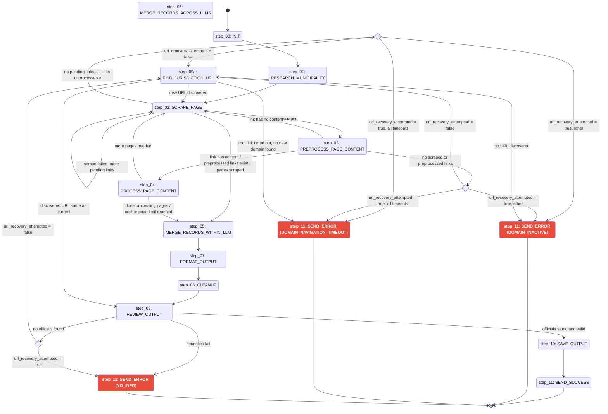

## people_collector state transitions

Keep this diagram in sync with `transitions/main.py` whenever states or edges change.

```mermaid
stateDiagram-v2
    classDef errorState fill:#e74c3c,color:#fff,font-weight:bold

    state all_scrapes_failed <<choice>>
    state no_content_found <<choice>>
    state no_officials_found <<choice>>

    state "step_00: INIT" as INIT
    state "step_01: RESEARCH_MUNICIPALITY" as RESEARCH_MUNICIPALITY
    state "step_02: SCRAPE_PAGE" as SCRAPE_PAGE
    state "step_03: PREPROCESS_PAGE_CONTENT" as PREPROCESS_PAGE_CONTENT
    state "step_04: PROCESS_PAGE_CONTENT" as PROCESS_PAGE_CONTENT
    state "step_05: MERGE_RECORDS_WITHIN_LLM" as MERGE_RECORDS_WITHIN_LLM
    state "step_06: MERGE_RECORDS_ACROSS_LLMS" as MERGE_RECORDS_ACROSS_LLMS
    state "step_07: FORMAT_OUTPUT" as FORMAT_OUTPUT
    state "step_08: CLEANUP" as CLEANUP
    state "step_09: REVIEW_OUTPUT" as REVIEW_OUTPUT
    state "step_09a: FIND_JURISDICTION_URL" as FIND_JURISDICTION_URL
    state "step_10: SAVE_OUTPUT" as SAVE_OUTPUT
    state "step_11: SEND_SUCCESS" as SEND_SUCCESS
    state "step_11: SEND_ERROR (DOMAIN_INACTIVE)" as ERR_DOMAIN_INACTIVE
    state "step_11: SEND_ERROR (DOMAIN_NAVIGATION_TIMEOUT)" as ERR_DOMAIN_NAVIGATION_TIMEOUT
    state "step_11: SEND_ERROR (NO_INFO)" as ERR_NO_INFO

    [*] --> INIT

    INIT --> RESEARCH_MUNICIPALITY

    RESEARCH_MUNICIPALITY --> SCRAPE_PAGE

    SCRAPE_PAGE --> PREPROCESS_PAGE_CONTENT : page scraped
    SCRAPE_PAGE --> SCRAPE_PAGE : scrape failed, more pending links
    SCRAPE_PAGE --> all_scrapes_failed : no pending links, all links unprocessable
    SCRAPE_PAGE --> MERGE_RECORDS_WITHIN_LLM : no pending links, some pages scraped

    all_scrapes_failed --> FIND_JURISDICTION_URL : url_recovery_attempted = false
    all_scrapes_failed --> ERR_DOMAIN_NAVIGATION_TIMEOUT : url_recovery_attempted = true, all timeouts
    all_scrapes_failed --> ERR_DOMAIN_INACTIVE : url_recovery_attempted = true, other

    PREPROCESS_PAGE_CONTENT --> PROCESS_PAGE_CONTENT : link has content / preprocessed links exist
    PREPROCESS_PAGE_CONTENT --> SCRAPE_PAGE : link has no content
    PREPROCESS_PAGE_CONTENT --> no_content_found : no scraped or preprocessed links

    no_content_found --> FIND_JURISDICTION_URL : url_recovery_attempted = false
    no_content_found --> ERR_DOMAIN_NAVIGATION_TIMEOUT : url_recovery_attempted = true, all timeouts
    no_content_found --> ERR_DOMAIN_INACTIVE : url_recovery_attempted = true, other

    PROCESS_PAGE_CONTENT --> SCRAPE_PAGE : more pages needed
    PROCESS_PAGE_CONTENT --> MERGE_RECORDS_WITHIN_LLM : done processing pages / cost or page limit reached

    MERGE_RECORDS_WITHIN_LLM --> FORMAT_OUTPUT

    FORMAT_OUTPUT --> CLEANUP

    CLEANUP --> REVIEW_OUTPUT

    REVIEW_OUTPUT --> no_officials_found : no officials found
    REVIEW_OUTPUT --> ERR_NO_INFO : heuristics fail
    REVIEW_OUTPUT --> SAVE_OUTPUT : officials found and valid

    no_officials_found --> FIND_JURISDICTION_URL : url_recovery_attempted = false
    no_officials_found --> ERR_NO_INFO : url_recovery_attempted = true

    FIND_JURISDICTION_URL --> ERR_DOMAIN_NAVIGATION_TIMEOUT : root link timed out, no new domain found
    FIND_JURISDICTION_URL --> ERR_DOMAIN_INACTIVE : no URL discovered
    FIND_JURISDICTION_URL --> REVIEW_OUTPUT : discovered URL same as current
    FIND_JURISDICTION_URL --> SCRAPE_PAGE : new URL discovered

    SAVE_OUTPUT --> SEND_SUCCESS

    SEND_SUCCESS --> [*]
    ERR_DOMAIN_INACTIVE --> [*]
    ERR_DOMAIN_NAVIGATION_TIMEOUT --> [*]
    ERR_NO_INFO --> [*]

    class ERR_DOMAIN_INACTIVE errorState
    class ERR_DOMAIN_NAVIGATION_TIMEOUT errorState
    class ERR_NO_INFO errorState
```
